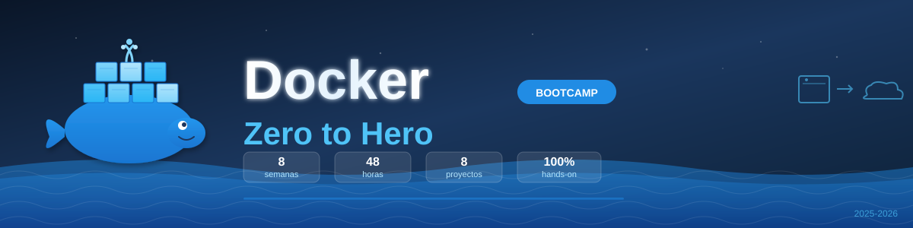

<p align="center">
  
</p>

<p align="center">
  <a href="LICENSE"></a>
  <a href="#"></a>
  <a href="#"></a>
  <a href="#"></a>
  <a href="CONTRIBUTING.md"></a>
</p>

<p align="center">
  <a href="README.md"></a>
</p>

---

## 📋 Description

**Docker Zero to Hero Bootcamp** is an intensive **8-week** training program designed to take you from container basics to deploying production-ready applications with Docker.

This bootcamp is part of the **Zero to Hero** series and serves as ideal preparation for the next level: **Kubernetes**.

### 🎯 Objectives

Upon completing the bootcamp, students will be able to:

- ✅ Understand the difference between containers and virtual machines
- ✅ Create and optimize Docker images with Dockerfile
- ✅ Manage the complete container lifecycle
- ✅ Configure networks for inter-container communication
- ✅ Implement data persistence with volumes
- ✅ Orchestrate multi-container applications with Docker Compose
- ✅ Apply security best practices in containers
- ✅ Prepare applications for production environments
- ✅ Integrate Docker into basic CI/CD workflows

---

## 🗓️ Bootcamp Structure

|       Stage       | Weeks | Hours | Main Topics                                      |
| :---------------: | :---: | :---: | ------------------------------------------------ |
| **Fundamentals**  |  1-2  |  12h  | Basic concepts, installation, Dockerfile, images |
|  **Management**   |  3-4  |  12h  | Containers, lifecycle, networks, communication   |
|  **Persistence**  |   5   |  6h   | Volumes, bind mounts, backups                    |
| **Orchestration** |  6-7  |  12h  | Basic and advanced Docker Compose                |
|  **Production**   |   8   |  6h   | Security, best practices, CI/CD                  |

**Total: 8 weeks** | **48 hours** of intensive training

---

## 📚 Weekly Content

Each week includes:

```
bootcamp/week-XX/
├── README.md                 # Description and objectives
├── rubrica-evaluacion.md     # Evaluation criteria
├── 0-assets/                 # Images and diagrams
├── 1-teoria/                 # Theoretical material
├── 2-ejercicios/             # Guided exercises
├── 3-proyecto/               # Weekly project
├── 4-recursos/               # Additional resources
│   ├── ebooks-free/
│   ├── videografia/
│   └── webgrafia/
└── 5-glosario/               # Key terms
```

### 🔑 Key Components

| Week | Topic                       | Description                                                    |
| ---- | --------------------------- | -------------------------------------------------------------- |
| 01   | **Docker Fundamentals**     | Basic concepts, architecture, installation, essential commands |
| 02   | **Docker Images**           | Dockerfile, layers, building, optimization, multi-stage builds |
| 03   | **Container Management**    | Lifecycle, logs, exec, environment variables, resources        |
| 04   | **Docker Networks**         | Bridge, host, overlay, internal DNS, port mapping              |
| 05   | **Volumes and Persistence** | Named volumes, bind mounts, tmpfs, backup and restore          |
| 06   | **Basic Docker Compose**    | Multiple services, dependencies, override files                |
| 07   | **Advanced Docker Compose** | Profiles, extends, healthchecks, secrets, configs              |
| 08   | **Security and Production** | Non-root users, vulnerability scanning, basic CI/CD            |

---

## 🛠️ Tech Stack

| Technology     | Version    | Use                 |
| -------------- | ---------- | ------------------- |
| Docker         | **27+**    | Container engine    |
| Docker Compose | **2.31+**  | Local orchestration |
| Git            | **2.40+**  | Version control     |
| VS Code        | **Latest** | Recommended editor  |

**Development environment**: Docker Desktop (Windows/macOS) or Docker Engine (Linux)

---

## 🚀 Quick Start

### Prerequisites

- **Docker** and **Docker Compose** installed
- **Git** for version control
- **VS Code** (recommended) with included extensions
- Modern browser (Chrome, Firefox, Edge)

### 1. Clone the Repository

```bash
git clone https://github.com/epti-dev/bc-docker.git
cd bc-docker
```

### 2. Install VS Code Extensions

```bash
# Open in VS Code
code .

# Recommended extensions will appear automatically
# Or run: Ctrl+Shift+P → "Extensions: Show Recommended Extensions"
```

### 3. Verify Docker Installation

```bash
# Verify Docker
docker --version
docker compose version

# Run test container
docker run hello-world
```

### 4. Navigate to Current Week

```bash
cd bootcamp/week-01-fundamentos_docker
```

### 5. Follow Instructions

Each week contains a `README.md` with detailed instructions.

---

## 📊 Learning Methodology

### ⏱️ Weekly Time Distribution (6 hours)

| Activity     | Time | Description               |
| ------------ | ---- | ------------------------- |
| 📖 Theory    | 1.5h | Concepts and fundamentals |
| 💻 Exercises | 2.5h | Guided practice           |
| 🚀 Project   | 1.5h | Knowledge application     |
| 📚 Resources | 0.5h | Supplementary material    |

### 🏆 Evaluation System

| Evidence       | Weight | Description                              |
| -------------- | ------ | ---------------------------------------- |
| 🧠 Knowledge   | 30%    | Theoretical quiz (≥70% to pass)          |
| 💪 Performance | 40%    | Correctly completed exercises            |
| 📦 Product     | 30%    | Functional and documented weekly project |

---

## 🤝 Contributing

Contributions are welcome! This is an open-source educational project.

### How to Contribute

1. Read the [Contributing Guide](CONTRIBUTING.md)
2. Review the [Code of Conduct](CODE_OF_CONDUCT.md)
3. Fork the repository
4. Create your branch (`git checkout -b feature/new-feature`)
5. Commit with [Conventional Commits](https://www.conventionalcommits.org/) (`git commit -m 'feat: add new exercise'`)
6. Push to branch (`git push origin feature/new-feature`)
7. Open a Pull Request

### 📋 Contribution Areas

- ✨ Additional exercises
- 📚 Documentation improvements
- 🐛 Bug fixes
- 🎨 Visual resources (SVG diagrams)
- 🌐 Translations
- 📹 Tutorial videos

---

## 📞 Support

- 💬 **Discussions**: [GitHub Discussions](https://github.com/epti-dev/bc-docker/discussions)
- 🐛 **Issues**: [GitHub Issues](https://github.com/epti-dev/bc-docker/issues)

---

## 📄 License

This project is licensed under the MIT License - see the [LICENSE](LICENSE) file for details.

---

## 🏆 Acknowledgments

- [Docker](https://docker.com/) - For revolutionizing application deployment
- [Docker Hub](https://hub.docker.com/) - For the image registry
- [Play with Docker](https://labs.play-with-docker.com/) - For the online practice environment
- Docker Community - For resources and examples
- All contributors

---

## 📚 Additional Documentation

- [🤖 Copilot Instructions](.github/copilot-instructions.md)
- [🤝 Contributing Guide](CONTRIBUTING.md)
- [📜 Code of Conduct](CODE_OF_CONDUCT.md)
- [🔒 Security Policy](SECURITY.md)

---

## 🚀 What's Next?

After completing this bootcamp, you'll be ready for:

- 🎓 **Kubernetes Bootcamp** - Container orchestration at scale
- ☁️ Cloud deployment (AWS, GCP, Azure)
- 🔄 Advanced CI/CD pipelines

---

<p align="center">
  <strong>🐳 Docker Bootcamp - Zero to Hero</strong><br>
  <em>From zero to container expert in 2 months</em>
</p>

<p align="center">
  <a href="bootcamp/week-01-fundamentos_docker">Start Week 1</a> •
  <a href="docs">View Documentation</a> •
  <a href="https://github.com/epti-dev/bc-docker/issues">Report Issue</a> •
  <a href="CONTRIBUTING.md">Contribute</a>
</p>

<p align="center">
  Made with ❤️ for the developer community
</p>
