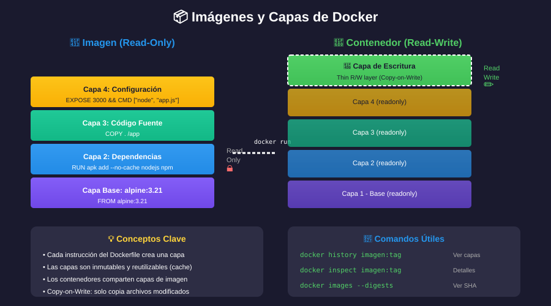

# 📚 Introducción a la Contenedorización

## 🎯 Objetivos de Aprendizaje

Al finalizar esta sección, serás capaz de:

- Comprender qué es la contenedorización
- Identificar los problemas que resuelve
- Conocer la historia y evolución de los contenedores

---

## 🤔 ¿Qué es la Contenedorización?

La **contenedorización** es una forma de virtualización a nivel de sistema operativo que permite ejecutar aplicaciones en espacios aislados llamados **contenedores**.

### Analogía: El Contenedor de Envío 📦

Imagina el comercio internacional antes de los contenedores de envío:

- Cada producto se empaquetaba de forma diferente
- Los barcos perdían tiempo cargando/descargando
- Alto riesgo de daños y pérdidas
- Difícil de automatizar

Los **contenedores de envío estandarizados** resolvieron todo esto:

- Tamaño uniforme → fácil de apilar y transportar
- Cualquier barco, tren o camión puede moverlos
- Contenido protegido e independiente
- Automatización total

> 💡 Los **contenedores de software** hacen lo mismo con las aplicaciones: empaquetan todo lo necesario para que funcionen en cualquier lugar.

---

## 🔥 El Problema: "En mi máquina funciona"

### Escenario Clásico

| Entorno                    | Configuración                                        | Resultado                           |
| -------------------------- | ---------------------------------------------------- | ----------------------------------- |
| **Mi Laptop** (Desarrollo) | Ubuntu 22.04, Python 3.11, Node.js 18, PostgreSQL 15 | ✅ "¡Funciona perfecto!"            |
| **Servidor** (Producción)  | CentOS 7, Python 3.6, Node.js 14, PostgreSQL 12      | ❌ "Error: incompatible version..." |

### Causas del Problema

| Factor                   | Descripción                              |
| ------------------------ | ---------------------------------------- |
| **Versiones diferentes** | Sistema operativo, lenguajes, librerías  |
| **Dependencias**         | Librerías del sistema, paquetes          |
| **Configuración**        | Variables de entorno, archivos de config |
| **Permisos**             | Usuarios, grupos, SELinux                |

---

## 💡 La Solución: Contenedores

Los contenedores encapsulan:

| Capa                 | Contenido                             |
| -------------------- | ------------------------------------- |
| 🔷 **Aplicación**    | Tu código                             |
| 🔷 **Runtime**       | Python, Node, Java...                 |
| 🔷 **Librerías**     | Dependencias del sistema y aplicación |
| 🔷 **Configuración** | Variables de entorno, archivos config |

### Beneficios

| Beneficio         | Descripción                                          |
| ----------------- | ---------------------------------------------------- |
| **Portabilidad**  | Mismo contenedor en desarrollo, testing y producción |
| **Consistencia**  | Elimina "en mi máquina funciona"                     |
| **Aislamiento**   | Cada contenedor es independiente                     |
| **Eficiencia**    | Uso óptimo de recursos                               |
| **Velocidad**     | Inician en segundos                                  |
| **Escalabilidad** | Fácil de replicar                                    |

---

## 📜 Breve Historia

| Año      | Evento                                |
| -------- | ------------------------------------- |
| 1979     | `chroot` en Unix - primer aislamiento |
| 2000     | FreeBSD Jails                         |
| 2004     | Solaris Zones                         |
| 2006     | cgroups en Linux                      |
| 2008     | LXC (Linux Containers)                |
| **2013** | **🐳 Docker revoluciona todo**        |
| 2014     | Kubernetes (Google)                   |
| 2015     | Open Container Initiative (OCI)       |
| 2017     | containerd donado a CNCF              |
| 2020+    | Docker Desktop, Podman, containerd    |

> 🐳 Docker no inventó los contenedores, pero los hizo **accesibles para todos**.

---

## 🏢 Casos de Uso

### Desarrollo

- Entornos de desarrollo reproducibles
- Múltiples versiones de una tecnología
- Onboarding rápido de nuevos developers

### Testing

- Entornos de prueba idénticos a producción
- Tests de integración aislados
- CI/CD pipelines

### Producción

- Microservicios
- Escalado horizontal
- Blue-green deployments
- Rollbacks instantáneos

---

## ✅ Verificación de Aprendizaje

1. ¿Qué problema principal resuelve la contenedorización?
2. ¿Qué contiene un contenedor además del código de la aplicación?
3. ¿En qué año se lanzó Docker?
4. Nombra 3 beneficios de usar contenedores.

---

## 🔗 Siguiente

[02 - Docker vs Máquinas Virtuales →](02-docker-vs-vm.md)
