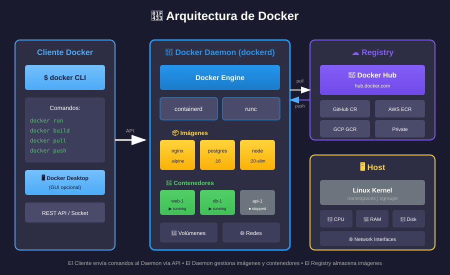

# 📚 Arquitectura de Docker

## 🎯 Objetivos de Aprendizaje

Al finalizar esta sección, serás capaz de:

- Comprender la arquitectura cliente-servidor de Docker
- Identificar los componentes principales
- Entender el flujo de trabajo de Docker

---

## 🏗️ Arquitectura General



Docker utiliza una arquitectura **cliente-servidor** donde el **Docker Client** (CLI) envía comandos vía REST API al **Docker Daemon**, que gestiona imágenes, contenedores, redes, volúmenes y plugins. El daemon se comunica con **Docker Registry** (como Docker Hub) para descargar y publicar imágenes.

---

## 🧩 Componentes Principales

### 1. Docker Client (CLI)

Es la interfaz que usas para interactuar con Docker.

```bash
# Ejemplos de comandos del cliente
docker run nginx          # Ejecutar contenedor
docker build .            # Construir imagen
docker pull ubuntu        # Descargar imagen
```

**Características:**

- Puede conectarse a daemons locales o remotos
- Envía comandos vía REST API
- También existe Docker Desktop (GUI)

### 2. Docker Daemon (dockerd)

Es el "cerebro" de Docker que se ejecuta en segundo plano.

**Responsabilidades:**

- Gestionar imágenes
- Ejecutar contenedores
- Administrar redes y volúmenes
- Escuchar peticiones del cliente

```bash
# Verificar que el daemon está corriendo
sudo systemctl status docker

# Ver información del daemon
docker info
```

### 3. Docker Registry

Almacén de imágenes Docker.

| Registry                      | Descripción                  |
| ----------------------------- | ---------------------------- |
| **Docker Hub**                | Registry público oficial     |
| **GitHub Container Registry** | ghcr.io                      |
| **Amazon ECR**                | AWS Container Registry       |
| **Google GCR**                | Google Container Registry    |
| **Azure ACR**                 | Azure Container Registry     |
| **Harbor**                    | Registry privado open source |

```bash
# Descargar imagen de Docker Hub
docker pull nginx:alpine

# Subir imagen a registry
docker push miusuario/miapp:v1
```

---

## 📦 Objetos Docker

### Imágenes

Una **imagen** es una plantilla de solo lectura con instrucciones para crear un contenedor.

| Capa | Contenido                   | Descripción           |
| ---- | --------------------------- | --------------------- |
| 4    | `CMD ["nginx"]`             | Instrucción de inicio |
| 3    | `COPY app/ /usr/share/...`  | Tu código             |
| 2    | `RUN apt-get install nginx` | Dependencias          |
| 1    | Ubuntu base                 | Sistema base          |

**Características:**

- Compuestas de **capas** (layers)
- Cada capa es de **solo lectura**
- Las capas se **comparten** entre imágenes
- Se definen con un **Dockerfile**

### Contenedores

Un **contenedor** es una instancia ejecutable de una imagen.

| Capa       | Tipo         | Descripción                 |
| ---------- | ------------ | --------------------------- |
| **R/W**    | Escritura    | Cambios en runtime          |
| **Imagen** | Solo lectura | Capas 1-4 de la imagen base |

**Características:**

- Añade una capa de **escritura** sobre la imagen
- Puede **iniciarse, detenerse, eliminarse**
- Aislado de otros contenedores
- **Efímero** por defecto (sin persistencia)

### Volúmenes

Mecanismo para **persistir datos** generados por contenedores.

```bash
# Crear volumen
docker volume create mis-datos

# Usar volumen en contenedor
docker run -v mis-datos:/app/data nginx
```

### Redes

Permiten que los contenedores se **comuniquen** entre sí y con el exterior.

```bash
# Crear red
docker network create mi-red

# Conectar contenedor a red
docker run --network mi-red nginx
```

---

## 🔄 Flujo de Trabajo

### 1. Build (Construir)

```bash
# Crear imagen desde Dockerfile
docker build -t miapp:v1 .
```

```
  Dockerfile  →  docker build  →  Imagen
```

### 2. Ship (Distribuir)

```bash
# Subir imagen a registry
docker push miusuario/miapp:v1
```

```
  Imagen local  →  docker push  →  Registry
```

### 3. Run (Ejecutar)

```bash
# Ejecutar contenedor
docker run miusuario/miapp:v1
```

```
  Registry  →  docker pull  →  Imagen local  →  docker run  →  Contenedor
```

---

## 🔧 Docker Engine

Docker Engine está compuesto por una pila de componentes que trabajan juntos:

| Componente     | Función                             | Comunicación |
| -------------- | ----------------------------------- | ------------ |
| **Docker CLI** | Interfaz de usuario                 | → REST API   |
| **dockerd**    | API REST, gestión de objetos        | → containerd |
| **containerd** | Gestión del ciclo de vida           | → runc       |
| **runc**       | Ejecuta contenedores según spec OCI | ← Contenedor |

---

## ✅ Verificación de Aprendizaje

1. ¿Cuáles son los tres componentes principales de la arquitectura Docker?
2. ¿Qué diferencia hay entre una imagen y un contenedor?
3. ¿Qué función cumple Docker Hub?
4. ¿Qué es containerd y cuál es su rol?

---

## 🔗 Navegación

| ← Anterior                               | Siguiente →                           |
| ---------------------------------------- | ------------------------------------- |
| [02 - Docker vs VMs](02-docker-vs-vm.md) | [04 - Instalación](04-instalacion.md) |
