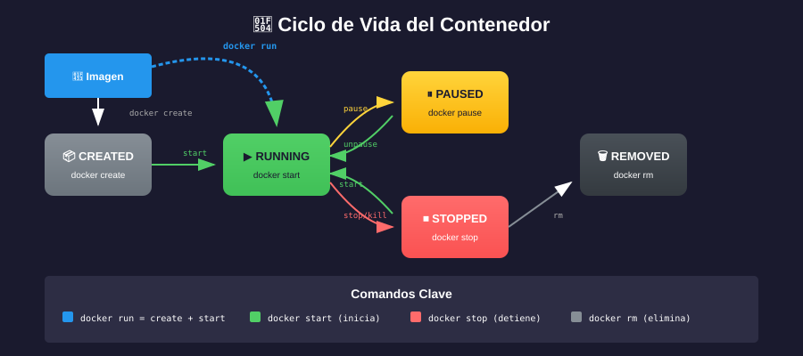

# 📚 Comandos Esenciales de Docker

## 🎯 Objetivos de Aprendizaje

Al finalizar esta sección, serás capaz de:

- Utilizar los comandos básicos de Docker
- Gestionar imágenes y contenedores
- Inspeccionar el estado del sistema Docker

---

## 📋 Estructura de Comandos Docker

```
docker [opciones] <comando> [subcomando] [argumentos]
```

### Categorías de Comandos

| Categoría        | Comandos                       |
| ---------------- | ------------------------------ |
| **Imágenes**     | pull, images, rmi, build, tag  |
| **Contenedores** | run, ps, stop, start, rm, exec |
| **Sistema**      | info, version, system prune    |
| **Redes**        | network ls, network create     |
| **Volúmenes**    | volume ls, volume create       |

---

## 🖼️ Comandos de Imágenes

### Descargar una imagen

```bash
# Sintaxis
docker pull <imagen>:<tag>

# Ejemplos
docker pull nginx                 # Descarga nginx:latest
docker pull nginx:alpine          # Descarga versión Alpine
docker pull ubuntu:22.04          # Descarga Ubuntu 22.04
```

### Listar imágenes

```bash
docker images

# Salida ejemplo:
# REPOSITORY   TAG       IMAGE ID       CREATED        SIZE
# nginx        alpine    a6eb2a334a9f   2 days ago     42.6MB
# ubuntu       22.04     e4c58958181a   3 weeks ago    77.8MB
```

### Eliminar imágenes

```bash
# Eliminar una imagen
docker rmi nginx:alpine

# Eliminar imagen por ID
docker rmi a6eb2a334a9f

# Eliminar imágenes sin usar
docker image prune

# Eliminar TODAS las imágenes
docker rmi $(docker images -q)
```

### Inspeccionar imagen

```bash
docker inspect nginx:alpine
```

---

## 📦 Comandos de Contenedores



### Ejecutar un contenedor

```bash
# Sintaxis básica
docker run <opciones> <imagen> [comando]

# Ejemplos
docker run nginx                              # Ejecuta en primer plano
docker run -d nginx                           # Ejecuta en segundo plano (detached)
docker run -d --name mi-nginx nginx           # Con nombre personalizado
docker run -d -p 8080:80 nginx                # Mapea puerto 8080 del host al 80 del contenedor
docker run -it ubuntu bash                    # Interactivo con terminal
docker run --rm nginx                         # Se elimina automáticamente al detenerse
```

### Opciones comunes de `docker run`

| Opción      | Descripción                   | Ejemplo                                |
| ----------- | ----------------------------- | -------------------------------------- |
| `-d`        | Modo detached (segundo plano) | `docker run -d nginx`                  |
| `-it`       | Interactivo con terminal      | `docker run -it ubuntu bash`           |
| `--name`    | Asignar nombre                | `docker run --name web nginx`          |
| `-p`        | Mapear puertos                | `docker run -p 8080:80 nginx`          |
| `-v`        | Montar volumen                | `docker run -v /host:/container nginx` |
| `-e`        | Variable de entorno           | `docker run -e VAR=valor nginx`        |
| `--rm`      | Eliminar al detener           | `docker run --rm nginx`                |
| `--network` | Conectar a red                | `docker run --network mi-red nginx`    |

### Listar contenedores

```bash
# Contenedores en ejecución
docker ps

# TODOS los contenedores (incluidos detenidos)
docker ps -a

# Solo IDs
docker ps -q

# Salida ejemplo:
# CONTAINER ID   IMAGE   COMMAND                  STATUS         PORTS                  NAMES
# a1b2c3d4e5f6   nginx   "/docker-entrypoint.…"   Up 2 minutes   0.0.0.0:8080->80/tcp   mi-nginx
```

### Detener contenedores

```bash
# Detener un contenedor
docker stop mi-nginx

# Detener por ID
docker stop a1b2c3d4e5f6

# Detener todos los contenedores
docker stop $(docker ps -q)
```

### Iniciar contenedores detenidos

```bash
docker start mi-nginx
```

### Reiniciar contenedores

```bash
docker restart mi-nginx
```

### Eliminar contenedores

```bash
# Eliminar contenedor detenido
docker rm mi-nginx

# Forzar eliminación (aunque esté corriendo)
docker rm -f mi-nginx

# Eliminar todos los contenedores detenidos
docker container prune

# Eliminar TODOS los contenedores
docker rm -f $(docker ps -aq)
```

---

## 🔍 Comandos de Inspección

### Ver logs

```bash
# Ver logs de un contenedor
docker logs mi-nginx

# Seguir logs en tiempo real
docker logs -f mi-nginx

# Ver últimas 100 líneas
docker logs --tail 100 mi-nginx

# Con timestamps
docker logs -t mi-nginx
```

### Ejecutar comandos en contenedor

```bash
# Ejecutar comando
docker exec mi-nginx ls -la

# Abrir shell interactivo
docker exec -it mi-nginx /bin/sh
docker exec -it mi-nginx /bin/bash

# Ejecutar como usuario específico
docker exec -u root mi-nginx whoami
```

### Ver procesos

```bash
# Procesos dentro del contenedor
docker top mi-nginx
```

### Ver uso de recursos

```bash
# Estadísticas en tiempo real
docker stats

# Estadísticas de un contenedor
docker stats mi-nginx

# Sin streaming
docker stats --no-stream
```

### Inspeccionar contenedor

```bash
# Ver toda la información
docker inspect mi-nginx

# Obtener IP del contenedor
docker inspect -f '{{range.NetworkSettings.Networks}}{{.IPAddress}}{{end}}' mi-nginx

# Ver variables de entorno
docker inspect -f '{{.Config.Env}}' mi-nginx
```

---

## 🔧 Comandos del Sistema

### Información del sistema

```bash
# Información detallada de Docker
docker info

# Versión de Docker
docker version
```

### Limpieza del sistema

```bash
# Eliminar recursos no utilizados (contenedores, redes, imágenes sin usar)
docker system prune

# Incluir volúmenes
docker system prune --volumes

# Eliminar TODO lo no usado (¡cuidado!)
docker system prune -a --volumes

# Ver uso de disco
docker system df
```

---

## 📝 Cheat Sheet de Comandos

### Imágenes

```bash
docker pull <imagen>:<tag>      # Descargar
docker images                    # Listar
docker rmi <imagen>              # Eliminar
docker image prune               # Limpiar no usadas
```

### Contenedores

```bash
docker run -d --name <n>    # Crear y ejecutar
docker ps                         # Listar activos
docker ps -a                      # Listar todos
docker stop <nombre>              # Detener
docker start <nombre>             # Iniciar
docker rm <nombre>                # Eliminar
docker logs -f <nombre>           # Ver logs
docker exec -it <nombre> sh       # Shell interactivo
```

### Sistema

```bash
docker info                       # Info del sistema
docker system prune               # Limpiar recursos
docker stats                      # Uso de recursos
```

---

## 💡 Tips y Buenas Prácticas

### 1. Siempre nombra tus contenedores

```bash
# ❌ Malo
docker run -d nginx

# ✅ Bueno
docker run -d --name nginx-web nginx
```

### 2. Usa `--rm` para contenedores temporales

```bash
# El contenedor se elimina al terminar
docker run --rm -it ubuntu bash
```

### 3. Combina comandos para limpieza

```bash
# Detener y eliminar todos los contenedores
docker stop $(docker ps -q) && docker rm $(docker ps -aq)
```

### 4. Usa aliases (Linux/macOS)

```bash
# Añadir a ~/.bashrc o ~/.zshrc
alias dps='docker ps'
alias dpsa='docker ps -a'
alias dimg='docker images'
alias dex='docker exec -it'
```

---

## ✅ Verificación de Aprendizaje

1. ¿Qué opción de `docker run` mapea puertos?
2. ¿Cuál es la diferencia entre `docker stop` y `docker rm`?
3. ¿Cómo abres un shell interactivo en un contenedor en ejecución?
4. ¿Qué comando muestra las estadísticas de uso de recursos?

---

## 🔗 Navegación

| ← Anterior                            | 📚 Teoría Completa               |
| ------------------------------------- | -------------------------------- |
| [04 - Instalación](04-instalacion.md) | [Volver al índice](../README.md) |
