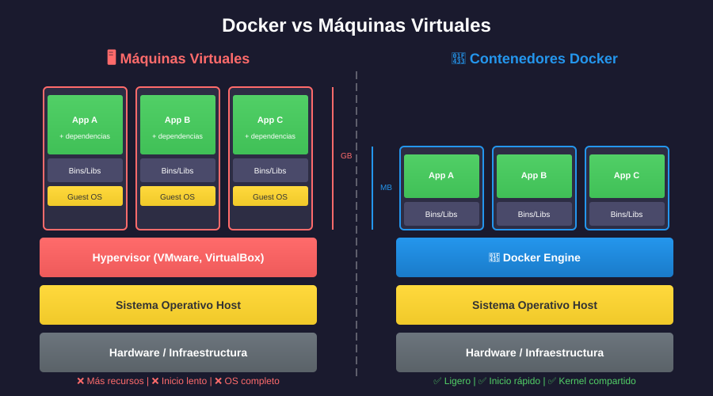

# 📚 Docker vs Máquinas Virtuales

## 🎯 Objetivos de Aprendizaje

Al finalizar esta sección, serás capaz de:

- Diferenciar contenedores de máquinas virtuales
- Entender cuándo usar cada tecnología
- Comprender la arquitectura de ambas soluciones

---

## 🆚 Comparación Visual



### Máquinas Virtuales

```
┌─────────────────────────────────────────────────────────────┐
│                      HARDWARE FÍSICO                         │
├─────────────────────────────────────────────────────────────┤
│                    SISTEMA OPERATIVO HOST                    │
├─────────────────────────────────────────────────────────────┤
│                       HYPERVISOR                             │
│                  (VMware, VirtualBox, KVM)                   │
├───────────────┬───────────────┬───────────────┬─────────────┤
│      VM 1     │      VM 2     │      VM 3     │    ...      │
├───────────────┼───────────────┼───────────────┼─────────────┤
│   Guest OS    │   Guest OS    │   Guest OS    │  Guest OS   │
│   (Ubuntu)    │   (CentOS)    │   (Windows)   │  (Debian)   │
├───────────────┼───────────────┼───────────────┼─────────────┤
│   Binarios    │   Binarios    │   Binarios    │  Binarios   │
│   Librerías   │   Librerías   │   Librerías   │  Librerías  │
├───────────────┼───────────────┼───────────────┼─────────────┤
│     App A     │     App B     │     App C     │    App D    │
└───────────────┴───────────────┴───────────────┴─────────────┘
```

### Contenedores Docker

```
┌─────────────────────────────────────────────────────────────┐
│                      HARDWARE FÍSICO                         │
├─────────────────────────────────────────────────────────────┤
│                    SISTEMA OPERATIVO HOST                    │
├─────────────────────────────────────────────────────────────┤
│                      DOCKER ENGINE                           │
├───────────────┬───────────────┬───────────────┬─────────────┤
│  Container 1  │  Container 2  │  Container 3  │    ...      │
├───────────────┼───────────────┼───────────────┼─────────────┤
│   Binarios    │   Binarios    │   Binarios    │  Binarios   │
│   Librerías   │   Librerías   │   Librerías   │  Librerías  │
├───────────────┼───────────────┼───────────────┼─────────────┤
│     App A     │     App B     │     App C     │    App D    │
└───────────────┴───────────────┴───────────────┴─────────────┘
```

> 💡 **Diferencia clave**: Los contenedores comparten el kernel del sistema operativo host.

---

## 📊 Comparativa Detallada

| Característica   | Máquina Virtual     | Contenedor             |
| ---------------- | ------------------- | ---------------------- |
| **Arranque**     | Minutos             | Segundos               |
| **Tamaño**       | GB (1-20+ GB)       | MB (10-500 MB)         |
| **RAM mínima**   | 512 MB - 2 GB       | 1-50 MB                |
| **Aislamiento**  | Completo (hardware) | Proceso (kernel)       |
| **SO Guest**     | Cualquiera          | Comparte kernel host   |
| **Densidad**     | 10-50 por servidor  | 100-1000+ por servidor |
| **Portabilidad** | Media               | Alta                   |
| **Overhead**     | Alto                | Mínimo                 |

---

## ⚙️ ¿Cómo Funcionan?

### Máquina Virtual

1. El **Hypervisor** emula hardware virtual
2. Cada VM tiene su **propio kernel** y SO completo
3. Aislamiento a nivel de **hardware virtualizado**
4. Recursos asignados de forma **estática**

### Contenedor Docker

1. **Docker Engine** gestiona contenedores
2. Todos comparten el **kernel del host**
3. Aislamiento mediante **namespaces** y **cgroups**
4. Recursos asignados de forma **dinámica**

---

## 🔧 Tecnologías de Aislamiento en Linux

### Namespaces (Aislamiento)

| Namespace | Aísla                       |
| --------- | --------------------------- |
| **PID**   | Procesos                    |
| **NET**   | Interfaces de red           |
| **MNT**   | Puntos de montaje           |
| **UTS**   | Hostname                    |
| **IPC**   | Comunicación entre procesos |
| **USER**  | UIDs/GIDs                   |

### Control Groups (cgroups) - Límites

- CPU
- Memoria
- I/O de disco
- Red

```bash
# Ejemplo: Limitar un contenedor a 512MB de RAM y 50% CPU
docker run -m 512m --cpus="0.5" nginx:alpine
```

---

## 🤔 ¿Cuándo Usar Cada Uno?

### ✅ Usa Máquinas Virtuales cuando:

- Necesites ejecutar **diferentes sistemas operativos** (Windows + Linux)
- Requieras **aislamiento completo** por seguridad
- Ejecutes aplicaciones que necesiten **acceso directo al hardware**
- Trabajes con **software legacy** que no se puede contenedorizar

### ✅ Usa Contenedores cuando:

- Desarrolles **aplicaciones modernas** (microservicios)
- Necesites **portabilidad** entre entornos
- Quieras **escalar rápidamente**
- Busques **eficiencia** en uso de recursos
- Implementes **CI/CD pipelines**

---

## 🤝 Mejor de Ambos Mundos

En la práctica, **ambas tecnologías coexisten**:

```
┌─────────────────────────────────────────────────────────────┐
│                      SERVIDOR FÍSICO                         │
├─────────────────────────────────────────────────────────────┤
│                        HYPERVISOR                            │
├──────────────────────────────┬──────────────────────────────┤
│           VM Linux           │          VM Windows          │
├──────────────────────────────┼──────────────────────────────┤
│        Docker Engine         │        IIS / .NET            │
├───────────┬──────────────────┤                              │
│ Container │ Container        │      Aplicación .NET         │
│   (API)   │   (DB)          │                              │
└───────────┴──────────────────┴──────────────────────────────┘
```

---

## 📈 Rendimiento Real

### Tiempo de Arranque

| Tecnología          | Tiempo         |
| ------------------- | -------------- |
| VM (Ubuntu)         | 30-60 segundos |
| Contenedor (Alpine) | < 1 segundo    |

### Uso de Disco

| Tecnología        | Tamaño  |
| ----------------- | ------- |
| VM Ubuntu         | ~2.5 GB |
| Contenedor Alpine | ~5 MB   |
| Contenedor Ubuntu | ~77 MB  |

### Densidad

```
Servidor con 64GB RAM:

VMs (4GB c/u):     ~16 máquinas virtuales
Contenedores:      ~500+ contenedores
```

---

## ✅ Verificación de Aprendizaje

1. ¿Qué comparten los contenedores que las VMs no?
2. ¿Qué tecnología de Linux permite limitar recursos (CPU, memoria)?
3. ¿Cuándo elegirías una VM sobre un contenedor?
4. ¿Por qué los contenedores son más ligeros que las VMs?

---

## 🔗 Navegación

| ← Anterior                                           | Siguiente →                                           |
| ---------------------------------------------------- | ----------------------------------------------------- |
| [01 - Introducción](01-introduccion-contenedores.md) | [03 - Arquitectura Docker](03-arquitectura-docker.md) |
