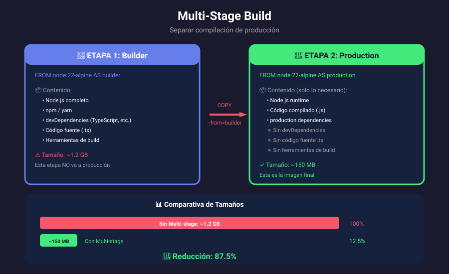
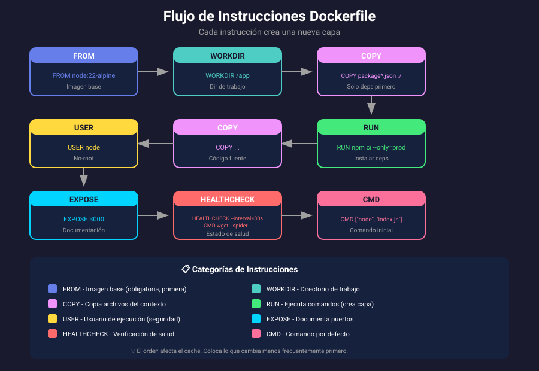
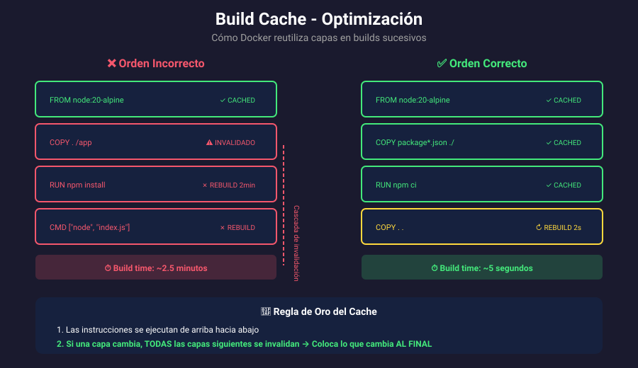
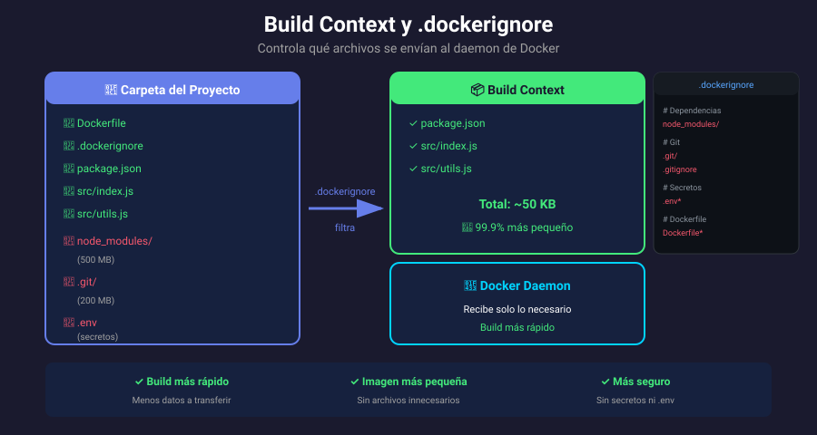

# 🎨 Assets - Semana 02

Diagramas y recursos visuales para la semana de **Imágenes Docker**.

---

## 📊 Catálogo de Diagramas

| #   | Archivo                                              | Descripción                              | Usado en              |
| --- | ---------------------------------------------------- | ---------------------------------------- | --------------------- |
| 1   | [01-sistema-capas.svg](01-sistema-capas.svg)         | Sistema de capas Docker, Copy-on-Write   | Teoría: Anatomía      |
| 2   | [02-multi-stage-build.svg](02-multi-stage-build.svg) | Multi-stage build: Builder vs Production | Teoría: Optimización  |
| 3   | [03-dockerfile-flujo.svg](03-dockerfile-flujo.svg)   | Flujo de instrucciones Dockerfile        | Teoría: Dockerfile    |
| 4   | [04-build-cache.svg](04-build-cache.svg)             | Optimización de Build Cache              | Teoría: Optimización  |
| 5   | [05-build-context.svg](05-build-context.svg)         | Build Context y .dockerignore            | Teoría: Build Context |

---

## 🖼️ Vista Previa

### 01 - Sistema de Capas

Muestra la arquitectura de capas de Docker:

- Capas de imagen (solo lectura)
- Capa del contenedor (lectura/escritura)
- Mecanismo Copy-on-Write

### 02 - Multi-Stage Build

Compara las etapas de un multi-stage build:

- Etapa Builder con todas las herramientas
- Etapa Production con solo lo necesario
- Reducción de ~87% en tamaño

### 03 - Flujo Dockerfile

Diagrama del flujo de instrucciones:

- FROM → WORKDIR → COPY → RUN → USER → EXPOSE → CMD
- Categorías de instrucciones con colores
- Orden recomendado

### 04 - Build Cache

Compara el impacto del orden en el caché:

- ❌ Orden incorrecto: invalidación en cascada
- ✅ Orden correcto: máximo aprovechamiento de caché
- Diferencia de tiempo: 2.5 min vs 5 segundos

### 05 - Build Context

Visualiza el filtrado de archivos:

- Carpeta del proyecto (~750 MB)
- Build context filtrado (~50 KB)
- Ejemplo de .dockerignore

---

## 📐 Especificaciones Técnicas

| Propiedad      | Valor                   |
| -------------- | ----------------------- |
| **Formato**    | SVG (vectorial)         |
| **Ancho**      | 900px                   |
| **Tema**       | Oscuro (#1a1a2e)        |
| **Fuentes**    | Segoe UI, Consolas      |
| **Gradientes** | Personalizados por tipo |

---

## 🎨 Paleta de Colores

| Color       | Hex       | Uso                         |
| ----------- | --------- | --------------------------- |
| 🔵 Azul     | `#667eea` | FROM, instrucciones base    |
| 🟢 Verde    | `#43e97b` | Éxito, cached, optimizado   |
| 🔴 Rojo     | `#f5576c` | Error, invalidado, excluido |
| 🟡 Amarillo | `#ffd93d` | Advertencia, USER           |
| 🟣 Púrpura  | `#764ba2` | Gradientes, COPY            |
| 🔷 Cyan     | `#00d4ff` | Docker, puertos             |

---

## 📝 Uso en Markdown

```markdown









```

---

## 🔧 Herramientas de Edición

Los SVGs pueden editarse con:

- **Inkscape** (gratuito, open source)
- **Figma** (gratuito para uso personal)
- **Adobe Illustrator**
- **VS Code** (con extensión SVG Preview)

---

> **Nota**: No usar ASCII art para diagramas. Todos los diagramas deben ser SVG siguiendo el estilo visual definido.
