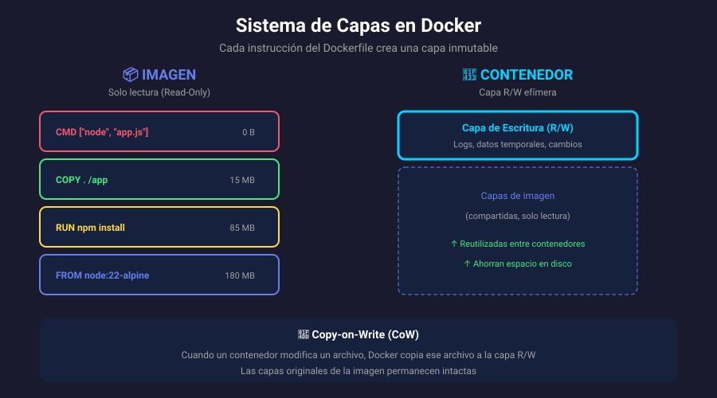

# 📚 Anatomía de una Imagen Docker

## 🎯 Objetivos de Aprendizaje

Al finalizar esta sección, serás capaz de:

- Comprender qué es una imagen Docker
- Entender el sistema de capas (layers)
- Diferenciar entre imagen y contenedor
- Conocer cómo se almacenan y comparten las capas

---

## 🤔 ¿Qué es una Imagen Docker?

Una **imagen Docker** es una plantilla de **solo lectura** que contiene todo lo necesario para ejecutar una aplicación:

| Componente        | Descripción                                          |
| ----------------- | ---------------------------------------------------- |
| **Sistema base**  | Sistema operativo mínimo (Alpine, Ubuntu, Debian...) |
| **Dependencias**  | Librerías, paquetes, runtime                         |
| **Código**        | Tu aplicación                                        |
| **Configuración** | Variables de entorno, archivos de config             |
| **Metadatos**     | Instrucciones de ejecución (CMD, ENTRYPOINT)         |

> 💡 **Analogía**: Una imagen es como una **receta de cocina** - define todos los ingredientes y pasos, pero no es el plato final. El **contenedor** es el plato cocinado.

---

## 📊 Sistema de Capas (Layers)



### ¿Qué son las Capas?

Las imágenes Docker están compuestas por **capas apiladas**, donde cada capa representa un cambio o instrucción del Dockerfile.

| Capa | Instrucción           | Tamaño | Descripción                     |
| ---- | --------------------- | ------ | ------------------------------- |
| 5    | `CMD`                 | 0 B    | Comando de inicio (metadata)    |
| 4    | `COPY app.js`         | 2 KB   | Código de la aplicación         |
| 3    | `RUN npm install`     | 50 MB  | Dependencias instaladas         |
| 2    | `WORKDIR /app`        | 0 B    | Cambio de directorio (metadata) |
| 1    | `FROM node:22-alpine` | 180 MB | Imagen base                     |

### Características de las Capas

| Característica    | Descripción                                                |
| ----------------- | ---------------------------------------------------------- |
| **Solo lectura**  | Una vez creadas, las capas no se modifican                 |
| **Compartidas**   | Múltiples imágenes pueden compartir capas comunes          |
| **Cacheadas**     | Docker reutiliza capas sin cambios para builds más rápidos |
| **Incrementales** | Cada capa solo contiene los cambios respecto a la anterior |

---

## 🔄 Copy-on-Write (CoW)

Cuando un contenedor se ejecuta, Docker añade una **capa de escritura** temporal sobre las capas de solo lectura de la imagen.

| Tipo de Capa            | Permisos                | Persistencia | Descripción                |
| ----------------------- | ----------------------- | ------------ | -------------------------- |
| **Capas de imagen**     | Solo lectura (R)        | Permanente   | Definidas en el Dockerfile |
| **Capa del contenedor** | Lectura/Escritura (R/W) | Temporal     | Cambios en runtime         |

### Comportamiento Copy-on-Write

1. **Lectura**: Se busca el archivo desde la capa superior hacia abajo
2. **Escritura**: Se copia el archivo a la capa R/W y se modifica ahí
3. **Eliminación**: Se marca como "eliminado" en la capa R/W (whiteout)

```bash
# Ejemplo: Ver capas de una imagen
docker history nginx:alpine

# Salida ejemplo:
# IMAGE          CREATED       CREATED BY                                      SIZE
# a6eb2a334a9f   2 days ago    CMD ["nginx" "-g" "daemon off;"]                0B
# <missing>      2 days ago    STOPSIGNAL SIGQUIT                              0B
# <missing>      2 days ago    EXPOSE map[80/tcp:{}]                           0B
# <missing>      2 days ago    ENTRYPOINT ["/docker-entrypoint.sh"]            0B
# <missing>      2 days ago    COPY file:... in /docker-entrypoint.d           4.62kB
# ...
```

---

## 📦 Imagen vs Contenedor

| Aspecto            | Imagen               | Contenedor              |
| ------------------ | -------------------- | ----------------------- |
| **Estado**         | Estática (inmutable) | Dinámico (en ejecución) |
| **Capas**          | Solo lectura         | Capa R/W adicional      |
| **Persistencia**   | Permanente           | Efímero por defecto     |
| **Analogía**       | Clase (POO)          | Instancia/Objeto        |
| **Almacenamiento** | Registry / Local     | Solo local              |

```bash
# Una imagen puede crear múltiples contenedores
docker run -d --name web1 nginx:alpine
docker run -d --name web2 nginx:alpine
docker run -d --name web3 nginx:alpine

# Todos comparten la misma imagen base
docker images nginx:alpine
# REPOSITORY   TAG       IMAGE ID       SIZE
# nginx        alpine    a6eb2a334a9f   42.6MB  # ← Solo una copia
```

---

## 🏷️ Identificación de Imágenes

### Image ID

Cada imagen tiene un **ID único** basado en el hash SHA256 de su contenido.

```bash
docker images --no-trunc
# REPOSITORY   TAG       IMAGE ID                                                           SIZE
# nginx        alpine    sha256:a6eb2a334a9f1a28c4a9f8b5c1e2f3a4b5c6d7e8f9a0b1c2d3e4f5a6b7c8d9   42.6MB
```

### Tags (Etiquetas)

Los **tags** son nombres legibles para identificar versiones de una imagen.

```bash
# Formato: repositorio:tag
nginx:latest
nginx:1.25
nginx:1.25-alpine
node:22-slim
python:3.12-bookworm
```

| Componente     | Descripción            | Ejemplo                          |
| -------------- | ---------------------- | -------------------------------- |
| **Registry**   | Servidor de imágenes   | `docker.io` (por defecto)        |
| **Namespace**  | Usuario u organización | `library` (oficial), `miusuario` |
| **Repository** | Nombre de la imagen    | `nginx`, `node`, `python`        |
| **Tag**        | Versión específica     | `latest`, `1.25`, `alpine`       |

```bash
# Nombre completo de una imagen
docker.io/library/nginx:1.25-alpine
#    │        │      │      │
#    │        │      │      └── Tag
#    │        │      └── Repositorio
#    │        └── Namespace (library = oficial)
#    └── Registry
```

---

## 💾 Almacenamiento de Imágenes

### Local

```bash
# Ver imágenes locales
docker images

# Ver uso de disco
docker system df

# Ubicación física (Linux)
/var/lib/docker/overlay2/
```

### Registry (Remoto)

| Registry                      | URL                   | Descripción              |
| ----------------------------- | --------------------- | ------------------------ |
| **Docker Hub**                | hub.docker.com        | Registry público oficial |
| **GitHub Container Registry** | ghcr.io               | Integrado con GitHub     |
| **Amazon ECR**                | _.ecr._.amazonaws.com | AWS                      |
| **Google GCR**                | gcr.io                | Google Cloud             |
| **Azure ACR**                 | \*.azurecr.io         | Microsoft Azure          |

```bash
# Descargar imagen de Docker Hub
docker pull nginx:alpine

# Subir imagen a Docker Hub
docker push miusuario/miapp:v1.0
```

---

## 🔍 Comandos de Inspección

```bash
# Listar imágenes locales
docker images
docker image ls

# Ver historial de capas
docker history nginx:alpine

# Inspeccionar metadatos
docker inspect nginx:alpine

# Ver tamaño detallado
docker images --format "table {{.Repository}}\t{{.Tag}}\t{{.Size}}"

# Filtrar imágenes
docker images --filter "dangling=true"    # Sin tag
docker images --filter "reference=nginx"  # Por nombre
```

---

## ✅ Verificación de Aprendizaje

1. ¿Qué contiene una capa de imagen Docker?
2. ¿Por qué las capas son de solo lectura?
3. ¿Cómo se beneficia Docker del sistema de capas compartidas?
4. ¿Qué sucede cuando modificas un archivo dentro de un contenedor?
5. ¿Cuál es la diferencia entre Image ID y Tag?

---

## 🔗 Navegación

| Inicio                           | Siguiente →                                       |
| -------------------------------- | ------------------------------------------------- |
| [Volver al índice](../README.md) | [02 - Dockerfile Básico](02-dockerfile-basico.md) |
