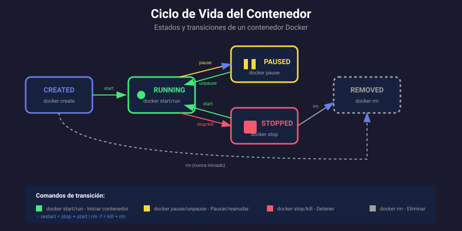

# 📚 Ciclo de Vida del Contenedor

## 🎯 Objetivos de Aprendizaje

Al finalizar esta sección, serás capaz de:

- Comprender los diferentes estados de un contenedor
- Gestionar transiciones entre estados
- Diferenciar entre `docker run`, `create`, `start`, `stop`
- Usar correctamente `restart`, `pause` y `kill`

---

## 📊 Estados del Contenedor



Un contenedor Docker puede estar en uno de los siguientes estados:

| Estado      | Descripción                             | Comando para llegar |
| ----------- | --------------------------------------- | ------------------- |
| **Created** | Contenedor creado pero nunca iniciado   | `docker create`     |
| **Running** | Contenedor en ejecución activa          | `docker start/run`  |
| **Paused**  | Procesos suspendidos temporalmente      | `docker pause`      |
| **Stopped** | Contenedor detenido (proceso terminado) | `docker stop`       |
| **Removed** | Contenedor eliminado del sistema        | `docker rm`         |

---

## 🚀 Crear Contenedores

### docker create vs docker run

```bash
# docker create: Solo crea el contenedor (estado: created)
docker create --name mi-nginx nginx:alpine
# El contenedor existe pero NO está corriendo

# docker run: Crea + Inicia (estado: running)
docker run -d --name mi-web nginx:alpine
# El contenedor se crea Y se inicia automáticamente
```

| Comando         | Crea | Inicia | Estado Final |
| --------------- | ---- | ------ | ------------ |
| `docker create` | ✅   | ❌     | Created      |
| `docker run`    | ✅   | ✅     | Running      |

### Opciones comunes de creación

```bash
docker run [opciones] imagen [comando]

# Opciones más usadas:
-d, --detach          # Ejecutar en segundo plano
--name <nombre>       # Asignar nombre al contenedor
-p <host>:<cont>      # Mapear puertos
-v <host>:<cont>      # Montar volúmenes
-e VAR=valor          # Variables de entorno
--rm                  # Eliminar al detenerse
-it                   # Interactivo con terminal
--restart <política>  # Política de reinicio
```

---

## ▶️ Iniciar Contenedores

### docker start

Inicia uno o más contenedores detenidos:

```bash
# Iniciar un contenedor
docker start mi-nginx

# Iniciar múltiples contenedores
docker start web1 web2 web3

# Iniciar con output adjunto (ver logs)
docker start -a mi-nginx

# Iniciar en modo interactivo
docker start -ai mi-contenedor
```

### Opciones de start

| Opción              | Descripción                   |
| ------------------- | ----------------------------- |
| `-a, --attach`      | Adjuntar STDOUT/STDERR        |
| `-i, --interactive` | Adjuntar STDIN del contenedor |

---

## ⏹️ Detener Contenedores

### docker stop vs docker kill

```bash
# docker stop: Detención graceful (SIGTERM → espera → SIGKILL)
docker stop mi-nginx
# Envía SIGTERM, espera 10s, luego SIGKILL

# docker kill: Detención inmediata (SIGKILL)
docker kill mi-nginx
# Termina el proceso inmediatamente
```

| Comando       | Señal   | Timeout | Uso                            |
| ------------- | ------- | ------- | ------------------------------ |
| `docker stop` | SIGTERM | 10s     | Detención normal (recomendado) |
| `docker kill` | SIGKILL | 0s      | Emergencia, proceso bloqueado  |

### Opciones de stop

```bash
# Cambiar timeout de espera
docker stop -t 30 mi-nginx    # Esperar 30 segundos
docker stop --time=5 mi-nginx # Esperar 5 segundos

# Detener múltiples contenedores
docker stop web1 web2 web3

# Detener TODOS los contenedores en ejecución
docker stop $(docker ps -q)
```

---

## 🔄 Reiniciar Contenedores

### docker restart

Equivale a `stop` + `start`:

```bash
# Reiniciar contenedor
docker restart mi-nginx

# Reiniciar con timeout personalizado
docker restart -t 5 mi-nginx

# Reiniciar múltiples
docker restart web1 web2 web3
```

### Políticas de reinicio automático

```bash
# Configurar al crear el contenedor
docker run -d --restart=always nginx

# Actualizar contenedor existente
docker update --restart=unless-stopped mi-nginx
```

| Política         | Descripción                                         |
| ---------------- | --------------------------------------------------- |
| `no`             | No reiniciar automáticamente (default)              |
| `always`         | Siempre reiniciar, incluso si se detuvo manualmente |
| `unless-stopped` | Reiniciar excepto si se detuvo manualmente          |
| `on-failure[:n]` | Reiniciar solo si falla (exit code ≠ 0)             |

```bash
# Ejemplos de políticas
docker run -d --restart=no nginx              # Nunca reinicia
docker run -d --restart=always nginx          # Siempre reinicia
docker run -d --restart=unless-stopped nginx  # Reinicia excepto stop manual
docker run -d --restart=on-failure:3 nginx    # Máximo 3 reintentos si falla
```

---

## ⏸️ Pausar y Reanudar

### docker pause / unpause

Suspende todos los procesos del contenedor usando SIGSTOP:

```bash
# Pausar contenedor (congela procesos)
docker pause mi-nginx

# Ver estado pausado
docker ps
# STATUS: Up 5 minutes (Paused)

# Reanudar contenedor
docker unpause mi-nginx
```

> 💡 **Uso**: Útil para hacer snapshots o liberar CPU temporalmente sin perder el estado del contenedor.

---

## 🗑️ Eliminar Contenedores

### docker rm

Elimina uno o más contenedores detenidos:

```bash
# Eliminar contenedor detenido
docker rm mi-nginx

# Forzar eliminación (incluso si está corriendo)
docker rm -f mi-nginx    # Equivale a: kill + rm

# Eliminar y sus volúmenes anónimos
docker rm -v mi-nginx

# Eliminar múltiples
docker rm web1 web2 web3

# Eliminar TODOS los contenedores detenidos
docker rm $(docker ps -aq -f status=exited)

# O usando prune
docker container prune
```

### Opciones de rm

| Opción        | Descripción                           |
| ------------- | ------------------------------------- |
| `-f, --force` | Forzar eliminación (SIGKILL si corre) |
| `-v`          | Eliminar volúmenes anónimos asociados |
| `-l, --link`  | Eliminar el link especificado         |

---

## 📋 Ver Estado de Contenedores

### docker ps

```bash
# Contenedores en ejecución
docker ps

# Todos los contenedores (incluidos detenidos)
docker ps -a

# Solo IDs
docker ps -q

# Último contenedor creado
docker ps -l

# Filtrar por estado
docker ps -f status=running
docker ps -f status=exited
docker ps -f status=paused

# Filtrar por nombre
docker ps -f name=nginx

# Formato personalizado
docker ps --format "table {{.Names}}\t{{.Status}}\t{{.Ports}}"
```

### Códigos de estado (Exit Codes)

| Exit Code | Significado                           |
| --------- | ------------------------------------- |
| 0         | Éxito - proceso terminó correctamente |
| 1         | Error general de la aplicación        |
| 125       | Error del Docker daemon               |
| 126       | Comando no ejecutable                 |
| 127       | Comando no encontrado                 |
| 137       | SIGKILL (128 + 9) - OOM o docker kill |
| 143       | SIGTERM (128 + 15) - docker stop      |

```bash
# Ver exit code de un contenedor
docker inspect -f '{{.State.ExitCode}}' mi-contenedor
```

---

## 🔧 Comandos Útiles Combinados

```bash
# Crear, iniciar e inspeccionar en secuencia
docker create --name test nginx && \
docker start test && \
docker ps -f name=test

# Ciclo completo
docker run -d --name ciclo nginx && \
sleep 5 && \
docker pause ciclo && \
sleep 2 && \
docker unpause ciclo && \
sleep 2 && \
docker stop ciclo && \
docker rm ciclo

# Reiniciar todos los contenedores
docker restart $(docker ps -q)

# Detener y eliminar todos
docker stop $(docker ps -q) && docker rm $(docker ps -aq)
```

---

## ✅ Verificación de Aprendizaje

1. ¿Cuál es la diferencia entre `docker create` y `docker run`?
2. ¿Qué señal envía `docker stop` vs `docker kill`?
3. ¿Cuándo usarías la política `on-failure`?
4. ¿Qué significa el exit code 137?
5. ¿Cómo eliminarías todos los contenedores detenidos?

---

## 🔗 Navegación

| Inicio                           | Siguiente →                                        |
| -------------------------------- | -------------------------------------------------- |
| [Volver al índice](../README.md) | [02 - Comandos de Gestión](02-comandos-gestion.md) |
