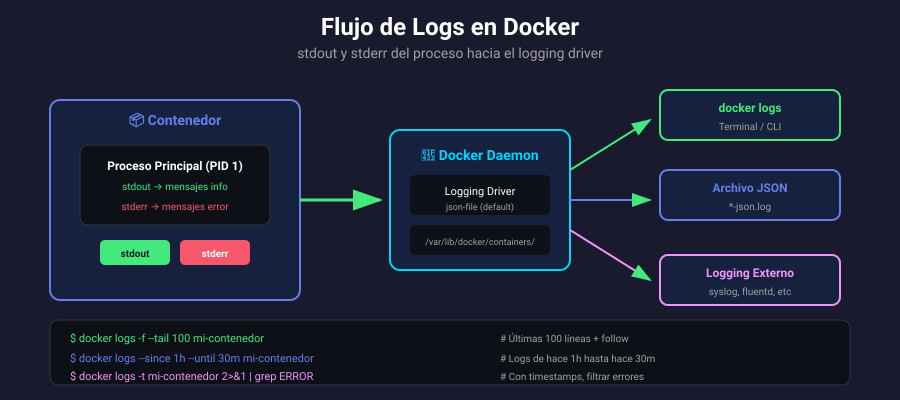

# 📚 Logs y Monitoreo de Contenedores

## 🎯 Objetivos de Aprendizaje

Al finalizar esta sección, serás capaz de:

- Visualizar y filtrar logs de contenedores
- Entender el flujo de stdout/stderr
- Configurar logging drivers
- Monitorear recursos con docker stats
- Implementar rotación de logs

---

## 📊 Flujo de Logs en Docker



Docker captura la salida estándar (stdout) y error estándar (stderr) del proceso principal (PID 1) del contenedor.

```
Proceso (PID 1)
     │
     ├── stdout ──┐
     │            ├──→ Docker Daemon ──→ Logging Driver ──→ Destino
     └── stderr ──┘
```

> ⚠️ **Importante**: Solo se capturan logs del proceso principal. Si tu aplicación escribe a archivos en `/var/log/`, esos logs NO aparecerán en `docker logs`.

---

## 📜 Visualizar Logs

### docker logs

```bash
# Ver todos los logs
docker logs mi-nginx

# Seguir logs en tiempo real (como tail -f)
docker logs -f mi-nginx

# Últimas N líneas
docker logs --tail 100 mi-nginx

# Con timestamps
docker logs -t mi-nginx

# Combinar opciones
docker logs -f --tail 50 -t mi-nginx
```

### Filtrar por tiempo

```bash
# Logs desde hace 1 hora
docker logs --since 1h mi-nginx

# Logs desde fecha específica
docker logs --since 2024-01-15T10:00:00 mi-nginx

# Logs hasta hace 30 minutos
docker logs --until 30m mi-nginx

# Rango de tiempo
docker logs --since 2h --until 1h mi-nginx

# Formatos de tiempo aceptados
--since 10m          # hace 10 minutos
--since 2h           # hace 2 horas
--since 2024-01-15   # desde fecha
--since 1704844800   # timestamp Unix
```

### Opciones de docker logs

| Opción             | Descripción                     |
| ------------------ | ------------------------------- |
| `-f, --follow`     | Seguir logs en tiempo real      |
| `--tail N`         | Mostrar últimas N líneas        |
| `-t, --timestamps` | Añadir timestamps               |
| `--since`          | Logs desde tiempo especificado  |
| `--until`          | Logs hasta tiempo especificado  |
| `--details`        | Mostrar atributos extra del log |

---

## 🎯 Filtrar y Buscar en Logs

### Usando pipes y herramientas Unix

```bash
# Buscar errores
docker logs mi-nginx 2>&1 | grep -i error

# Buscar patrón específico
docker logs mi-app 2>&1 | grep "user login"

# Contar ocurrencias
docker logs mi-app 2>&1 | grep -c "ERROR"

# Últimas líneas con error
docker logs mi-app 2>&1 | grep ERROR | tail -20

# Excluir líneas
docker logs mi-app 2>&1 | grep -v DEBUG

# Guardar logs a archivo
docker logs mi-nginx > nginx.log 2>&1

# Logs con contexto (3 líneas antes y después)
docker logs mi-app 2>&1 | grep -B3 -A3 "Exception"
```

### Separar stdout y stderr

```bash
# Solo stdout
docker logs mi-nginx 2>/dev/null

# Solo stderr
docker logs mi-nginx 2>&1 1>/dev/null

# Redirigir a archivos separados
docker logs mi-nginx > stdout.log 2> stderr.log
```

---

## 🔧 Logging Drivers

Docker soporta diferentes drivers para gestionar logs:

### Drivers disponibles

| Driver      | Descripción                      | Almacenamiento |
| ----------- | -------------------------------- | -------------- |
| `json-file` | JSON en archivos (default)       | Local          |
| `local`     | Formato personalizado optimizado | Local          |
| `syslog`    | Envía a syslog del sistema       | Syslog         |
| `journald`  | Envía a journald (systemd)       | Journald       |
| `fluentd`   | Envía a Fluentd                  | Fluentd        |
| `awslogs`   | Envía a AWS CloudWatch           | AWS            |
| `gcplogs`   | Envía a Google Cloud Logging     | GCP            |
| `splunk`    | Envía a Splunk                   | Splunk         |
| `none`      | Desactiva logging                | Ninguno        |

### Configurar logging driver

```bash
# Al crear el contenedor
docker run -d --log-driver=json-file \
    --log-opt max-size=10m \
    --log-opt max-file=3 \
    nginx

# Ver driver configurado
docker inspect -f '{{.HostConfig.LogConfig.Type}}' mi-nginx

# Ejemplo con syslog
docker run -d --log-driver=syslog \
    --log-opt syslog-address=udp://192.168.1.100:514 \
    --log-opt tag="mi-app" \
    nginx

# Desactivar logs
docker run -d --log-driver=none nginx
```

### Configuración global (daemon.json)

```json
{
  "log-driver": "json-file",
  "log-opts": {
    "max-size": "10m",
    "max-file": "3",
    "labels": "production_status",
    "env": "os,customer"
  }
}
```

Ubicación: `/etc/docker/daemon.json`

---

## 📦 Rotación de Logs

### Problema: Logs creciendo indefinidamente

```bash
# Ver tamaño de logs
du -sh /var/lib/docker/containers/*/*-json.log

# Logs pueden crecer a GB si no se limitan
```

### Solución: Configurar límites

```bash
# Al crear contenedor
docker run -d \
    --log-opt max-size=10m \
    --log-opt max-file=5 \
    nginx

# Esto crea rotación:
# - Máximo 10 MB por archivo
# - Máximo 5 archivos
# - Total máximo: 50 MB de logs
```

### Opciones del driver json-file

| Opción     | Descripción                | Default  |
| ---------- | -------------------------- | -------- |
| `max-size` | Tamaño máximo por archivo  | -1 (∞)   |
| `max-file` | Número máximo de archivos  | 1        |
| `compress` | Comprimir archivos rotados | disabled |
| `labels`   | Labels a incluir en logs   | -        |
| `env`      | Variables ENV a incluir    | -        |

```bash
# Configuración recomendada para producción
docker run -d \
    --log-driver=json-file \
    --log-opt max-size=50m \
    --log-opt max-file=5 \
    --log-opt compress=true \
    mi-app
```

---

## 📊 Monitoreo de Recursos

### docker stats

Monitoreo en tiempo real del uso de recursos:

```bash
# Stats de todos los contenedores
docker stats

# Contenedor específico
docker stats mi-nginx

# Sin refresh (una lectura)
docker stats --no-stream

# Múltiples contenedores
docker stats web1 web2 db

# Formato personalizado
docker stats --format "table {{.Name}}\t{{.CPUPerc}}\t{{.MemUsage}}\t{{.MemPerc}}"

# Solo valores (sin headers)
docker stats --no-stream --format "{{.Name}}: CPU={{.CPUPerc}}, MEM={{.MemPerc}}"
```

### Columnas de stats

| Columna      | Descripción                        |
| ------------ | ---------------------------------- |
| CONTAINER ID | ID corto del contenedor            |
| NAME         | Nombre del contenedor              |
| CPU %        | % de CPU del host usado            |
| MEM USAGE    | Memoria usada / Límite             |
| MEM %        | % de memoria del límite usado      |
| NET I/O      | Datos recibidos / enviados por red |
| BLOCK I/O    | Datos leídos / escritos a disco    |
| PIDS         | Número de procesos/threads         |

### Placeholders para --format

```bash
{{.Container}}    # ID del contenedor
{{.Name}}         # Nombre
{{.ID}}           # ID completo
{{.CPUPerc}}      # % CPU
{{.MemUsage}}     # Uso de memoria
{{.MemPerc}}      # % memoria
{{.NetIO}}        # I/O de red
{{.BlockIO}}      # I/O de disco
{{.PIDs}}         # Número de PIDs
```

---

## 🚨 Eventos del Sistema

### docker events

Monitorea eventos del Docker daemon:

```bash
# Escuchar todos los eventos
docker events

# Filtrar por tipo
docker events --filter type=container
docker events --filter type=image
docker events --filter type=volume
docker events --filter type=network

# Filtrar por evento específico
docker events --filter event=start
docker events --filter event=stop
docker events --filter event=die

# Filtrar por contenedor
docker events --filter container=mi-nginx

# Eventos desde timestamp
docker events --since 1h
docker events --since 2024-01-15T10:00:00

# Formato personalizado
docker events --format '{{.Time}} {{.Type}} {{.Action}} {{.Actor.Attributes.name}}'
```

### Tipos de eventos

| Tipo      | Eventos comunes                          |
| --------- | ---------------------------------------- |
| container | create, start, stop, die, kill, pause... |
| image     | pull, push, tag, untag, delete...        |
| volume    | create, mount, unmount, destroy          |
| network   | create, connect, disconnect, destroy     |

---

## 📋 Script de Monitoreo Básico

```bash
#!/bin/bash
# monitor.sh - Script de monitoreo básico

echo "=== Docker System Status ==="
echo ""

echo "📊 Recursos del sistema:"
docker stats --no-stream --format "table {{.Name}}\t{{.CPUPerc}}\t{{.MemUsage}}"

echo ""
echo "📦 Contenedores en ejecución:"
docker ps --format "table {{.Names}}\t{{.Status}}\t{{.Ports}}"

echo ""
echo "⚠️ Contenedores con errores recientes:"
for container in $(docker ps -q); do
    name=$(docker inspect -f '{{.Name}}' $container | tr -d '/')
    errors=$(docker logs --since 5m $container 2>&1 | grep -ci error)
    if [ $errors -gt 0 ]; then
        echo "  $name: $errors errores en últimos 5 min"
    fi
done

echo ""
echo "💾 Uso de disco Docker:"
docker system df
```

---

## ✅ Verificación de Aprendizaje

1. ¿Por qué solo se capturan logs del proceso PID 1?
2. ¿Cómo verías solo los logs de errores de la última hora?
3. ¿Qué logging driver usarías para enviar logs a AWS?
4. ¿Cómo evitarías que los logs crezcan indefinidamente?
5. ¿Cuál es la diferencia entre `docker stats` y `docker events`?

---

## 🔗 Navegación

| ← Anterior                                         | Siguiente →                                 |
| -------------------------------------------------- | ------------------------------------------- |
| [02 - Comandos de Gestión](02-comandos-gestion.md) | [04 - Exec y Comandos](04-exec-comandos.md) |
