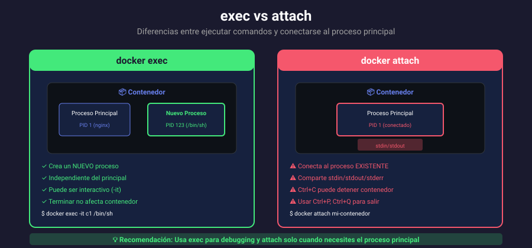

# 📚 Exec, Attach y Comandos Interactivos

## 🎯 Objetivos de Aprendizaje

Al finalizar esta sección, serás capaz de:

- Diferenciar entre `exec` y `attach`
- Ejecutar comandos dentro de contenedores
- Establecer sesiones interactivas
- Debuggear contenedores en ejecución
- Usar `exec` de forma segura

---

## 🔄 Exec vs Attach



### Diferencias clave

| Característica | docker exec                 | docker attach                |
| -------------- | --------------------------- | ---------------------------- |
| Proceso        | Crea nuevo proceso          | Conecta a PID 1              |
| Uso típico     | Debugging, inspección       | Ver output del proceso main  |
| Al salir       | Proceso exec termina        | Puede detener contenedor     |
| Múltiples      | Múltiples sesiones posibles | Una conexión a la vez        |
| Interactivo    | `-it` para shell            | Depende del proceso original |

---

## 🔧 Docker Exec

### Ejecutar comandos

```bash
# Sintaxis
docker exec [OPCIONES] CONTENEDOR COMANDO [ARGS...]

# Ejecutar comando simple
docker exec mi-nginx ls /etc/nginx

# Ver configuración
docker exec mi-nginx cat /etc/nginx/nginx.conf

# Verificar proceso
docker exec mi-nginx ps aux

# Comprobar conectividad
docker exec mi-nginx ping -c 3 google.com
```

### Shell interactivo

```bash
# Shell bash (si disponible)
docker exec -it mi-nginx /bin/bash

# Shell sh (Alpine, imágenes mínimas)
docker exec -it mi-nginx /bin/sh

# Shell como root
docker exec -it -u root mi-nginx /bin/sh

# Shell como usuario específico
docker exec -it -u nginx mi-nginx /bin/sh
```

### Opciones de exec

| Opción              | Descripción             |
| ------------------- | ----------------------- |
| `-i, --interactive` | Mantener STDIN abierto  |
| `-t, --tty`         | Asignar pseudo-TTY      |
| `-d, --detach`      | Ejecutar en background  |
| `-u, --user`        | Usuario o UID           |
| `-w, --workdir`     | Directorio de trabajo   |
| `-e, --env`         | Variables de entorno    |
| `--privileged`      | Dar permisos extendidos |

### Ejemplos prácticos

```bash
# Ejecutar como otro usuario
docker exec -u www-data mi-php whoami

# Con directorio de trabajo específico
docker exec -w /var/www/html mi-php ls -la

# Pasar variables de entorno
docker exec -e DEBUG=true mi-app ./run-tests.sh

# Comando en background
docker exec -d mi-app /scripts/cleanup.sh

# Múltiples comandos con shell
docker exec mi-nginx sh -c "cd /var/log/nginx && ls -la && tail -5 access.log"
```

---

## 📎 Docker Attach

### Conectar al proceso principal

```bash
# Conectar a PID 1 del contenedor
docker attach mi-nginx

# El output que ves es stdout/stderr del proceso principal
```

### Detach sin detener

```bash
# Para desconectar SIN detener el contenedor:
# Presiona: Ctrl + P, luego Ctrl + Q

# Configurar secuencia de detach personalizada
docker attach --detach-keys="ctrl-x" mi-contenedor
```

> ⚠️ **Cuidado**: Si presionas `Ctrl+C` en attach, puedes detener el contenedor si el proceso principal responde a SIGINT.

### Opciones de attach

| Opción          | Descripción                               |
| --------------- | ----------------------------------------- |
| `--no-stdin`    | No conectar STDIN                         |
| `--sig-proxy`   | Enviar señales al proceso (default: true) |
| `--detach-keys` | Secuencia de teclas para desconectar      |

---

## 🔍 Casos de Uso

### 1. Debugging de aplicación

```bash
# Inspeccionar contenedor
docker exec -it mi-app /bin/sh

# Dentro del contenedor:
$ ps aux                    # Ver procesos
$ netstat -tlnp             # Ver puertos
$ cat /proc/1/environ       # Variables de entorno
$ df -h                     # Espacio en disco
$ free -m                   # Memoria
```

### 2. Verificar configuración

```bash
# Ver configuración de nginx
docker exec mi-nginx nginx -T

# Ver configuración de MySQL
docker exec mi-mysql mysqladmin variables

# Ver versión de Node
docker exec mi-node node --version
```

### 3. Interactuar con base de datos

```bash
# MySQL client
docker exec -it mi-mysql mysql -u root -p

# PostgreSQL client
docker exec -it mi-postgres psql -U postgres

# Redis CLI
docker exec -it mi-redis redis-cli

# MongoDB shell
docker exec -it mi-mongo mongosh
```

### 4. Backup y restore

```bash
# Backup MySQL
docker exec mi-mysql mysqldump -u root -p mydatabase > backup.sql

# Restore MySQL
docker exec -i mi-mysql mysql -u root -p mydatabase < backup.sql

# Backup PostgreSQL
docker exec mi-postgres pg_dump -U postgres mydb > backup.sql
```

### 5. Ejecutar scripts de mantenimiento

```bash
# Limpiar cache
docker exec mi-app php artisan cache:clear

# Ejecutar migraciones
docker exec mi-app python manage.py migrate

# Ejecutar tests
docker exec mi-app npm test
```

---

## 🛡️ Seguridad con Exec

### Ejecutar como no-root

```bash
# Crear usuario en Dockerfile
# USER appuser

# Exec como usuario específico
docker exec -u appuser mi-app whoami

# Verificar usuario actual
docker exec mi-app id
```

### Limitar capabilities

```bash
# Contenedor sin privilegios extra
docker run -d --name secure-app \
    --cap-drop=ALL \
    --cap-add=NET_BIND_SERVICE \
    nginx

# Exec hereda las restricciones del contenedor
docker exec secure-app cat /etc/shadow
# Permission denied
```

### Auditoría de exec

```bash
# Ver todos los exec realizados
docker events --filter event=exec_start --since 1h

# Log de exec con detalles
docker events --filter event=exec_start \
    --format '{{.Time}} exec by user={{.Actor.Attributes.execID}}'
```

---

## 📋 Debugging Avanzado

### Contenedor sin shell

Algunos contenedores (distroless, scratch) no tienen shell:

```bash
# Error: OCI runtime exec failed: executable file not found
docker exec -it mi-app /bin/sh
# Error: executable file not found in $PATH

# Solución 1: Usar debug container (Docker 1.25+)
docker debug mi-app

# Solución 2: Copiar binarios necesarios
docker cp /usr/bin/bash mi-app:/tmp/
docker exec -it mi-app /tmp/bash

# Solución 3: nsenter desde host (Linux)
PID=$(docker inspect -f '{{.State.Pid}}' mi-app)
sudo nsenter -t $PID -m -u -i -n -p /bin/sh
```

### Inspeccionar procesos

```bash
# Ver todos los procesos
docker exec mi-app ps auxww

# Ver árbol de procesos
docker exec mi-app pstree -p

# Información de un proceso específico
docker exec mi-app cat /proc/1/status

# Ver file descriptors abiertos
docker exec mi-app ls -la /proc/1/fd/
```

### Verificar red

```bash
# Ver interfaces de red
docker exec mi-app ip addr

# Ver rutas
docker exec mi-app ip route

# DNS lookup
docker exec mi-app nslookup api.example.com

# Verificar conectividad
docker exec mi-app curl -v http://otro-servicio:8080/health
```

---

## 📊 Comparativa de Comandos

| Tarea                    | Comando                              |
| ------------------------ | ------------------------------------ |
| Shell interactivo        | `docker exec -it c1 /bin/sh`         |
| Ejecutar comando         | `docker exec c1 ls -la`              |
| Ver logs del proceso     | `docker attach c1`                   |
| Ejecutar como root       | `docker exec -u root c1 whoami`      |
| Comando en background    | `docker exec -d c1 ./script.sh`      |
| Con variable de entorno  | `docker exec -e VAR=val c1 printenv` |
| En directorio específico | `docker exec -w /app c1 pwd`         |
| Desconectar sin matar    | `Ctrl+P`, `Ctrl+Q`                   |

---

## ⚠️ Errores Comunes

### "executable file not found"

```bash
# Error
docker exec mi-alpine bash
# OCI runtime exec failed: exec: "bash": not found

# Solución: usar sh en Alpine
docker exec mi-alpine sh
```

### "cannot exec in a paused container"

```bash
# Error: contenedor pausado
docker exec mi-app ls
# Error response: cannot exec in a paused container

# Solución: reanudar primero
docker unpause mi-app
docker exec mi-app ls
```

### "container is not running"

```bash
# Error: contenedor detenido
docker exec mi-app ls
# Error: container is not running

# Solución: iniciar primero
docker start mi-app
docker exec mi-app ls
```

---

## ✅ Verificación de Aprendizaje

1. ¿Cuándo usarías `exec` vs `attach`?
2. ¿Cómo ejecutarías un comando como usuario root?
3. ¿Cómo sales de `attach` sin detener el contenedor?
4. ¿Qué haces si el contenedor no tiene shell?
5. ¿Cómo verificarías la conectividad de red desde un contenedor?

---

## 🔗 Navegación

| ← Anterior                                    | Siguiente →                                          |
| --------------------------------------------- | ---------------------------------------------------- |
| [03 - Logs y Monitoreo](03-logs-monitoreo.md) | [05 - Variables de Entorno](05-variables-entorno.md) |
