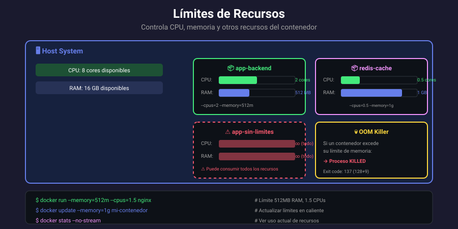

# 📚 Recursos y Límites de Contenedores

## 🎯 Objetivos de Aprendizaje

Al finalizar esta sección, serás capaz de:

- Limitar CPU y memoria de contenedores
- Entender el comportamiento de OOM
- Configurar límites de I/O
- Monitorear uso de recursos
- Aplicar buenas prácticas de recursos

---

## 📊 Vista General de Recursos



Docker permite limitar los recursos que un contenedor puede consumir:

| Recurso | Opciones principales           | Default    |
| ------- | ------------------------------ | ---------- |
| CPU     | `--cpus`, `--cpu-shares`       | Sin límite |
| Memoria | `--memory`, `--memory-swap`    | Sin límite |
| I/O     | `--blkio-weight`, `--device-*` | Sin límite |
| PIDs    | `--pids-limit`                 | Sin límite |

---

## 🧠 Límites de Memoria

### Configurar límite de memoria

```bash
# Límite de memoria (formatos: b, k, m, g)
docker run -d --memory=512m nginx
docker run -d --memory=1g nginx
docker run -d -m 256m nginx  # Forma corta

# Verificar límite
docker inspect -f '{{.HostConfig.Memory}}' mi-nginx
# 536870912 (bytes = 512MB)

# Ver uso actual
docker stats --no-stream mi-nginx
```

### Memoria + Swap

```bash
# Memoria + swap total
docker run -d --memory=512m --memory-swap=1g nginx
# Puede usar 512MB RAM + 512MB swap

# Deshabilitar swap
docker run -d --memory=512m --memory-swap=512m nginx
# memory-swap = memory significa sin swap

# Swap ilimitado
docker run -d --memory=512m --memory-swap=-1 nginx

# Ver configuración
docker inspect -f '{{.HostConfig.MemorySwap}}' mi-nginx
```

### Memory reservation (soft limit)

```bash
# Soft limit: sugerencia, no garantía
docker run -d \
    --memory=1g \
    --memory-reservation=512m \
    nginx

# Docker intentará mantener el contenedor bajo 512MB
# pero puede crecer hasta 1GB si hay recursos disponibles
```

### Comportamiento OOM (Out of Memory)

```bash
# Cuando se excede la memoria:
# 1. Docker mata el proceso principal
# 2. Contenedor se detiene
# 3. Exit code 137 (128 + 9 = SIGKILL)

# Ver si murió por OOM
docker inspect -f '{{.State.OOMKilled}}' mi-app
# true

# Deshabilitar OOM killer (peligroso)
docker run -d --oom-kill-disable --memory=512m nginx

# Score de OOM (prioridad para ser matado, -1000 a 1000)
docker run -d --oom-score-adj=500 nginx  # Más probable de morir
docker run -d --oom-score-adj=-500 nginx # Menos probable
```

---

## ⚡ Límites de CPU

### Limitar número de CPUs

```bash
# Limitar a N CPUs (puede ser decimal)
docker run -d --cpus=2 nginx      # Máximo 2 CPUs
docker run -d --cpus=0.5 nginx    # Medio CPU
docker run -d --cpus=1.5 nginx    # 1.5 CPUs

# Equivalente usando period/quota
docker run -d --cpu-period=100000 --cpu-quota=50000 nginx
# 50000/100000 = 0.5 CPU
```

### CPU shares (peso relativo)

```bash
# Peso relativo cuando hay contención (default: 1024)
docker run -d --cpu-shares=512 --name low-priority nginx
docker run -d --cpu-shares=2048 --name high-priority nginx

# high-priority recibe ~4x más CPU que low-priority
# cuando ambos compiten por CPU

# Sin contención, ambos usan lo que necesiten
```

### Fijar a CPUs específicas

```bash
# Ejecutar solo en CPU 0
docker run -d --cpuset-cpus=0 nginx

# CPUs 0 y 2
docker run -d --cpuset-cpus=0,2 nginx

# Rango de CPUs (0, 1, 2)
docker run -d --cpuset-cpus=0-2 nginx

# Ver CPUs disponibles
lscpu | grep "CPU(s):"

# Verificar configuración
docker inspect -f '{{.HostConfig.CpusetCpus}}' mi-nginx
```

### Tabla resumen de CPU

| Opción          | Descripción                  | Ejemplo               |
| --------------- | ---------------------------- | --------------------- |
| `--cpus`        | Límite de CPUs (decimal)     | `--cpus=1.5`          |
| `--cpu-shares`  | Peso relativo (default 1024) | `--cpu-shares=512`    |
| `--cpuset-cpus` | Fijar a CPUs específicas     | `--cpuset-cpus=0,1`   |
| `--cpu-period`  | Período CFS en μs            | `--cpu-period=100000` |
| `--cpu-quota`   | Cuota CFS en μs              | `--cpu-quota=50000`   |

---

## 💾 Límites de I/O

### Block I/O weight

```bash
# Peso de I/O (10-1000, default 500)
docker run -d --blkio-weight=100 --name low-io nginx
docker run -d --blkio-weight=900 --name high-io nginx

# high-io tiene prioridad cuando hay contención de disco
```

### Limitar velocidad de I/O

```bash
# Limitar lectura (bytes por segundo)
docker run -d \
    --device-read-bps=/dev/sda:1mb \
    nginx

# Limitar escritura
docker run -d \
    --device-write-bps=/dev/sda:1mb \
    nginx

# Limitar IOPS (operaciones por segundo)
docker run -d \
    --device-read-iops=/dev/sda:1000 \
    --device-write-iops=/dev/sda:1000 \
    nginx
```

---

## 🔢 Límites de PIDs

```bash
# Limitar número de procesos
docker run -d --pids-limit=100 nginx

# Previene fork bombs
docker run --pids-limit=50 alpine sh -c ":(){ :|:& };:"
# Se detendrá al alcanzar 50 procesos

# Ver límite actual
docker inspect -f '{{.HostConfig.PidsLimit}}' mi-nginx
```

---

## 📊 Monitoreo de Recursos

### docker stats

```bash
# Monitoreo en tiempo real
docker stats

# Sin refresh
docker stats --no-stream

# Contenedores específicos
docker stats web1 web2 db

# Formato personalizado
docker stats --format "table {{.Name}}\t{{.CPUPerc}}\t{{.MemUsage}}\t{{.MemPerc}}"

# Solo uso de memoria
docker stats --format "{{.Name}}: {{.MemPerc}}"
```

### Ver límites configurados

```bash
# Memoria
docker inspect -f '{{.HostConfig.Memory}}' mi-nginx  # bytes

# CPU
docker inspect -f '{{.HostConfig.NanoCpus}}' mi-nginx  # nanoCPUs
# 1000000000 = 1 CPU

# Todos los límites
docker inspect mi-nginx | jq '.[0].HostConfig | {
    Memory: .Memory,
    MemorySwap: .MemorySwap,
    CpuShares: .CpuShares,
    NanoCpus: .NanoCpus,
    PidsLimit: .PidsLimit
}'
```

### cgroups (Linux)

```bash
# Ver cgroup del contenedor
docker inspect -f '{{.Id}}' mi-nginx

# Leer límites desde cgroups v2
cat /sys/fs/cgroup/docker/<container_id>/memory.max
cat /sys/fs/cgroup/docker/<container_id>/cpu.max

# Uso actual desde cgroups
cat /sys/fs/cgroup/docker/<container_id>/memory.current
cat /sys/fs/cgroup/docker/<container_id>/cpu.stat
```

---

## 🔄 Actualizar Recursos en Caliente

### docker update

```bash
# Actualizar memoria
docker update --memory=1g mi-nginx
docker update --memory=1g --memory-swap=2g mi-nginx

# Actualizar CPU
docker update --cpus=2 mi-nginx
docker update --cpu-shares=512 mi-nginx

# Actualizar límite de PIDs
docker update --pids-limit=200 mi-nginx

# Actualizar múltiples contenedores
docker update --memory=512m web1 web2 web3

# Verificar cambios
docker inspect -f '{{.HostConfig.Memory}}' mi-nginx
```

---

## 🏭 Escenarios Prácticos

### Aplicación web con base de datos

```bash
# Base de datos: más memoria, menos CPU
docker run -d --name db \
    --memory=2g \
    --cpus=1 \
    mysql

# Aplicación: balanceado
docker run -d --name app \
    --memory=512m \
    --cpus=2 \
    myapp

# Cache: memoria alta, CPU bajo
docker run -d --name cache \
    --memory=1g \
    --cpus=0.5 \
    redis
```

### Ambiente de desarrollo vs producción

```bash
# Desarrollo: límites relajados
docker run -d --name dev-app \
    --memory=256m \
    --cpus=0.5 \
    myapp

# Producción: límites estrictos
docker run -d --name prod-app \
    --memory=1g \
    --memory-reservation=512m \
    --cpus=2 \
    --oom-score-adj=-500 \
    --restart=unless-stopped \
    myapp
```

### Testing de comportamiento bajo límites

```bash
# Simular restricción de memoria
docker run -it --memory=50m alpine sh -c "
    # Intentar usar más de 50MB
    dd if=/dev/zero of=/tmp/file bs=1M count=100
"
# Contenedor será matado por OOM

# Simular restricción de CPU
docker run -it --cpus=0.1 alpine sh -c "
    time $(for i in \$(seq 1 1000000); do :; done)
"
```

---

## ✅ Buenas Prácticas

### Siempre establecer límites

```bash
# ❌ Sin límites (un contenedor puede consumir todo)
docker run -d nginx

# ✅ Con límites definidos
docker run -d \
    --memory=512m \
    --cpus=1 \
    nginx
```

### Considerar el entorno

```bash
# Servidor con 16GB RAM, 8 CPUs

# ✅ Dejar margen para el host
docker run -d --memory=12g --cpus=6 app  # 75% de recursos

# ❌ Usar todo
docker run -d --memory=16g --cpus=8 app  # Puede causar problemas
```

### Monitoring y alertas

```bash
# Script de alerta simple
#!/bin/bash
for container in $(docker ps -q); do
    mem=$(docker stats --no-stream --format "{{.MemPerc}}" $container | tr -d '%')
    if (( $(echo "$mem > 80" | bc -l) )); then
        echo "ALERTA: $container usando $mem% de memoria"
    fi
done
```

---

## 📋 Resumen de Opciones

| Opción                 | Descripción           | Ejemplo                     |
| ---------------------- | --------------------- | --------------------------- |
| `--memory`, `-m`       | Límite de memoria     | `-m 512m`                   |
| `--memory-swap`        | Memoria + swap total  | `--memory-swap=1g`          |
| `--memory-reservation` | Soft limit de memoria | `--memory-reservation=256m` |
| `--cpus`               | Límite de CPUs        | `--cpus=2`                  |
| `--cpu-shares`         | Peso relativo de CPU  | `--cpu-shares=512`          |
| `--cpuset-cpus`        | CPUs específicas      | `--cpuset-cpus=0,1`         |
| `--blkio-weight`       | Peso de I/O           | `--blkio-weight=500`        |
| `--pids-limit`         | Máximo de procesos    | `--pids-limit=100`          |

---

## ✅ Verificación de Aprendizaje

1. ¿Qué sucede cuando un contenedor excede su límite de memoria?
2. ¿Cuál es la diferencia entre `--cpus` y `--cpu-shares`?
3. ¿Cómo actualizarías la memoria de un contenedor en ejecución?
4. ¿Qué significa un exit code de 137?
5. ¿Cómo verificarías el uso de recursos de un contenedor?

---

## 🔗 Navegación

| ← Anterior                                           | Inicio                           |
| ---------------------------------------------------- | -------------------------------- |
| [05 - Variables de Entorno](05-variables-entorno.md) | [Volver al índice](../README.md) |
