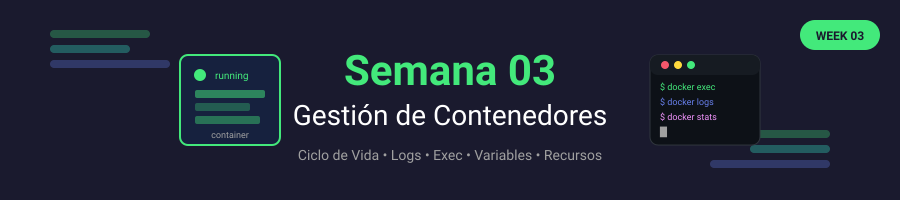

# 🐳 Semana 03: Gestión de Contenedores

<p align="center">
  
</p>

## 🎯 Objetivos de Aprendizaje

Al finalizar esta semana, serás capaz de:

- ✅ Gestionar el ciclo de vida completo de contenedores
- ✅ Inspeccionar y depurar contenedores en ejecución
- ✅ Trabajar con logs y monitoreo básico
- ✅ Configurar variables de entorno
- ✅ Limitar recursos (CPU, memoria)
- ✅ Ejecutar comandos dentro de contenedores

---

## 📚 Requisitos Previos

Antes de comenzar esta semana, debes:

- ✅ Completar la Semana 02 (Imágenes Docker)
- ✅ Saber construir imágenes con Dockerfile
- ✅ Entender el concepto de capas

---

## 🗂️ Estructura de la Semana

```
week-03/
├── README.md                    # Este archivo
├── rubrica-evaluacion.md        # Criterios de evaluación
├── 0-assets/                    # Recursos visuales
│   └── week-03-header.svg
├── 1-teoria/                    # Material teórico
│   ├── 01-ciclo-vida.md
│   ├── 02-logs-debugging.md
│   ├── 03-variables-entorno.md
│   ├── 04-recursos-limites.md
│   └── 05-exec-attach.md
├── 2-ejercicios/                # Ejercicios guiados
│   ├── 01-ciclo-vida/
│   ├── 02-debugging/
│   └── 03-recursos/
├── 3-proyecto/                  # Proyecto semanal
│   ├── README.md
│   ├── starter/
│   └── solution/
├── 4-recursos/                  # Material adicional
│   ├── ebooks-free/
│   ├── videografia/
│   └── webgrafia/
└── 5-glosario/                  # Términos clave
    └── README.md
```

---

## 📝 Contenidos

### 📚 Teoría

| #   | Tema                         | Duración | Archivo                                                     |
| --- | ---------------------------- | -------- | ----------------------------------------------------------- |
| 1   | Ciclo de Vida del Contenedor | 25 min   | [01-ciclo-vida.md](1-teoria/01-ciclo-vida.md)               |
| 2   | Logs y Debugging             | 20 min   | [02-logs-debugging.md](1-teoria/02-logs-debugging.md)       |
| 3   | Variables de Entorno         | 20 min   | [03-variables-entorno.md](1-teoria/03-variables-entorno.md) |
| 4   | Recursos y Límites           | 25 min   | [04-recursos-limites.md](1-teoria/04-recursos-limites.md)   |
| 5   | Exec y Attach                | 15 min   | [05-exec-attach.md](1-teoria/05-exec-attach.md)             |

### 💻 Ejercicios Guiados

| #   | Ejercicio                 | Duración | Carpeta                                       |
| --- | ------------------------- | -------- | --------------------------------------------- |
| 1   | Ciclo de Vida             | 45 min   | [01-ciclo-vida/](2-ejercicios/01-ciclo-vida/) |
| 2   | Debugging de Contenedores | 50 min   | [02-debugging/](2-ejercicios/02-debugging/)   |
| 3   | Gestión de Recursos       | 45 min   | [03-recursos/](2-ejercicios/03-recursos/)     |

### 🚀 Proyecto Semanal

**Sistema de Monitoreo de Contenedores**

Crear un sistema que gestione múltiples contenedores, configure variables de entorno y aplique límites de recursos.

📁 [Ver instrucciones del proyecto](3-proyecto/README.md)

---

## ⏱️ Distribución del Tiempo

| Actividad     | Tiempo      |
| ------------- | ----------- |
| 📖 Teoría     | 1.75 horas  |
| 💻 Ejercicios | 2.5 horas   |
| 🚀 Proyecto   | 1.5 horas   |
| **Total**     | **6 horas** |

---

## 📌 Entregables

- [ ] Ejercicios 01, 02 y 03 completados
- [ ] Proyecto semanal funcional
- [ ] Script de gestión de contenedores
- [ ] Quiz teórico aprobado (≥70%)

---

## 🧪 Criterios de Evaluación

| Evidencia       | Peso | Criterio                             |
| --------------- | ---- | ------------------------------------ |
| 🧠 Conocimiento | 30%  | Quiz teórico aprobado (≥70%)         |
| 💪 Desempeño    | 40%  | Ejercicios completados correctamente |
| 📦 Producto     | 30%  | Proyecto funcional y documentado     |

📋 [Ver rúbrica detallada](rubrica-evaluacion.md)

---

## 💡 Conceptos Clave

- **Ciclo de vida**: created → running → paused → stopped → removed
- **Logs**: Salida estándar (stdout/stderr) del contenedor
- **ENV**: Variables de entorno pasadas al contenedor
- **Resources**: Límites de CPU, memoria, I/O
- **exec**: Ejecutar comandos en contenedor en ejecución
- **attach**: Conectar terminal al proceso principal

---

## ⚠️ Errores Comunes

1. **Contenedor que sale inmediatamente**: El proceso principal termina
2. **Logs vacíos**: La aplicación escribe a archivo en vez de stdout
3. **OOM Killed**: Contenedor excede límite de memoria
4. **Variables no disponibles**: Diferencia entre ARG y ENV

---

## 🔗 Navegación

| ⬅️ Anterior                       | 🏠 Inicio                   | Siguiente ➡️                      |
| --------------------------------- | --------------------------- | --------------------------------- |
| [Semana 02](../week-02/README.md) | [Bootcamp](../../README.md) | [Semana 04](../week-04/README.md) |

---

## 📚 Recursos Adicionales

- [Docker run reference](https://docs.docker.com/engine/reference/run/)
- [Resource constraints](https://docs.docker.com/config/containers/resource_constraints/)
- [View container logs](https://docs.docker.com/config/containers/logging/)
