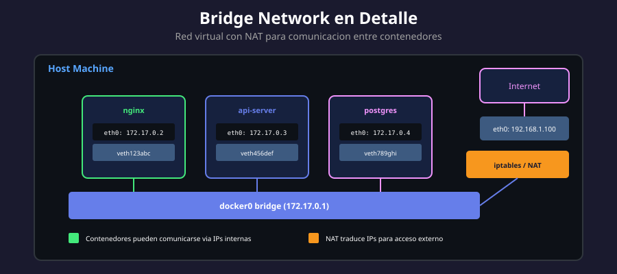

# 🌉 Bridge Network en Profundidad

<p align="center">
  
</p>

## 📋 Tabla de Contenidos

- [¿Qué es Bridge Network?](#qué-es-bridge-network)
- [Arquitectura Interna](#arquitectura-interna)
- [Red Bridge Default vs Personalizada](#red-bridge-default-vs-personalizada)
- [Crear Redes Bridge](#crear-redes-bridge)
- [Configuración Avanzada](#configuración-avanzada)
- [Inspeccionar Redes](#inspeccionar-redes)
- [Casos de Uso](#casos-de-uso)

---

## ¿Qué es Bridge Network?

Bridge network es el driver de red por defecto en Docker. Crea un **puente de red virtual** (similar a un switch) que permite la comunicación entre contenedores.

### Componentes Principales

| Componente | Descripción                                                |
| ---------- | ---------------------------------------------------------- |
| `docker0`  | Interfaz bridge default creada por Docker                  |
| `veth`     | Virtual Ethernet pairs que conectan contenedores al bridge |
| `iptables` | Reglas de firewall y NAT para tráfico                      |
| DNS Server | Servidor DNS interno (127.0.0.11)                          |

### Funcionamiento

```
┌─────────────────────────────────────────────────────┐
│                    Host Machine                      │
│                                                      │
│  ┌──────────┐   ┌──────────┐   ┌──────────┐        │
│  │Container1│   │Container2│   │Container3│        │
│  │ eth0     │   │ eth0     │   │ eth0     │        │
│  └────┬─────┘   └────┬─────┘   └────┬─────┘        │
│       │veth          │veth          │veth          │
│  ┌────┴──────────────┴──────────────┴────┐         │
│  │          docker0 (bridge)              │         │
│  │          172.17.0.1                    │         │
│  └────────────────┬───────────────────────┘         │
│                   │                                  │
│              ┌────┴────┐                            │
│              │iptables │ (NAT)                      │
│              └────┬────┘                            │
│                   │                                  │
│              ┌────┴────┐                            │
│              │  eth0   │ (Host interface)           │
│              └─────────┘                            │
└─────────────────────────────────────────────────────┘
```

---

## Arquitectura Interna

### Virtual Ethernet (veth)

Cada contenedor conectado a una red bridge tiene un par **veth**:

```bash
# Ver interfaces veth en el host
ip link show type veth

# Ejemplo de salida:
# veth1234abc@if5: <BROADCAST,MULTICAST,UP,LOWER_UP>
# veth5678def@if7: <BROADCAST,MULTICAST,UP,LOWER_UP>
```

### Tabla de Rutas y NAT

```bash
# Ver reglas iptables de Docker
sudo iptables -t nat -L -n -v

# Ver cadena DOCKER
sudo iptables -L DOCKER -n -v
```

### Asignación de IPs

Docker asigna IPs automáticamente del rango de la red:

```bash
# Red default: 172.17.0.0/16
# Contenedor 1: 172.17.0.2
# Contenedor 2: 172.17.0.3
# ...
```

---

## Red Bridge Default vs Personalizada

### Bridge Default (docker0)

```bash
# Usar red default (implícito)
docker run -d nginx

# Equivalente explícito
docker run -d --network bridge nginx
```

**Limitaciones de la red default:**

- ❌ Sin resolución DNS por nombre de contenedor
- ❌ Todos los contenedores en el mismo rango
- ❌ Sin aislamiento entre proyectos

### Bridge Personalizada (Recomendado)

```bash
# Crear red personalizada
docker network create mi-app-net

# Usar la red
docker run -d --name web --network mi-app-net nginx
docker run -d --name api --network mi-app-net node:alpine
```

**Ventajas de redes personalizadas:**

- ✅ DNS automático por nombre de contenedor
- ✅ Aislamiento entre diferentes redes
- ✅ Configuración de subnet personalizado
- ✅ Mejor organización por proyecto

### Comparación

| Característica | Default (docker0) | Personalizada |
| -------------- | ----------------- | ------------- |
| DNS interno    | ❌ Solo por IP    | ✅ Por nombre |
| Aislamiento    | ❌ Compartida     | ✅ Por red    |
| Configuración  | Fija              | Flexible      |
| Recomendada    | Solo pruebas      | Producción    |

---

## Crear Redes Bridge

### Sintaxis Básica

```bash
docker network create [OPTIONS] NETWORK_NAME
```

### Ejemplos de Creación

```bash
# Red simple
docker network create app-network

# Con subnet específico
docker network create \
  --subnet=10.0.0.0/24 \
  --gateway=10.0.0.1 \
  custom-net

# Con rango de IPs para contenedores
docker network create \
  --subnet=192.168.100.0/24 \
  --ip-range=192.168.100.128/25 \
  --gateway=192.168.100.1 \
  limited-net

# Con opciones adicionales
docker network create \
  --driver bridge \
  --opt com.docker.network.bridge.name=br-custom \
  --opt com.docker.network.bridge.enable_icc=true \
  --opt com.docker.network.bridge.enable_ip_masquerade=true \
  advanced-net
```

### Opciones del Driver Bridge

| Opción                                           | Descripción                   | Default |
| ------------------------------------------------ | ----------------------------- | ------- |
| `com.docker.network.bridge.name`                 | Nombre de la interfaz bridge  | auto    |
| `com.docker.network.bridge.enable_icc`           | Inter-container communication | true    |
| `com.docker.network.bridge.enable_ip_masquerade` | NAT para salida               | true    |
| `com.docker.network.bridge.host_binding_ipv4`    | IP para port binding          | 0.0.0.0 |
| `com.docker.network.driver.mtu`                  | MTU de la red                 | 1500    |

---

## Configuración Avanzada

### Asignar IP Estática a Contenedor

```bash
# Crear red con subnet
docker network create --subnet=172.20.0.0/16 static-net

# Ejecutar con IP específica
docker run -d \
  --name web \
  --network static-net \
  --ip 172.20.0.100 \
  nginx
```

### Conectar Contenedor a Múltiples Redes

```bash
# Crear dos redes
docker network create frontend
docker network create backend

# Ejecutar contenedor en primera red
docker run -d --name api --network frontend alpine sleep 3600

# Conectar a segunda red
docker network connect backend api

# Verificar
docker inspect api --format '{{json .NetworkSettings.Networks}}' | jq
```

### Deshabilitar ICC (Inter-Container Communication)

```bash
# Crear red sin comunicación entre contenedores
docker network create \
  --opt com.docker.network.bridge.enable_icc=false \
  isolated-net
```

> ⚠️ **Nota**: Con ICC deshabilitado, los contenedores solo pueden comunicarse a través de links publicados.

---

## Inspeccionar Redes

### Ver Detalles de una Red

```bash
# Información completa
docker network inspect mi-red

# Formato JSON con jq
docker network inspect mi-red | jq '.[0].Containers'
```

### Información Relevante

```json
{
  "Name": "mi-red",
  "Driver": "bridge",
  "IPAM": {
    "Config": [
      {
        "Subnet": "172.18.0.0/16",
        "Gateway": "172.18.0.1"
      }
    ]
  },
  "Containers": {
    "abc123...": {
      "Name": "web",
      "IPv4Address": "172.18.0.2/16"
    }
  },
  "Options": {
    "com.docker.network.bridge.name": "br-abc123"
  }
}
```

### Ver Contenedores en una Red

```bash
# Listar contenedores de una red
docker network inspect mi-red -f '{{range .Containers}}{{.Name}} {{end}}'

# Ver IPs asignadas
docker network inspect mi-red -f '{{range .Containers}}{{.Name}}: {{.IPv4Address}}{{"\n"}}{{end}}'
```

### Ver Red de un Contenedor

```bash
# Ver redes del contenedor
docker inspect web -f '{{json .NetworkSettings.Networks}}' | jq

# Ver solo IP
docker inspect web -f '{{range .NetworkSettings.Networks}}{{.IPAddress}}{{end}}'
```

---

## Casos de Uso

### Caso 1: Aplicación Web + Base de Datos

```bash
# Crear red para la aplicación
docker network create webapp-net

# Base de datos (solo accesible internamente)
docker run -d \
  --name db \
  --network webapp-net \
  -e POSTGRES_PASSWORD=secret \
  postgres:15

# Aplicación web
docker run -d \
  --name web \
  --network webapp-net \
  -p 8080:80 \
  -e DATABASE_URL=postgres://postgres:secret@db:5432/postgres \
  mi-webapp
```

### Caso 2: Microservicios con Múltiples Redes

```bash
# Red para frontend
docker network create frontend-net

# Red para backend
docker network create backend-net

# Nginx (solo frontend)
docker run -d --name nginx --network frontend-net -p 80:80 nginx

# API Gateway (ambas redes)
docker run -d --name gateway --network frontend-net api-gateway
docker network connect backend-net gateway

# Servicios backend (solo backend)
docker run -d --name users-svc --network backend-net users-service
docker run -d --name orders-svc --network backend-net orders-service
```

### Caso 3: Entorno de Desarrollo Aislado

```bash
# Red para proyecto A
docker network create proyecto-a

# Red para proyecto B
docker network create proyecto-b

# Ambos pueden usar los mismos nombres de contenedor
docker run -d --name db --network proyecto-a postgres:15
docker run -d --name db --network proyecto-b postgres:15

# Sin conflictos, completamente aislados
```

---

## 🧪 Laboratorio Práctico

### Ejercicio: Comunicación entre Contenedores

```bash
# 1. Crear red
docker network create lab-net

# 2. Ejecutar servidor
docker run -d --name server --network lab-net nginx

# 3. Ejecutar cliente y probar conectividad
docker run --rm --network lab-net curlimages/curl \
  curl -s http://server

# 4. Verificar DNS
docker run --rm --network lab-net alpine nslookup server

# 5. Limpiar
docker rm -f server
docker network rm lab-net
```

---

## 📚 Recursos Adicionales

- [Docker Bridge Networks](https://docs.docker.com/network/bridge/)
- [Networking with Standalone Containers](https://docs.docker.com/network/network-tutorial-standalone/)

---

<div align="center">

⬅️ [Anterior: Tipos de Redes](01-tipos-redes.md) | [Siguiente: Host y None](03-host-none.md) ➡️

</div>
