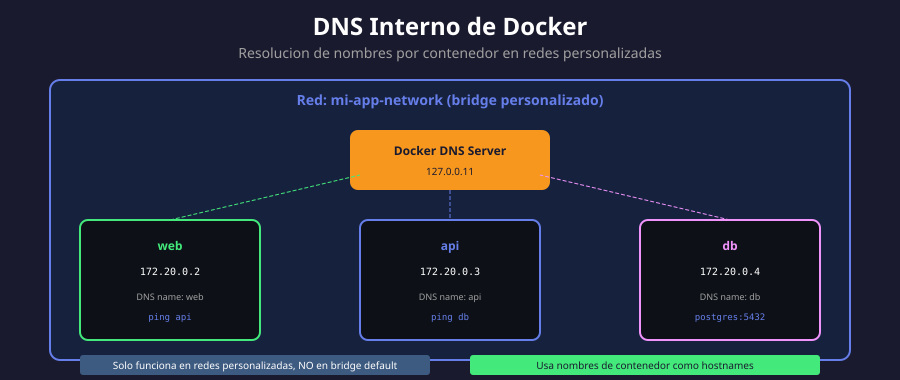

# 🔍 DNS Interno de Docker

<p align="center">
  
</p>

## 📋 Tabla de Contenidos

- [¿Qué es el DNS Interno?](#qué-es-el-dns-interno)
- [Cómo Funciona](#cómo-funciona)
- [Resolución por Nombre de Contenedor](#resolución-por-nombre-de-contenedor)
- [Network Aliases](#network-aliases)
- [Configuración DNS Personalizada](#configuración-dns-personalizada)
- [Troubleshooting DNS](#troubleshooting-dns)

---

## ¿Qué es el DNS Interno?

Docker incluye un **servidor DNS embebido** que permite a los contenedores resolver nombres de otros contenedores en la misma red, sin necesidad de conocer sus IPs.

### Características Principales

| Característica      | Descripción                           |
| ------------------- | ------------------------------------- |
| **IP del servidor** | `127.0.0.11` (interno del contenedor) |
| **Resolución**      | Nombres de contenedor → IPs           |
| **Scope**           | Por red (no global)                   |
| **Disponibilidad**  | Solo en redes personalizadas          |

### Importante: Solo Redes Personalizadas

```bash
# ❌ La red bridge DEFAULT no tiene DNS
docker run -d --name app1 nginx
docker run --rm alpine ping app1
# ping: bad address 'app1'

# ✅ Las redes PERSONALIZADAS sí tienen DNS
docker network create mi-red
docker run -d --name app2 --network mi-red nginx
docker run --rm --network mi-red alpine ping -c 2 app2
# PING app2 (172.18.0.2): 64 bytes...
```

---

## Cómo Funciona

### Arquitectura DNS

```
┌─────────────────────────────────────────────────────┐
│                   Red Personalizada                  │
│                                                      │
│  ┌──────────┐    ┌──────────┐    ┌──────────┐      │
│  │   web    │    │   api    │    │    db    │      │
│  │172.20.0.2│    │172.20.0.3│    │172.20.0.4│      │
│  └────┬─────┘    └────┬─────┘    └────┬─────┘      │
│       │               │               │             │
│       └───────────────┼───────────────┘             │
│                       │                             │
│              ┌────────┴────────┐                    │
│              │  Docker DNS     │                    │
│              │  127.0.0.11     │                    │
│              └─────────────────┘                    │
│                                                      │
│  Registros:                                         │
│  web → 172.20.0.2                                   │
│  api → 172.20.0.3                                   │
│  db  → 172.20.0.4                                   │
└─────────────────────────────────────────────────────┘
```

### Resolución Automática

Docker automáticamente:

1. **Registra** cada contenedor con su nombre en el DNS
2. **Actualiza** registros cuando contenedores se crean/eliminan
3. **Resuelve** consultas DNS entre contenedores de la misma red

### Verificar Servidor DNS

```bash
# Ver configuración DNS dentro del contenedor
docker run --rm --network mi-red alpine cat /etc/resolv.conf

# Salida:
# nameserver 127.0.0.11
# options ndots:0
```

---

## Resolución por Nombre de Contenedor

### Ejemplo Práctico

```bash
# 1. Crear red
docker network create app-network

# 2. Crear base de datos
docker run -d \
  --name postgres-db \
  --network app-network \
  -e POSTGRES_PASSWORD=secret \
  postgres:15

# 3. Crear aplicación que conecta por nombre
docker run -d \
  --name my-app \
  --network app-network \
  -e DATABASE_HOST=postgres-db \
  -e DATABASE_PORT=5432 \
  my-application

# 4. Verificar resolución DNS
docker exec my-app nslookup postgres-db

# Server:    127.0.0.11
# Address 1: 127.0.0.11
#
# Name:      postgres-db
# Address 1: 172.18.0.2 postgres-db.app-network
```

### Nombres DNS Disponibles

Docker registra varios nombres para cada contenedor:

```bash
# Nombres que resuelven al contenedor "web"
docker run --rm --network mi-red alpine nslookup web

# Todos estos funcionan:
# - web                    (nombre corto)
# - web.mi-red             (nombre + red)
# - <container_id>         (ID del contenedor)
```

### Resolución entre Contenedores

```bash
# Setup
docker network create test-dns
docker run -d --name server --network test-dns nginx
docker run -d --name client --network test-dns alpine sleep 3600

# El cliente puede resolver "server"
docker exec client ping -c 3 server

# También puede hacer HTTP
docker exec client wget -qO- http://server

# Ver la IP resuelta
docker exec client getent hosts server
# 172.18.0.2      server
```

---

## Network Aliases

Los **aliases** permiten que un contenedor responda a múltiples nombres DNS.

### Crear Alias al Ejecutar

```bash
# Un contenedor con múltiples nombres
docker run -d \
  --name postgres \
  --network app-network \
  --network-alias db \
  --network-alias database \
  --network-alias pg \
  postgres:15

# Todos estos nombres resuelven al mismo contenedor
docker run --rm --network app-network alpine nslookup db
docker run --rm --network app-network alpine nslookup database
docker run --rm --network app-network alpine nslookup pg
```

### Alias para Balanceo de Carga

Múltiples contenedores pueden compartir un alias:

```bash
# Crear red
docker network create lb-net

# Crear múltiples instancias con el mismo alias
docker run -d --name web1 --network lb-net --network-alias web nginx
docker run -d --name web2 --network lb-net --network-alias web nginx
docker run -d --name web3 --network lb-net --network-alias web nginx

# El alias "web" resuelve a cualquiera de los tres (round-robin DNS)
docker run --rm --network lb-net alpine nslookup web

# Cada consulta puede devolver diferente IP
for i in 1 2 3 4 5; do
  docker run --rm --network lb-net alpine getent hosts web
done
```

### Agregar Alias a Contenedor Existente

```bash
# Conectar a red con alias
docker network connect --alias backup-db app-network postgres
```

---

## Configuración DNS Personalizada

### Servidores DNS Externos

```bash
# Usar servidor DNS específico
docker run -d \
  --name my-app \
  --dns 8.8.8.8 \
  --dns 8.8.4.4 \
  nginx

# Verificar
docker exec my-app cat /etc/resolv.conf
# nameserver 8.8.8.8
# nameserver 8.8.4.4
```

### Dominios de Búsqueda

```bash
# Agregar dominios de búsqueda
docker run -d \
  --name my-app \
  --dns-search example.com \
  --dns-search internal.corp \
  nginx

# Permite resolver "server" como "server.example.com"
```

### Entradas Hosts Personalizadas

```bash
# Agregar entradas al /etc/hosts del contenedor
docker run -d \
  --name my-app \
  --add-host db.local:192.168.1.100 \
  --add-host cache.local:192.168.1.101 \
  nginx

# Verificar
docker exec my-app cat /etc/hosts
# 192.168.1.100   db.local
# 192.168.1.101   cache.local
```

### Host Gateway (Docker 20.10+)

```bash
# Referencia especial para la IP del host
docker run -d \
  --name my-app \
  --add-host host.docker.internal:host-gateway \
  nginx

# Permite al contenedor conectar a servicios del host
docker exec my-app ping host.docker.internal
```

---

## Troubleshooting DNS

### Problema: No Resuelve Nombres

```bash
# ❌ Síntoma
docker exec my-app ping other-container
# ping: bad address 'other-container'

# Diagnóstico
# 1. Verificar que están en la misma red
docker inspect my-app --format '{{json .NetworkSettings.Networks}}' | jq
docker inspect other-container --format '{{json .NetworkSettings.Networks}}' | jq

# 2. Verificar que NO es la red default
docker network inspect bridge | grep -A5 Containers

# ✅ Solución: Usar red personalizada
docker network create custom-net
docker network connect custom-net my-app
docker network connect custom-net other-container
```

### Problema: DNS Lento

```bash
# Síntoma: Resolución tarda varios segundos

# Diagnóstico
docker exec my-app time nslookup other-container

# Posible causa: IPv6 deshabilitado incorrectamente
# Solución: Configurar opciones DNS
docker run -d \
  --name my-app \
  --dns-opt single-request \
  --dns-opt timeout:1 \
  nginx
```

### Herramientas de Diagnóstico

```bash
# 1. Verificar resolución DNS
docker exec container nslookup target-name

# 2. Ver servidor DNS configurado
docker exec container cat /etc/resolv.conf

# 3. Usar dig para más detalle
docker run --rm --network mi-red tutum/dnsutils \
  dig @127.0.0.11 target-name

# 4. Tcpdump para ver tráfico DNS
docker run --rm --network mi-red nicolaka/netshoot \
  tcpdump -i any port 53
```

### Verificar Conectividad Completa

```bash
#!/bin/bash
# Script de diagnóstico DNS

NETWORK="mi-red"
TARGET="target-container"

echo "=== Diagnóstico DNS ==="

# 1. Red actual
echo -e "\n1. Redes del contenedor:"
docker inspect test-container --format '{{range $k, $v := .NetworkSettings.Networks}}{{$k}} {{end}}'

# 2. Resolución DNS
echo -e "\n2. Resolución DNS:"
docker exec test-container nslookup $TARGET 2>&1

# 3. Ping
echo -e "\n3. Ping:"
docker exec test-container ping -c 2 $TARGET 2>&1

# 4. Contenedores en la red
echo -e "\n4. Contenedores en $NETWORK:"
docker network inspect $NETWORK -f '{{range .Containers}}{{.Name}} {{end}}'
```

---

## 🧪 Laboratorio Práctico

### Ejercicio: Sistema Multi-Contenedor con DNS

```bash
# Objetivo: Crear una aplicación de 3 capas que se comunique por DNS

# 1. Crear red
docker network create three-tier

# 2. Base de datos
docker run -d \
  --name db \
  --network three-tier \
  --network-alias database \
  -e POSTGRES_PASSWORD=secret \
  postgres:15-alpine

# 3. API (simular con nginx por simplicidad)
docker run -d \
  --name api \
  --network three-tier \
  --network-alias backend \
  nginx:alpine

# 4. Frontend
docker run -d \
  --name web \
  --network three-tier \
  -p 8080:80 \
  nginx:alpine

# 5. Verificar resolución desde web
docker exec web nslookup db
docker exec web nslookup api
docker exec web nslookup database  # alias
docker exec web nslookup backend   # alias

# 6. Verificar conectividad
docker exec web ping -c 2 db
docker exec api ping -c 2 database

# 7. Limpiar
docker rm -f db api web
docker network rm three-tier
```

---

## 📚 Recursos Adicionales

- [Embedded DNS Server](https://docs.docker.com/config/containers/container-networking/#dns-services)
- [Network Aliases](https://docs.docker.com/engine/reference/commandline/network_connect/)
- [Configure DNS](https://docs.docker.com/config/containers/container-networking/#dns-services)

---

<div align="center">

⬅️ [Anterior: Host y None](03-host-none.md) | [Siguiente: Port Mapping](05-port-mapping.md) ➡️

</div>
