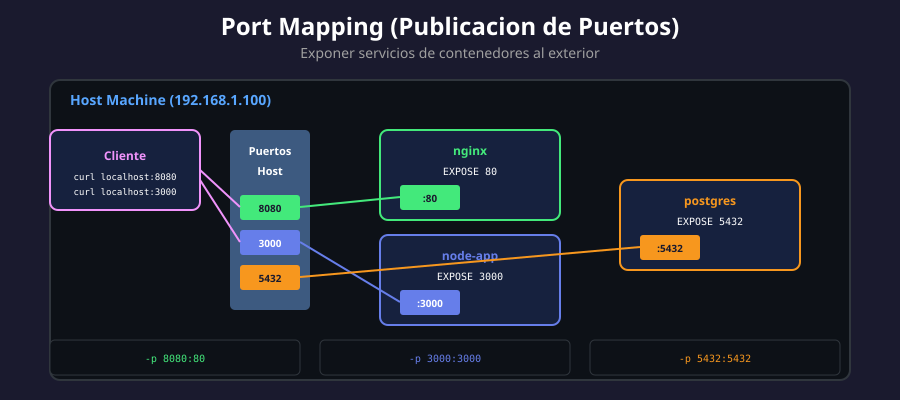

# 🚪 Port Mapping (Publicación de Puertos)

<p align="center">
  
</p>

## 📋 Tabla de Contenidos

- [¿Qué es Port Mapping?](#qué-es-port-mapping)
- [Sintaxis y Opciones](#sintaxis-y-opciones)
- [Tipos de Publicación](#tipos-de-publicación)
- [Protocolos TCP y UDP](#protocolos-tcp-y-udp)
- [Binding a Interfaces Específicas](#binding-a-interfaces-específicas)
- [EXPOSE vs Publish](#expose-vs-publish)
- [Buenas Prácticas](#buenas-prácticas)

---

## ¿Qué es Port Mapping?

Port mapping (mapeo de puertos) permite **exponer servicios** de un contenedor al exterior, redirigiendo tráfico desde un puerto del host hacia un puerto del contenedor.

### Concepto Visual

```
                    Internet/LAN
                         │
                         ▼
┌────────────────────────────────────────┐
│              Host Machine              │
│                                        │
│    Puerto 8080 ◄─── Solicitud HTTP    │
│         │                              │
│         ▼ (iptables NAT)               │
│    ┌─────────────────────┐             │
│    │     Contenedor      │             │
│    │                     │             │
│    │    Puerto 80 ◄──────┤             │
│    │    (nginx)          │             │
│    └─────────────────────┘             │
│                                        │
└────────────────────────────────────────┘

Comando: docker run -p 8080:80 nginx
```

### ¿Por Qué es Necesario?

| Sin Port Mapping                   | Con Port Mapping                  |
| ---------------------------------- | --------------------------------- |
| Solo accesible dentro de Docker    | Accesible desde exterior          |
| Comunicación contenedor-contenedor | Clientes externos pueden conectar |
| IPs internas (172.x.x.x)           | Puerto en IP del host             |

---

## Sintaxis y Opciones

### Formato Básico

```bash
docker run -p [ip_host:]puerto_host:puerto_contenedor[/protocolo]
```

### Variantes de Sintaxis

```bash
# 1. Puerto host:puerto contenedor
docker run -p 8080:80 nginx
# Host:8080 → Container:80

# 2. Solo puerto contenedor (asigna puerto aleatorio en host)
docker run -p 80 nginx
# Host:32768+ → Container:80

# 3. IP específica + puertos
docker run -p 127.0.0.1:8080:80 nginx
# Solo localhost:8080 → Container:80

# 4. IP específica + puerto aleatorio
docker run -p 127.0.0.1::80 nginx
# localhost:32768+ → Container:80

# 5. Múltiples puertos
docker run -p 80:80 -p 443:443 nginx
# Host:80 → Container:80
# Host:443 → Container:443

# 6. Rango de puertos
docker run -p 8080-8085:80-85 my-app
# Host:8080 → Container:80
# Host:8081 → Container:81
# ...
```

### Flag Largo

```bash
# Equivalentes
docker run -p 8080:80 nginx
docker run --publish 8080:80 nginx
```

---

## Tipos de Publicación

### Publicación Estática (Puerto Fijo)

```bash
# Puerto fijo en el host
docker run -d -p 3000:3000 node-app

# Verificar
docker ps
# PORTS: 0.0.0.0:3000->3000/tcp

# Conflicto si el puerto está ocupado
docker run -d -p 3000:3000 another-app
# Error: port is already allocated
```

### Publicación Dinámica (Puerto Aleatorio)

```bash
# Docker asigna puerto disponible
docker run -d -p 80 nginx

# Ver puerto asignado
docker ps
# PORTS: 0.0.0.0:32768->80/tcp

# O usar docker port
docker port <container_id>
# 80/tcp -> 0.0.0.0:32768
```

### Publicar Todos los Puertos (EXPOSE)

```bash
# Publicar todos los puertos definidos con EXPOSE en Dockerfile
docker run -d -P nginx

# Equivalente a publicar cada EXPOSE con puerto aleatorio
# Si Dockerfile tiene: EXPOSE 80 443
# Resultado:
# 0.0.0.0:32769->80/tcp
# 0.0.0.0:32770->443/tcp
```

---

## Protocolos TCP y UDP

### TCP (Default)

```bash
# Implícitamente TCP
docker run -p 8080:80 nginx

# Explícitamente TCP
docker run -p 8080:80/tcp nginx
```

### UDP

```bash
# Puerto UDP
docker run -p 53:53/udp dns-server

# DNS típicamente usa ambos
docker run -p 53:53/tcp -p 53:53/udp dns-server
```

### Ejemplo: Servidor DNS

```bash
# CoreDNS con TCP y UDP
docker run -d \
  --name coredns \
  -p 53:53/tcp \
  -p 53:53/udp \
  -v $(pwd)/Corefile:/Corefile \
  coredns/coredns
```

### Ejemplo: Aplicación de Streaming

```bash
# Servidor de video streaming (UDP para mejor rendimiento)
docker run -d \
  --name streaming \
  -p 1935:1935/tcp \
  -p 8554:8554/udp \
  streaming-server
```

---

## Binding a Interfaces Específicas

### Todas las Interfaces (Default)

```bash
# 0.0.0.0 = todas las interfaces
docker run -p 8080:80 nginx

# Equivalente explícito
docker run -p 0.0.0.0:8080:80 nginx

# Accesible desde:
# - localhost:8080
# - 192.168.1.x:8080 (LAN)
# - IP_PUBLICA:8080 (si está expuesto)
```

### Solo Localhost

```bash
# Solo accesible localmente
docker run -p 127.0.0.1:8080:80 nginx

# Accesible desde:
# ✅ localhost:8080
# ✅ 127.0.0.1:8080
# ❌ 192.168.1.x:8080 (No accesible desde LAN)
```

### IP Específica

```bash
# Solo una interfaz específica
docker run -p 192.168.1.100:8080:80 nginx

# Útil para servidores con múltiples NICs
```

### IPv6

```bash
# Binding IPv6
docker run -p [::1]:8080:80 nginx

# Todas las interfaces IPv6
docker run -p [::]:8080:80 nginx
```

### Casos de Uso por Binding

| Binding               | Caso de Uso                          |
| --------------------- | ------------------------------------ |
| `0.0.0.0:8080:80`     | Servicio público/accesible en red    |
| `127.0.0.1:8080:80`   | Desarrollo local, herramientas admin |
| `192.168.1.x:8080:80` | Solo red interna específica          |
| `[::]:8080:80`        | Servicio IPv6                        |

---

## EXPOSE vs Publish

### EXPOSE (Dockerfile)

```dockerfile
# Dockerfile
FROM nginx
EXPOSE 80
EXPOSE 443
```

**EXPOSE es solo documentación**:

- ❌ NO publica el puerto
- ❌ NO hace el puerto accesible externamente
- ✅ Documenta qué puertos usa la aplicación
- ✅ Permite usar `-P` para publicar automáticamente

### Publish (-p / -P)

```bash
# -p: Publica puerto específico
docker run -p 8080:80 nginx
# Puerto 80 del contenedor accesible en host:8080

# -P: Publica todos los puertos EXPOSE
docker run -P nginx
# Todos los EXPOSE publicados en puertos aleatorios
```

### Comparación

| Aspecto          | EXPOSE        | -p (publish)             |
| ---------------- | ------------- | ------------------------ |
| Ubicación        | Dockerfile    | docker run               |
| Función          | Documentación | Publicación real         |
| Puerto accesible | No            | Sí                       |
| Obligatorio      | No            | Sí (para acceso externo) |

### Ejemplo Completo

```dockerfile
# Dockerfile
FROM node:20-alpine
WORKDIR /app
COPY . .
EXPOSE 3000
CMD ["node", "server.js"]
```

```bash
# Sin -p: EXPOSE no hace nada visible
docker run -d my-node-app
# Puerto 3000 NO accesible desde el host

# Con -p: Puerto accesible
docker run -d -p 3000:3000 my-node-app
# localhost:3000 funciona

# Con -P: Usa los EXPOSE
docker run -d -P my-node-app
# localhost:32768 → container:3000
```

---

## Buenas Prácticas

### 1. Usa Puertos No Privilegiados

```bash
# ✅ Bueno: Puerto > 1024
docker run -p 8080:80 nginx
docker run -p 3000:3000 node-app

# ⚠️ Cuidado: Puerto privilegiado (requiere root en algunos sistemas)
docker run -p 80:80 nginx
docker run -p 443:443 nginx
```

### 2. Binding Seguro en Producción

```bash
# ❌ Evitar en servicios sensibles
docker run -p 0.0.0.0:5432:5432 postgres

# ✅ Mejor: Solo local o red interna
docker run -p 127.0.0.1:5432:5432 postgres
```

### 3. Documentar Puertos Siempre

```dockerfile
# Dockerfile con EXPOSE documentado
FROM python:3.11-slim
WORKDIR /app
COPY . .
# Puerto de la aplicación
EXPOSE 8000
# Puerto de métricas
EXPOSE 9090
CMD ["python", "app.py"]
```

### 4. Verificar Puertos Antes de Usar

```bash
# Ver qué puertos están en uso
sudo netstat -tlnp | grep LISTEN
# o
sudo ss -tlnp

# Ver puertos usados por Docker
docker ps --format "{{.Names}}: {{.Ports}}"
```

### 5. Usar Variables para Flexibilidad

```bash
# Script flexible
PORT=${PORT:-8080}
docker run -p $PORT:80 nginx

# Docker Compose
services:
  web:
    image: nginx
    ports:
      - "${WEB_PORT:-8080}:80"
```

---

## 🧪 Laboratorio Práctico

### Ejercicio 1: Port Mapping Básico

```bash
# 1. Ejecutar nginx con puerto específico
docker run -d --name web1 -p 8081:80 nginx

# 2. Ejecutar nginx con puerto aleatorio
docker run -d --name web2 -P nginx

# 3. Ver puertos asignados
docker port web1
docker port web2

# 4. Probar acceso
curl localhost:8081
curl localhost:$(docker port web2 80 | cut -d: -f2)

# 5. Limpiar
docker rm -f web1 web2
```

### Ejercicio 2: Múltiples Servicios

```bash
# Stack con diferentes puertos
docker network create app-net

# Frontend
docker run -d --name frontend \
  --network app-net \
  -p 80:80 \
  nginx

# API
docker run -d --name api \
  --network app-net \
  -p 3000:3000 \
  node:alpine sleep 3600

# Base de datos (solo local)
docker run -d --name db \
  --network app-net \
  -p 127.0.0.1:5432:5432 \
  -e POSTGRES_PASSWORD=secret \
  postgres:15

# Verificar
curl localhost:80
curl localhost:3000 2>&1 || echo "API not running"
psql -h localhost -p 5432 -U postgres -c '\l' 2>&1 || echo "DB OK (local only)"

# Limpiar
docker rm -f frontend api db
docker network rm app-net
```

---

## 📚 Recursos Adicionales

- [Container Networking](https://docs.docker.com/config/containers/container-networking/)
- [Published Ports](https://docs.docker.com/engine/reference/commandline/run/#publish)
- [EXPOSE Instruction](https://docs.docker.com/engine/reference/builder/#expose)

---

<div align="center">

⬅️ [Anterior: DNS Interno](04-dns-interno.md) | [Siguiente: Ejercicios](../2-ejercicios/README.md) ➡️

</div>
