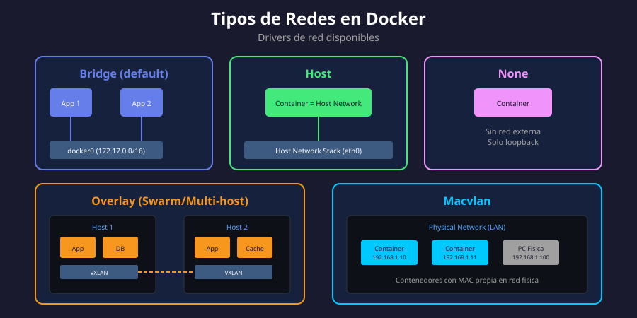

# 🌐 Tipos de Redes en Docker

<p align="center">
  
</p>

## 📋 Tabla de Contenidos

- [Introducción](#introducción)
- [Drivers de Red Disponibles](#drivers-de-red-disponibles)
- [Bridge Network](#bridge-network)
- [Host Network](#host-network)
- [None Network](#none-network)
- [Overlay Network](#overlay-network)
- [Macvlan Network](#macvlan-network)
- [Comparativa de Drivers](#comparativa-de-drivers)
- [Comandos Básicos](#comandos-básicos)

---

## Introducción

Docker utiliza un sistema de **drivers de red** para proporcionar diferentes tipos de conectividad a los contenedores. Cada driver está diseñado para casos de uso específicos, desde el aislamiento completo hasta la integración total con la red del host.

### ¿Por qué diferentes tipos de redes?

| Necesidad                       | Solución        |
| ------------------------------- | --------------- |
| Comunicación entre contenedores | Bridge network  |
| Máximo rendimiento de red       | Host network    |
| Aislamiento total               | None network    |
| Comunicación multi-host         | Overlay network |
| Integración con red física      | Macvlan network |

---

## Drivers de Red Disponibles

Docker incluye varios drivers de red por defecto:

```bash
# Ver drivers disponibles
docker network ls

# Salida típica:
NETWORK ID     NAME      DRIVER    SCOPE
a1b2c3d4e5f6   bridge    bridge    local
g7h8i9j0k1l2   host      host      local
m3n4o5p6q7r8   none      null      local
```

### Descripción de Cada Driver

| Driver    | Descripción                      | Uso Principal                        |
| --------- | -------------------------------- | ------------------------------------ |
| `bridge`  | Red virtual privada              | Default para contenedores standalone |
| `host`    | Usa la red del host directamente | Máximo rendimiento                   |
| `none`    | Sin conectividad de red          | Contenedores aislados                |
| `overlay` | Red distribuida multi-host       | Docker Swarm                         |
| `macvlan` | Asigna MAC a contenedores        | Integración con red física           |
| `ipvlan`  | Similar a macvlan sin MAC única  | Alternativa a macvlan                |

---

## Bridge Network

Es el driver por defecto y el más utilizado. Crea una red virtual privada dentro del host.

### Características

- ✅ Red virtual aislada del host
- ✅ Contenedores obtienen IPs del rango de la red
- ✅ NAT para acceso a internet
- ✅ Comunicación entre contenedores de la misma red
- ❌ No disponible DNS automático en `bridge` default

### Red Bridge por Defecto vs Personalizada

```bash
# Red bridge default (docker0)
docker run -d --name app1 nginx
# IP: 172.17.0.X

# Crear red bridge personalizada
docker network create mi-red

# Usar red personalizada
docker run -d --name app2 --network mi-red nginx
# IP: 172.18.0.X (rango diferente)
```

> 💡 **Tip**: Siempre usa redes personalizadas en lugar de la default para aprovechar el DNS interno.

---

## Host Network

El contenedor comparte directamente el stack de red del host, sin aislamiento.

### Características

- ✅ Máximo rendimiento (sin overhead de NAT)
- ✅ El contenedor ve todas las interfaces del host
- ✅ Puerto del contenedor = Puerto del host
- ❌ Sin aislamiento de red
- ❌ Posibles conflictos de puertos

### Ejemplo de Uso

```bash
# El contenedor nginx escucha directamente en el puerto 80 del host
docker run -d --network host nginx

# Verificar
curl localhost:80
```

### Cuándo Usar Host Network

| ✅ Recomendado                               | ❌ No Recomendado                      |
| -------------------------------------------- | -------------------------------------- |
| Aplicaciones que requieren máximo throughput | Múltiples contenedores del mismo tipo  |
| Monitoreo de red del host                    | Entornos multi-tenant                  |
| Debugging de red                             | Producción con requisitos de seguridad |

---

## None Network

Desactiva completamente la red del contenedor, excepto la interfaz loopback.

### Características

- ✅ Máximo aislamiento
- ✅ Solo interfaz `lo` (127.0.0.1)
- ❌ Sin comunicación externa
- ❌ Sin comunicación con otros contenedores

### Ejemplo de Uso

```bash
# Contenedor completamente aislado
docker run -d --network none alpine sleep 3600

# Verificar interfaces
docker exec <container_id> ip addr
# Solo verás: lo (loopback)
```

### Casos de Uso

- Procesamiento de datos sensibles
- Contenedores que solo necesitan CPU/memoria
- Tareas batch sin requisitos de red
- Entornos de alta seguridad

---

## Overlay Network

Permite comunicación entre contenedores en diferentes hosts Docker (Swarm mode).

### Características

- ✅ Comunicación multi-host transparente
- ✅ Encriptación opcional
- ✅ Balanceo de carga integrado
- ❌ Requiere Docker Swarm
- ❌ Mayor overhead de red

### Creación

```bash
# Inicializar Swarm (si no está activo)
docker swarm init

# Crear red overlay
docker network create -d overlay mi-overlay

# Crear servicio que use la red
docker service create --name web --network mi-overlay nginx
```

### Arquitectura

```
┌─────────────────┐         ┌─────────────────┐
│     Host 1      │         │     Host 2      │
│  ┌───────────┐  │  VXLAN  │  ┌───────────┐  │
│  │ Container │◄─┼─────────┼─►│ Container │  │
│  └───────────┘  │         │  └───────────┘  │
│    overlay-net  │         │    overlay-net  │
└─────────────────┘         └─────────────────┘
```

---

## Macvlan Network

Asigna una dirección MAC única a cada contenedor, haciéndolo aparecer como un dispositivo físico en la red.

### Características

- ✅ Contenedores con IP de la red física
- ✅ Aparecen como dispositivos físicos
- ✅ Sin NAT necesario
- ❌ Configuración más compleja
- ❌ Requiere modo promiscuo en algunos casos

### Creación

```bash
# Crear red macvlan
docker network create -d macvlan \
  --subnet=192.168.1.0/24 \
  --gateway=192.168.1.1 \
  -o parent=eth0 \
  mi-macvlan

# Ejecutar contenedor con IP específica
docker run -d --network mi-macvlan \
  --ip 192.168.1.50 \
  nginx
```

### Casos de Uso

- Migración de aplicaciones legacy
- Integración con infraestructura existente
- Aplicaciones que requieren IP específica en LAN
- Contenedores que necesitan ser "visibles" en la red física

---

## Comparativa de Drivers

| Característica | Bridge   | Host       | None     | Overlay  | Macvlan  |
| -------------- | -------- | ---------- | -------- | -------- | -------- |
| Aislamiento    | ✅ Alto  | ❌ Ninguno | ✅ Total | ✅ Alto  | ⚠️ Medio |
| Rendimiento    | ⚠️ Medio | ✅ Máximo  | N/A      | ⚠️ Medio | ✅ Alto  |
| Multi-host     | ❌       | ❌         | ❌       | ✅       | ❌       |
| DNS interno    | ✅\*     | ❌         | ❌       | ✅       | ❌       |
| Configuración  | Fácil    | Fácil      | Fácil    | Media    | Compleja |

\*Solo en redes bridge personalizadas

---

## Comandos Básicos

### Listar Redes

```bash
# Ver todas las redes
docker network ls

# Ver detalles de una red
docker network inspect bridge
```

### Crear Redes

```bash
# Red bridge (default driver)
docker network create mi-red

# Especificar driver
docker network create -d bridge mi-bridge
docker network create -d overlay mi-overlay

# Con subnet personalizado
docker network create \
  --subnet=10.10.0.0/16 \
  --gateway=10.10.0.1 \
  mi-red-custom
```

### Conectar/Desconectar Contenedores

```bash
# Conectar contenedor existente a una red
docker network connect mi-red mi-contenedor

# Desconectar
docker network disconnect mi-red mi-contenedor

# Ejecutar con red específica
docker run -d --network mi-red nginx
```

### Eliminar Redes

```bash
# Eliminar red específica
docker network rm mi-red

# Eliminar redes no utilizadas
docker network prune
```

---

## 🧪 Ejercicio Práctico

1. Lista todas las redes existentes
2. Crea una red bridge personalizada llamada `test-net`
3. Ejecuta dos contenedores alpine en esa red
4. Verifica que pueden comunicarse entre sí
5. Elimina los contenedores y la red

```bash
# Solución
docker network create test-net
docker run -d --name c1 --network test-net alpine sleep 3600
docker run -d --name c2 --network test-net alpine sleep 3600
docker exec c1 ping -c 3 c2
docker rm -f c1 c2
docker network rm test-net
```

---

## 📚 Recursos Adicionales

- [Docker Networking Overview](https://docs.docker.com/network/)
- [Bridge Network Driver](https://docs.docker.com/network/bridge/)
- [Use Overlay Networks](https://docs.docker.com/network/overlay/)

---

<div align="center">

⬅️ [Anterior: Semana 03](../../week-03/README.md) | [Siguiente: Bridge Network](02-bridge-network.md) ➡️

</div>
