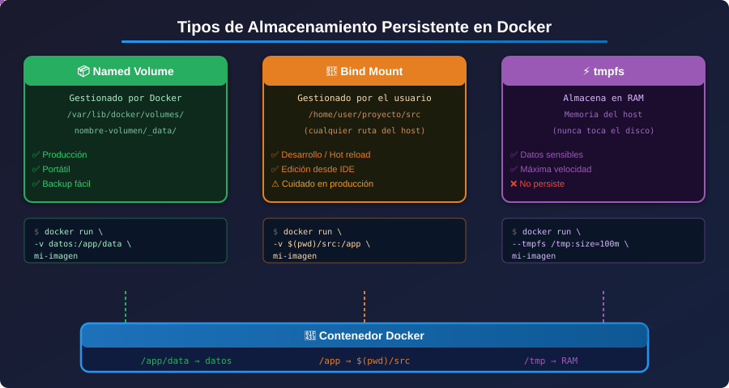

# 💾 Persistencia de Datos en Docker

<p align="center">
  
</p>

## 📋 Tabla de Contenidos

- [El Problema de la Efimeralidad](#el-problema-de-la-efimeralidad)
- [Cómo Docker Maneja el Almacenamiento](#cómo-docker-maneja-el-almacenamiento)
- [Tipos de Almacenamiento Persistente](#tipos-de-almacenamiento-persistente)
- [Cuándo Usar Cada Tipo](#cuándo-usar-cada-tipo)
- [Resumen Visual](#resumen-visual)

---

## El Problema de la Efimeralidad

Los contenedores Docker son **efímeros por diseño**: cuando un contenedor se elimina, todos los datos escritos dentro de él desaparecen. Esto es intencional y deseable para garantizar reproducibilidad, pero plantea un desafío: **¿cómo persistimos datos?**

### Ejemplo del problema

```bash
# Crear un contenedor y escribir un archivo
docker run -it --name demo alpine sh -c "echo 'datos importantes' > /data/archivo.txt"

# Eliminar el contenedor
docker rm demo

# Crear uno nuevo — ¡los datos desaparecieron!
docker run -it --name demo alpine sh -c "cat /data/archivo.txt"
# Error: No such file or directory
```

### ¿Por qué los contenedores son efímeros?

Los contenedores usan un sistema de archivos por capas llamado **Union File System**:

```
┌─────────────────────────────────┐
│  Capa de Escritura (contenedor) │  ← Temporal, desaparece al eliminar
├─────────────────────────────────┤
│  Capa de Imagen (read-only)     │  ← Permanente, definida en Dockerfile
├─────────────────────────────────┤
│  Capa Base (OS)                 │  ← Permanente
└─────────────────────────────────┘
```

Cuando eliminas un contenedor, solo se elimina la **capa de escritura**. La imagen permanece intacta.

---

## Cómo Docker Maneja el Almacenamiento

Docker ofrece tres mecanismos para gestionar datos persistentes, cada uno con diferentes casos de uso:

```
Host Machine
┌────────────────────────────────────────────┐
│                                            │
│  /var/lib/docker/volumes/  ◄── Named       │
│  /home/user/myapp/         ◄── Bind Mount  │
│  tmpfs (memoria RAM)       ◄── tmpfs       │
│                                            │
└──────────────┬─────────────────────────────┘
               │ montados en
               ▼
┌──────────────────────┐
│     Contenedor       │
│  /data  /app  /tmp   │
└──────────────────────┘
```

---

## Tipos de Almacenamiento Persistente

### 1. Volúmenes Nombrados (Named Volumes)

Gestionados completamente por Docker. Son la **opción recomendada** para la mayoría de casos.

```bash
# Crear volumen
docker volume create mis-datos

# Usar volumen en contenedor
docker run -v mis-datos:/app/data nginx

# Listar volúmenes
docker volume ls

# Inspeccionar volumen
docker volume inspect mis-datos
```

**Ubicación en el host**: `/var/lib/docker/volumes/<nombre>/_data`

### 2. Bind Mounts

Montan un directorio del **host** directamente en el contenedor. Ideales para desarrollo.

```bash
# Montar directorio actual en /app
docker run -v $(pwd):/app node:20-alpine

# Sintaxis con --mount (más explícita)
docker run --mount type=bind,source=$(pwd),target=/app node:20-alpine
```

### 3. tmpfs Mounts

Almacenan datos en la **memoria RAM** del host. Los datos son temporales y muy rápidos.

```bash
# Montar tmpfs en /tmp del contenedor
docker run --tmpfs /tmp:rw,size=100m nginx

# Con --mount
docker run --mount type=tmpfs,destination=/tmp,tmpfs-size=100m nginx
```

---

## Cuándo Usar Cada Tipo

| Situación | Tipo Recomendado | Razón |
|-----------|-----------------|-------|
| Base de datos en producción | Named Volume | Docker gestiona backups y portabilidad |
| Desarrollo con hot-reload | Bind Mount | Sincronización directa con el host |
| Datos sensibles temporales | tmpfs | No se escriben en disco |
| Compartir datos entre contenedores | Named Volume | Fácil de montar en múltiples contenedores |
| Configuraciones de desarrollo | Bind Mount | Edición directa desde el IDE |
| Cache de aplicaciones | Named Volume o tmpfs | Dependiendo de si necesita persistir |

---

## La Bandera `-v` vs `--mount`

```bash
# Sintaxis antigua con -v (más común, más corta)
docker run -v nombre-volumen:/ruta/en/contenedor imagen

# Sintaxis moderna con --mount (más explícita, recomendada en scripts)
docker run --mount type=volume,source=nombre-volumen,target=/ruta/en/contenedor imagen
```

La bandera `--mount` es más verbosa pero **más clara** y detecta errores mejor. Úsala en producción.

---

## Resumen Visual

```
TIPOS DE MONTAJE EN DOCKER
═══════════════════════════

Named Volume          Bind Mount           tmpfs
─────────────         ──────────           ─────
Docker gestiona       Host gestiona        RAM del host
la ubicación          la ubicación         sin disco

/var/lib/docker/      /home/user/          Memoria
volumes/mi-vol/       mi-proyecto/

✅ Producción          ✅ Desarrollo         ✅ Datos sensibles
✅ Portabilidad        ✅ Hot-reload         ✅ Alto rendimiento
✅ Backups fáciles     ✅ Edición directa    ❌ No persiste
```

---

## 💡 Tips Importantes

> **Nunca guardes datos críticos en la capa de escritura del contenedor.** Si necesitas persistir algo, usa siempre alguno de los tres tipos de montaje.

> **Los volúmenes nombrados sobreviven a `docker-compose down`**, pero `docker-compose down -v` los elimina. ¡Cuidado con este comando en producción!

> **Los bind mounts en producción son peligrosos** porque un proceso dentro del contenedor puede modificar archivos del host. Úsalos principalmente en desarrollo.

---

## 🔗 Siguiente

[02 - Volúmenes Nombrados →](02-named-volumes.md)
