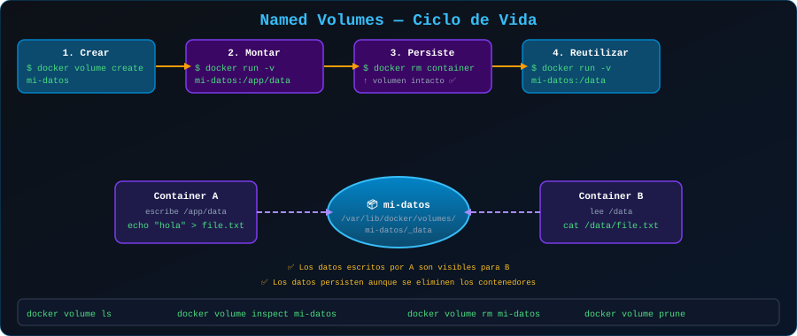

# 📦 Volúmenes Nombrados (Named Volumes)

<p align="center">
  
</p>

## 📋 Tabla de Contenidos

- [¿Qué es un Volumen Nombrado?](#qué-es-un-volumen-nombrado)
- [Gestión de Volúmenes](#gestión-de-volúmenes)
- [Compartir Datos entre Contenedores](#compartir-datos-entre-contenedores)
- [Volúmenes en Docker Compose](#volúmenes-en-docker-compose)
- [Drivers de Volumen](#drivers-de-volumen)
- [Buenas Prácticas](#buenas-prácticas)

---

## ¿Qué es un Volumen Nombrado?

Un **volumen nombrado** es un área de almacenamiento gestionada completamente por Docker, identificada por un nombre legible. Docker elige dónde almacenar los datos en el sistema host, generalmente en `/var/lib/docker/volumes/`.

### Ventajas sobre otros métodos

- 🔒 **Aislados**: No dependen de la estructura de directorios del host
- 🔄 **Portables**: Funcionan igual en cualquier sistema con Docker
- 📦 **Gestionables**: Fácil backup, migración e inspección
- 🤝 **Compartibles**: Múltiples contenedores pueden montar el mismo volumen
- 🧹 **Limpios**: Docker controla los permisos y el ciclo de vida

---

## Gestión de Volúmenes

### Crear un volumen

```bash
# Crear volumen simple
docker volume create datos-postgres

# Crear volumen con etiquetas (útil para organización)
docker volume create \
  --label proyecto=mi-app \
  --label entorno=produccion \
  datos-postgres
```

### Listar volúmenes

```bash
# Listar todos los volúmenes
docker volume ls

# Filtrar por etiqueta
docker volume ls --filter label=proyecto=mi-app

# Listar solo los volúmenes que no están en uso
docker volume ls --filter dangling=true
```

Salida típica:
```
DRIVER    VOLUME NAME
local     datos-postgres
local     app-uploads
local     redis-data
```

### Inspeccionar un volumen

```bash
docker volume inspect datos-postgres
```

```json
[
  {
    "CreatedAt": "2025-01-15T10:30:00Z",
    "Driver": "local",
    "Labels": {
      "proyecto": "mi-app"
    },
    "Mountpoint": "/var/lib/docker/volumes/datos-postgres/_data",
    "Name": "datos-postgres",
    "Options": {},
    "Scope": "local"
  }
]
```

### Eliminar volúmenes

```bash
# Eliminar un volumen específico (debe estar sin uso)
docker volume rm datos-postgres

# Eliminar todos los volúmenes sin usar
docker volume prune

# Eliminar con confirmación automática (¡cuidado!)
docker volume prune --force
```

> ⚠️ **ADVERTENCIA**: `docker volume prune` elimina permanentemente los datos. No hay recuperación posible.

---

## Montar Volúmenes en Contenedores

### Sintaxis básica con `-v`

```bash
# Crear contenedor con volumen nombrado
# Si el volumen no existe, Docker lo crea automáticamente
docker run -d \
  --name mi-postgres \
  -v datos-postgres:/var/lib/postgresql/data \
  -e POSTGRES_PASSWORD=secreto \
  postgres:16-alpine
```

### Sintaxis con `--mount` (recomendada en producción)

```bash
docker run -d \
  --name mi-postgres \
  --mount type=volume,source=datos-postgres,target=/var/lib/postgresql/data \
  -e POSTGRES_PASSWORD=secreto \
  postgres:16-alpine
```

### Montar como solo lectura

```bash
# El contenedor puede leer pero no escribir en el volumen
docker run -d \
  --name lector \
  -v datos-compartidos:/data:ro \
  alpine
```

---

## Compartir Datos entre Contenedores

Un caso de uso poderoso: múltiples contenedores acceden al mismo volumen.

```bash
# Crear volumen compartido
docker volume create datos-compartidos

# Contenedor escritor
docker run -d \
  --name escritor \
  -v datos-compartidos:/datos \
  alpine sh -c "while true; do echo \$(date) >> /datos/log.txt; sleep 5; done"

# Contenedor lector (solo lectura)
docker run -d \
  --name lector \
  -v datos-compartidos:/datos:ro \
  alpine sh -c "while true; do tail -5 /datos/log.txt; sleep 5; done"

# Ver los logs del lector
docker logs -f lector
```

> ⚠️ **Cuidado con condiciones de carrera**: Si múltiples contenedores escriben simultáneamente en el mismo archivo, pueden corromperse los datos. Usa bases de datos o sistemas diseñados para concurrencia.

---

## Volúmenes en Docker Compose

La forma más común de usar volúmenes en proyectos reales:

```yaml
# docker-compose.yml
services:
  postgres:
    image: postgres:16-alpine
    environment:
      POSTGRES_DB: mi_base
      POSTGRES_USER: usuario
      POSTGRES_PASSWORD: secreto
    volumes:
      # Volumen nombrado montado en la ruta de datos de PostgreSQL
      - datos-postgres:/var/lib/postgresql/data
    networks:
      - app-network

  redis:
    image: redis:7-alpine
    volumes:
      - datos-redis:/data
    networks:
      - app-network

# ¡IMPORTANTE! Declarar los volúmenes aquí
volumes:
  datos-postgres:
    # Sin configuración extra = volumen local gestionado por Docker
  datos-redis:
    labels:
      descripcion: "Cache de sesiones Redis"

networks:
  app-network:
    driver: bridge
```

### Reusar volúmenes externos

Si ya tienes un volumen creado manualmente:

```yaml
volumes:
  datos-existentes:
    external: true  # Docker no lo crea, usa el existente
    name: mis-datos-de-produccion
```

---

## Drivers de Volumen

Por defecto, Docker usa el driver `local`. Para casos avanzados:

```bash
# Driver local con opciones (NFS montado como volumen Docker)
docker volume create \
  --driver local \
  --opt type=nfs \
  --opt o=addr=192.168.1.100,rw \
  --opt device=:/ruta/nfs \
  volumen-nfs
```

Drivers populares de terceros:
- **Rex-Ray**: Para almacenamiento en la nube (AWS EBS, GCE PD)
- **Portworx**: Para clusters de alta disponibilidad
- **GlusterFS**: Para almacenamiento distribuido

---

## Buenas Prácticas

### ✅ Nombrado descriptivo

```bash
# ✅ Bueno: nombre descriptivo del proyecto y propósito
docker volume create myapp-postgres-data
docker volume create myapp-redis-sessions

# ❌ Evitar nombres genéricos
docker volume create data
docker volume create vol1
```

### ✅ Siempre declarar en Docker Compose

```yaml
# ✅ Declarar explícitamente
volumes:
  postgres-data:
  redis-data:

# ❌ Evitar volúmenes anónimos (difíciles de gestionar)
services:
  db:
    volumes:
      - /var/lib/postgresql/data  # Sin nombre = volumen anónimo
```

### ✅ Dimensionar correctamente

```bash
# Verificar espacio usado por volúmenes
docker system df -v
```

---

## 🔗 Navegación

[← 01 - Persistencia](01-persistencia.md) | [03 - Bind Mounts →](03-bind-mounts.md)
