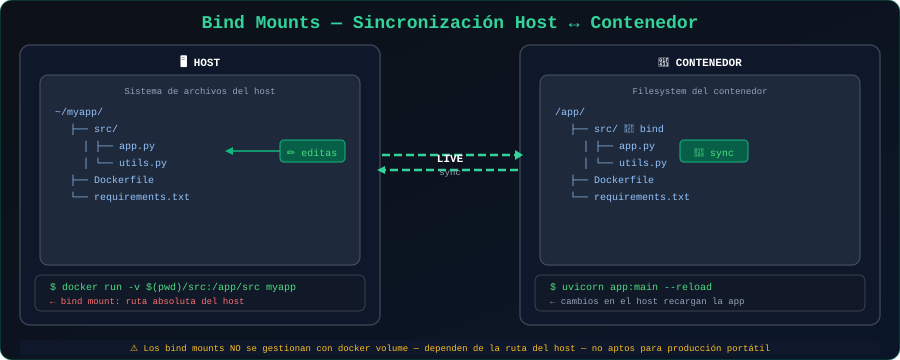

# 🔗 Bind Mounts

<p align="center">
  
</p>

## 📋 Tabla de Contenidos

- [¿Qué es un Bind Mount?](#qué-es-un-bind-mount)
- [Sintaxis y Uso](#sintaxis-y-uso)
- [Casos de Uso Principales](#casos-de-uso-principales)
- [Bind Mounts en Desarrollo](#bind-mounts-en-desarrollo)
- [Consideraciones de Seguridad](#consideraciones-de-seguridad)
- [Bind Mounts vs Named Volumes](#bind-mounts-vs-named-volumes)

---

## ¿Qué es un Bind Mount?

Un **bind mount** conecta directamente un directorio o archivo del **sistema host** con una ruta dentro del contenedor. A diferencia de los volúmenes nombrados, Docker **no gestiona** la ubicación: tú especificas exactamente qué carpeta del host se monta.

```
HOST                        CONTENEDOR
/home/usuario/proyecto  ←→  /app
/etc/nginx/nginx.conf   ←→  /etc/nginx/nginx.conf
/var/log/myapp          ←→  /var/log/myapp
```

Los cambios en el host **se reflejan inmediatamente** en el contenedor, y viceversa.

---

## Sintaxis y Uso

### Con `-v` (forma tradicional)

```bash
# Montar directorio actual en /app del contenedor
docker run -v $(pwd):/app node:22-alpine

# Montar archivo específico
docker run -v $(pwd)/nginx.conf:/etc/nginx/nginx.conf:ro nginx

# Montar con permisos de solo lectura (:ro)
docker run -v $(pwd)/config:/config:ro alpine
```

### Con `--mount` (forma moderna y recomendada)

```bash
# Montar directorio
docker run \
  --mount type=bind,source=$(pwd),target=/app \
  node:22-alpine

# Montar archivo de configuración como solo lectura
docker run \
  --mount type=bind,source=$(pwd)/nginx.conf,target=/etc/nginx/nginx.conf,readonly \
  nginx:alpine
```

> 💡 **Diferencia importante**: Con `-v`, si el directorio del host **no existe**, Docker lo crea. Con `--mount`, esto genera un **error**. `--mount` es más seguro porque detecta errores de configuración.

---

## Casos de Uso Principales

### 1. Desarrollo con Hot Reload

El caso de uso más común: modificas código en tu editor y el contenedor lo recarga automáticamente.

```bash
# Node.js con nodemon para hot reload
docker run -d \
  --name mi-api \
  -v $(pwd):/app \
  -w /app \
  -p 3000:3000 \
  node:22-alpine \
  sh -c "corepack enable && pnpm install && pnpm exec nodemon index.js"
```

### 2. Archivos de Configuración

Montar configuraciones externas al contenedor:

```bash
# Nginx con configuración personalizada
docker run -d \
  --name web \
  -v $(pwd)/nginx.conf:/etc/nginx/nginx.conf:ro \
  -v $(pwd)/html:/usr/share/nginx/html:ro \
  -p 8080:80 \
  nginx:alpine
```

### 3. Logs persistentes en ubicación conocida

```bash
# Guardar logs en directorio específico del host
docker run -d \
  --name mi-app \
  -v /var/log/mi-app:/app/logs \
  mi-imagen:latest
```

---

## Bind Mounts en Desarrollo

### Flujo de trabajo típico

```bash
# 1. Crear estructura del proyecto en el host
mkdir -p mi-proyecto/src && cd mi-proyecto

# 2. Correr contenedor de desarrollo con bind mount
docker run -d \
  --name dev-server \
  -v $(pwd):/workspace \
  -w /workspace \
  -p 8080:8080 \
  -e NODE_ENV=development \
  node:22-alpine \
  sh -c "corepack enable && pnpm install && pnpm run dev"

# 3. Editar archivos en tu IDE local — los cambios se aplican automáticamente

# 4. Ver logs del servidor
docker logs -f dev-server
```

### Con Docker Compose para desarrollo

```yaml
# docker-compose.dev.yml
services:
  api:
    build:
      context: .
      dockerfile: Dockerfile.dev
    volumes:
      # Código fuente: cambios en tiempo real
      - ./src:/app/src
      # node_modules dentro del contenedor (más rápido)
      - /app/node_modules
    ports:
      - "3000:3000"
    environment:
      - NODE_ENV=development
    command: pnpm run dev

  frontend:
    image: node:22-alpine
    volumes:
      - ./frontend:/app
      - /app/node_modules
    working_dir: /app
    ports:
      - "5173:5173"
    command: sh -c "corepack enable && pnpm install && pnpm run dev -- --host"
```

> 💡 El truco de `-v /app/node_modules` (volumen anónimo sin ruta de host) evita que el `node_modules` del host sobreescriba el del contenedor, que puede estar compilado para Linux.

---

## Problemas Comunes y Soluciones

### Problema: Permisos incorrectos

```bash
# El contenedor puede escribir en /app pero el usuario del host
# no puede leer los archivos creados porque pertenecen a root.

# Solución: especificar usuario al correr el contenedor
docker run -u $(id -u):$(id -g) -v $(pwd):/app node:22-alpine

# O en el Dockerfile, crear usuario con el mismo UID que el host
ARG UID=1000
RUN adduser --uid $UID appuser
USER appuser
```

### Problema: Rutas de Windows

```bash
# En Windows (PowerShell), usar ${PWD} en lugar de $(pwd)
docker run -v ${PWD}:/app node:22-alpine

# O con ruta absoluta de Windows
docker run -v C:\Users\usuario\proyecto:/app node:22-alpine
```

### Problema: El directorio host no existe

```bash
# Con --mount, Docker falla si el directorio no existe
docker run --mount type=bind,source=/ruta/inexistente,target=/app alpine
# Error: invalid mount config for type "bind": bind source path does not exist

# Crear el directorio primero
mkdir -p /ruta/necesaria
docker run --mount type=bind,source=/ruta/necesaria,target=/app alpine
```

---

## Consideraciones de Seguridad

> ⚠️ **Los bind mounts son potencialmente peligrosos en producción.**

### Riesgos

```bash
# Un proceso malicioso o bug dentro del contenedor puede:
# - Leer archivos sensibles del host
# - Modificar o eliminar archivos del host
# - Escapar del aislamiento del contenedor

# Nunca montes directorios sensibles del host
docker run -v /etc:/etc alpine  # ❌ PELIGROSO
docker run -v /:/host alpine    # ❌ EXTREMADAMENTE PELIGROSO
```

### Mitigaciones

```bash
# 1. Siempre usa :ro cuando no necesitas escritura
docker run -v $(pwd)/config:/config:ro alpine

# 2. Monta solo lo necesario, no directorios padre grandes
docker run -v $(pwd)/src:/app/src alpine  # ✅
docker run -v $(pwd):/app alpine          # Solo si es necesario todo

# 3. En producción, preferir siempre Named Volumes
```

---

## Bind Mounts vs Named Volumes

| Característica | Bind Mount | Named Volume |
|----------------|-----------|-------------|
| Ubicación | Definida por el usuario | Gestionada por Docker |
| Portabilidad | Depende del host | Portátil |
| Uso recomendado | Desarrollo | Producción |
| Gestión | Manual | Docker |
| Backups | Manual | Con `docker run --volumes-from` |
| Rendimiento | Similar | Similar |
| Seguridad en prod | ⚠️ Riesgo | ✅ Seguro |
| Hot reload dev | ✅ Perfecto | ❌ No aplica |

---

## 🔗 Navegación

[← 02 - Named Volumes](02-named-volumes.md) | [04 - tmpfs →](04-tmpfs.md)
