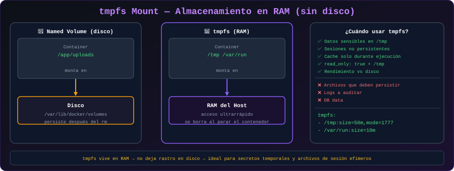

# ⚡ tmpfs Mounts

<p align="center">
  
</p>

## 📋 Tabla de Contenidos

- [¿Qué es tmpfs?](#qué-es-tmpfs)
- [Cuándo Usar tmpfs](#cuándo-usar-tmpfs)
- [Sintaxis y Opciones](#sintaxis-y-opciones)
- [Casos de Uso Prácticos](#casos-de-uso-prácticos)
- [Limitaciones](#limitaciones)

---

## ¿Qué es tmpfs?

**tmpfs** (Temporary File System) es un montaje que almacena datos directamente en la **memoria RAM del host**, sin escribir nada en disco. Los datos son completamente volátiles: desaparecen cuando el contenedor se detiene o se reinicia.

```
HOST (Memoria RAM)          CONTENEDOR
┌──────────────────┐        ┌──────────────────┐
│  tmpfs en RAM    │ ←────→ │  /tmp            │
│  (100 MB)        │        │  /run/secrets    │
│  ✅ Rápido       │        │  /app/cache      │
│  ❌ No persiste  │        └──────────────────┘
└──────────────────┘
```

> 💡 **Solo disponible en Linux**. No funciona en Docker Desktop para Windows/macOS del mismo modo (los contenedores ya corren en una VM Linux, así que funciona dentro de esa VM).

---

## Cuándo Usar tmpfs

### ✅ Casos apropiados

| Caso de Uso | Motivo |
|-------------|--------|
| Datos sensibles temporales (tokens, passwords en memoria) | No se escriben en disco, más seguros |
| Cache de alta velocidad | RAM es ~10x más rápida que SSD |
| Archivos temporales de procesamiento | Evita llenar el disco innecesariamente |
| Datos de sesión de corta duración | Performance sin necesidad de persistencia |
| Tests que generan muchos archivos | Limpieza automática al terminar |

### ❌ No usar cuando

- Los datos deben sobrevivir reinicios del contenedor
- El volumen de datos es mayor que la RAM disponible
- Se necesita compartir datos entre contenedores (tmpfs no se puede compartir)

---

## Sintaxis y Opciones

### Con `--tmpfs` (forma rápida)

```bash
# Montar tmpfs en /tmp del contenedor
docker run --tmpfs /tmp alpine sh

# Con opciones de tamaño y modo
docker run --tmpfs /tmp:rw,size=100m,mode=1777 alpine
```

### Con `--mount` (más control)

```bash
# Básico
docker run \
  --mount type=tmpfs,destination=/tmp \
  alpine

# Con opciones
docker run \
  --mount type=tmpfs,destination=/tmp,tmpfs-size=256m,tmpfs-mode=1777 \
  ubuntu:22.04
```

### Opciones disponibles

| Opción | Descripción | Ejemplo |
|--------|-------------|---------|
| `size` | Tamaño máximo (0 = sin límite, usa toda la RAM libre) | `size=100m`, `size=1g` |
| `mode` | Permisos del directorio (octal) | `mode=1777` (sticky + rwx) |

---

## Casos de Uso Prácticos

### 1. Secretos en Memoria

El uso más importante de tmpfs desde el punto de vista de seguridad:

```bash
# Los secretos se procesan en RAM y nunca toca el disco
docker run -d \
  --name procesador-pagos \
  --tmpfs /run/secrets:rw,noexec,nosuid,size=10m \
  mi-app-pagos

# Escribir secreto en el tmpfs:
docker exec procesador-pagos sh -c \
  "echo 'sk_live_secreto_stripe' > /run/secrets/stripe_key"

# Al detener el contenedor, el secreto desaparece automáticamente
docker stop procesador-pagos
```

### 2. Cache de Alto Rendimiento

```bash
# Aplicación con cache en memoria
docker run -d \
  --name mi-api \
  --tmpfs /app/cache:rw,size=512m \
  -p 3000:3000 \
  mi-api:latest
```

Dentro de la aplicación:
```python
# Python: escribir cache en /app/cache (va a RAM, no al disco)
import os

CACHE_DIR = "/app/cache"

def guardar_en_cache(clave: str, valor: bytes):
    with open(f"{CACHE_DIR}/{clave}", "wb") as f:
        f.write(valor)

def leer_cache(clave: str) -> bytes | None:
    ruta = f"{CACHE_DIR}/{clave}"
    if os.path.exists(ruta):
        with open(ruta, "rb") as f:
            return f.read()
    return None
```

### 3. Tests con Archivos Temporales

```bash
# Correr tests que generan muchos archivos temporales
docker run --rm \
  --tmpfs /tmp:rw,size=1g \
  -v $(pwd):/workspace \
  -w /workspace \
  node:22-alpine \
  sh -c "npm test"

# Los archivos en /tmp desaparecen al terminar (--rm + tmpfs)
```

### 4. Base de Datos en Memoria para Tests

```bash
# PostgreSQL con datos en RAM (para tests de integración rápidos)
docker run -d \
  --name postgres-test \
  --tmpfs /var/lib/postgresql/data:rw,size=512m \
  -e POSTGRES_PASSWORD=test \
  -e POSTGRES_DB=testdb \
  postgres:16-alpine

# Extremadamente rápido, pero los datos no persisten al reiniciar
```

---

## tmpfs en Docker Compose

```yaml
services:
  api:
    image: mi-api:latest
    tmpfs:
      # Forma corta
      - /tmp
      # Forma con opciones
      - /run/secrets:uid=0,gid=0,mode=0700,size=10m

  # Para tests de integración con BD en memoria
  postgres-test:
    image: postgres:16-alpine
    tmpfs:
      - /var/lib/postgresql/data:size=256m
    environment:
      POSTGRES_PASSWORD: test
      POSTGRES_DB: testdb
```

---

## Verificar el Uso de tmpfs

```bash
# Dentro del contenedor, verificar que el montaje es tmpfs
docker exec mi-contenedor df -h /tmp

# Salida esperada:
# Filesystem                Size      Used Available Use% Mounted on
# tmpfs                   100.0M         0    100.0M   0% /tmp

# También puedes verificar desde el host
docker inspect mi-contenedor | grep -A 10 Mounts
```

---

## Limitaciones

| Limitación | Detalle |
|----------|---------|
| **No compartible** | No puedes montar el mismo tmpfs en dos contenedores |
| **Solo Linux** | En macOS/Windows nativo no aplica directamente |
| **Límite de RAM** | Si no especificas `size`, puede consumir toda la RAM disponible |
| **No persiste** | Cualquier reinicio del contenedor borra los datos |
| **No respaldable** | No puedes hacer backup de datos en memoria |

---

## 💡 Consideración de Seguridad

```bash
# Opciones de seguridad útiles con tmpfs:
docker run \
  --tmpfs /tmp:rw,noexec,nosuid,size=100m \
  alpine

# noexec: no permite ejecutar binarios desde /tmp
# nosuid: ignora bits setuid/setgid (previene escalada de privilegios)
# rw:     lectura-escritura (por defecto)
```

---

## 🔗 Navegación

[← 03 - Bind Mounts](03-bind-mounts.md) | [05 - Backup y Restore →](05-backup-restore.md)
