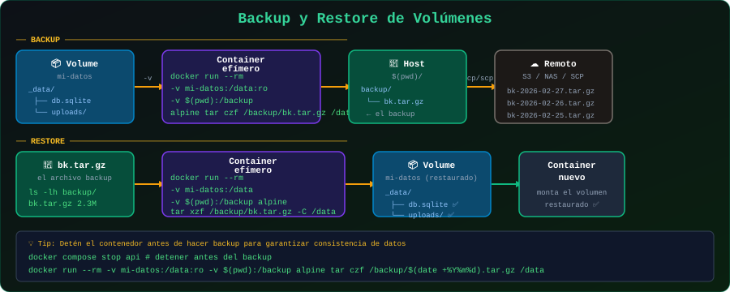

# 🔄 Backup y Restore de Volúmenes

<p align="center">
  
</p>

## 📋 Tabla de Contenidos

- [Por Qué Hacer Backups](#por-qué-hacer-backups)
- [Técnicas de Backup](#técnicas-de-backup)
- [Restore de Volúmenes](#restore-de-volúmenes)
- [Automatización de Backups](#automatización-de-backups)
- [Migrar Datos entre Hosts](#migrar-datos-entre-hosts)
- [Buenas Prácticas](#buenas-prácticas)

---

## Por Qué Hacer Backups

Los volúmenes Docker almacenan datos críticos: bases de datos, archivos de usuario, configuraciones, etc. Sin una estrategia de backup:

- `docker volume rm` elimina datos permanentemente
- `docker-compose down -v` elimina todos los volúmenes del proyecto
- Un disco duro dañado pierde todos los datos
- Un error de migración puede corromper la base de datos

> 🎯 **Regla 3-2-1**: 3 copias de los datos, en 2 tipos de medios diferentes, con 1 copia fuera del sitio.

---

## Técnicas de Backup

### Técnica 1: Contenedor auxiliar (`--volumes-from`)

La forma más portátil: usar un contenedor temporal que accede al volumen y comprime los datos.

```bash
# Estructura del comando:
# 1. Detener el contenedor en uso (recomendado para consistencia)
docker stop mi-postgres

# 2. Crear backup con contenedor auxiliar
docker run --rm \
  --volumes-from mi-postgres \
  -v $(pwd)/backups:/backup \
  alpine \
  tar czf /backup/postgres-$(date +%Y%m%d-%H%M%S).tar.gz /var/lib/postgresql/data

# 3. Verificar el backup
ls -lh backups/

# 4. Reiniciar el contenedor
docker start mi-postgres
```

**Explicación del comando:**
- `--rm`: elimina el contenedor auxiliar al terminar
- `--volumes-from mi-postgres`: monta todos los volúmenes de `mi-postgres`
- `-v $(pwd)/backups:/backup`: monta tu carpeta de backups
- `tar czf`: crea archivo comprimido gzip

### Técnica 2: `docker cp`

Para backups simples de archivos específicos:

```bash
# Copiar archivo/directorio desde contenedor al host
docker cp mi-contenedor:/app/data ./backup-data

# Copiar directorio completo
docker cp mi-contenedor:/var/lib/postgresql/data ./postgres-backup/

# Restaurar desde backup
docker cp ./backup-data mi-contenedor:/app/data
```

> ⚠️ `docker cp` no requiere detener el contenedor, pero los datos pueden ser inconsistentes si el contenedor está escribiendo activamente.

### Técnica 3: Herramientas nativas de base de datos

Para bases de datos, usar sus herramientas nativas garantiza consistencia:

```bash
# PostgreSQL: pg_dump
docker exec mi-postgres pg_dump -U usuario mi_base > backup.sql

# PostgreSQL: pg_dumpall (todas las bases de datos)
docker exec mi-postgres pg_dumpall -U postgres > all-databases.sql

# MySQL/MariaDB: mysqldump
docker exec mi-mysql mysqldump -u root -p'secreto' mi_base > backup.sql

# MongoDB: mongodump
docker exec mi-mongo mongodump --out /backup/mongo-$(date +%Y%m%d)
docker cp mi-mongo:/backup ./backups/
```

### Técnica 4: Snapshot del volumen

```bash
# Crear un volumen de backup a partir de uno existente
docker run --rm \
  -v datos-produccion:/source:ro \
  -v datos-backup-20250115:/dest \
  alpine \
  cp -av /source/. /dest/
```

---

## Restore de Volúmenes

### Restaurar desde archivo tar

```bash
# 1. Crear volumen vacío
docker volume create datos-restaurados

# 2. Restaurar datos desde backup
docker run --rm \
  -v datos-restaurados:/restore \
  -v $(pwd)/backups:/backup:ro \
  alpine \
  sh -c "cd /restore && tar xzf /backup/postgres-20250115-120000.tar.gz --strip 1"
  # --strip 1 elimina el primer nivel de directorio del tar

# 3. Verificar restauración
docker run --rm \
  -v datos-restaurados:/data \
  alpine \
  ls -la /data/
```

### Restaurar base de datos PostgreSQL

```bash
# 1. Crear base de datos vacía
docker run -d \
  --name postgres-nuevo \
  -v datos-postgres-nuevo:/var/lib/postgresql/data \
  -e POSTGRES_PASSWORD=secreto \
  postgres:16-alpine

# 2. Esperar que PostgreSQL esté listo
sleep 5

# 3. Restaurar desde SQL dump
docker exec -i postgres-nuevo \
  psql -U postgres < backup.sql

# O desde archivo comprimido
gunzip -c backup.sql.gz | docker exec -i postgres-nuevo psql -U postgres
```

### Restaurar MySQL/MariaDB

```bash
# Restaurar base de datos MySQL
docker exec -i mi-mysql \
  mysql -u root -p'secreto' mi_base < backup.sql
```

---

## Automatización de Backups

### Script de backup diario

```bash
#!/bin/bash
# Guardar como: /usr/local/bin/docker-backup.sh
# Ejecutar con cron

set -e  # Salir al primer error

# Configuración
BACKUP_DIR="/var/backups/docker"
RETENTION_DAYS=7
DATE=$(date +%Y%m%d-%H%M%S)

# Crear directorio de backup si no existe
mkdir -p "$BACKUP_DIR"

# Función para hacer backup de un volumen Docker
backup_volume() {
    local VOLUME_NAME=$1
    local BACKUP_FILE="$BACKUP_DIR/${VOLUME_NAME}-${DATE}.tar.gz"
    
    echo "📦 Haciendo backup de: $VOLUME_NAME"
    
    docker run --rm \
        -v "${VOLUME_NAME}:/data:ro" \
        -v "${BACKUP_DIR}:/backup" \
        alpine \
        tar czf "/backup/${VOLUME_NAME}-${DATE}.tar.gz" /data
    
    echo "✅ Backup guardado: $BACKUP_FILE"
}

# Hacer backup de volúmenes críticos
backup_volume "datos-postgres"
backup_volume "datos-redis"
backup_volume "app-uploads"

# Eliminar backups más antiguos que RETENTION_DAYS
echo "🧹 Limpiando backups más antiguos de $RETENTION_DAYS días..."
find "$BACKUP_DIR" -name "*.tar.gz" -mtime +$RETENTION_DAYS -delete

echo "✅ Backup completado: $(date)"
```

### Configurar cron

```bash
# Editar crontab
crontab -e

# Backup diario a las 2:00 AM
0 2 * * * /usr/local/bin/docker-backup.sh >> /var/log/docker-backup.log 2>&1

# Backup cada hora (para datos críticos)
0 * * * * /usr/local/bin/docker-backup.sh >> /var/log/docker-backup.log 2>&1
```

### Contenedor de backup dedicado

```yaml
# docker-compose.yml
services:
  # ... tus servicios normales ...

  backup:
    image: alpine
    volumes:
      - datos-postgres:/data/postgres:ro
      - datos-redis:/data/redis:ro
      - ./backups:/backups
      - ./scripts/backup.sh:/backup.sh:ro
    entrypoint: crond -f -d 8
    command: []
    # Configurar crond para ejecutar backup.sh cada noche
```

---

## Migrar Datos entre Hosts

### Exportar desde el host origen

```bash
# En el host origen: comprimir todos los datos del volumen
docker run --rm \
  -v datos-produccion:/source:ro \
  alpine \
  tar czf - /source | gzip > datos-migrar.tar.gz

# Transferir al host destino
scp datos-migrar.tar.gz usuario@servidor-destino:/tmp/
```

### Importar en el host destino

```bash
# En el host destino: crear volumen y restaurar
docker volume create datos-migrados

docker run --rm \
  -v datos-migrados:/dest \
  -v /tmp:/backup:ro \
  alpine \
  sh -c "cd /dest && tar xzf /backup/datos-migrar.tar.gz --strip 1"

# Verificar
docker run --rm -v datos-migrados:/data alpine ls -la /data/
```

---

## Buenas Prácticas

### ✅ Lista de verificación

```
□ Hacer backup ANTES de cualquier actualización importante
□ Verificar la integridad del backup (restaurar en entorno de test)
□ Documentar el proceso de restauración
□ Almacenar backups fuera del mismo servidor
□ Configurar retención automática para evitar llenar el disco
□ Monitorear que los backups se ejecutan correctamente
□ Usar herramientas nativas de la BD para mejor consistencia
□ Para BD en producción, hacer backup con la BD detenida o en modo lectura
```

### Verificar integridad del backup

```bash
# Verificar que el archivo tar no está corrupto
tar tzf mi-backup.tar.gz > /dev/null && echo "✅ OK" || echo "❌ ERROR"

# Verificar tamaño razonable
ls -lh mi-backup.tar.gz
```

---

## 🔗 Navegación

[← 04 - tmpfs](04-tmpfs.md) | [→ Ejercicios](../2-ejercicios/)
