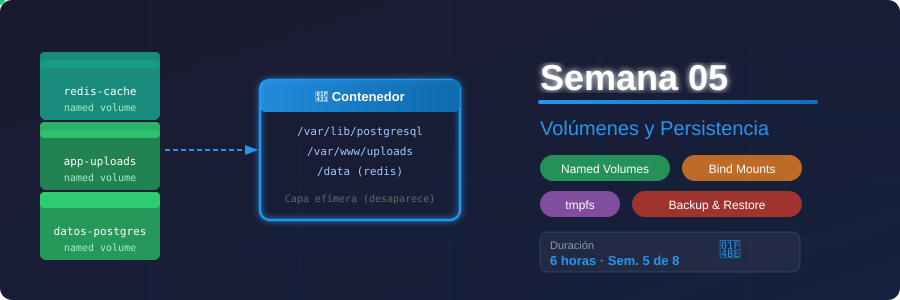

# 🐳 Semana 05: Volúmenes y Persistencia

<p align="center">
  
</p>

## 🎯 Objetivos de Aprendizaje

Al finalizar esta semana, serás capaz de:

- ✅ Entender la persistencia de datos en Docker
- ✅ Crear y gestionar volúmenes nombrados
- ✅ Usar bind mounts para desarrollo
- ✅ Implementar tmpfs para datos temporales
- ✅ Realizar backups y restauraciones
- ✅ Compartir datos entre contenedores

---

## 📚 Requisitos Previos

Antes de comenzar esta semana, debes:

- ✅ Completar la Semana 04 (Redes en Docker)
- ✅ Entender comunicación entre contenedores
- ✅ Conocer docker inspect

---

## 🗂️ Estructura de la Semana

```
week-05-volumenes_persistencia/
├── README.md                    # Este archivo
├── rubrica-evaluacion.md        # Criterios de evaluación
├── 0-assets/                    # Recursos visuales
│   └── week-05-header.svg
├── 1-teoria/                    # Material teórico
│   ├── 01-persistencia.md
│   ├── 02-named-volumes.md
│   ├── 03-bind-mounts.md
│   ├── 04-tmpfs.md
│   └── 05-backup-restore.md
├── 2-ejercicios/                # Ejercicios guiados
│   ├── 01-volumes-basicos/
│   ├── 02-bind-mounts/
│   └── 03-backup-restore/
├── 3-proyecto/                  # Proyecto semanal
│   ├── README.md
│   ├── starter/
│   └── solution/
├── 4-recursos/                  # Material adicional
│   ├── ebooks-free/
│   ├── videografia/
│   └── webgrafia/
└── 5-glosario/                  # Términos clave
    └── README.md
```

---

## 📝 Contenidos

### 📚 Teoría

| #   | Tema                   | Duración | Archivo                                               |
| --- | ---------------------- | -------- | ----------------------------------------------------- |
| 1   | Persistencia en Docker | 20 min   | [01-persistencia.md](1-teoria/01-persistencia.md)     |
| 2   | Volúmenes Nombrados    | 25 min   | [02-named-volumes.md](1-teoria/02-named-volumes.md)   |
| 3   | Bind Mounts            | 20 min   | [03-bind-mounts.md](1-teoria/03-bind-mounts.md)       |
| 4   | tmpfs Mounts           | 15 min   | [04-tmpfs.md](1-teoria/04-tmpfs.md)                   |
| 5   | Backup y Restore       | 25 min   | [05-backup-restore.md](1-teoria/05-backup-restore.md) |

### 💻 Ejercicios Guiados

| #   | Ejercicio            | Duración | Carpeta                                                 |
| --- | -------------------- | -------- | ------------------------------------------------------- |
| 1   | Volúmenes Básicos    | 45 min   | [01-volumes-basicos/](2-ejercicios/01-volumes-basicos/) |
| 2   | Bind Mounts para Dev | 50 min   | [02-bind-mounts/](2-ejercicios/02-bind-mounts/)         |
| 3   | Backup y Restore     | 50 min   | [03-backup-restore/](2-ejercicios/03-backup-restore/)   |

### 🚀 Proyecto Semanal

**Base de Datos Persistente**

Configurar una base de datos con persistencia, backups automáticos y restauración desde backup.

📁 [Ver instrucciones del proyecto](3-proyecto/README.md)

---

## ⏱️ Distribución del Tiempo

| Actividad     | Tiempo      |
| ------------- | ----------- |
| 📖 Teoría     | 1.75 horas  |
| 💻 Ejercicios | 2.5 horas   |
| 🚀 Proyecto   | 1.5 horas   |
| **Total**     | **6 horas** |

---

## 📌 Entregables

- [ ] Ejercicios 01, 02 y 03 completados
- [ ] Proyecto con BD persistente
- [ ] Script de backup funcional
- [ ] Demostración de restore
- [ ] Quiz teórico aprobado (≥70%)

---

## 🧪 Criterios de Evaluación

| Evidencia       | Peso | Criterio                             |
| --------------- | ---- | ------------------------------------ |
| 🧠 Conocimiento | 30%  | Quiz teórico aprobado (≥70%)         |
| 💪 Desempeño    | 40%  | Ejercicios completados correctamente |
| 📦 Producto     | 30%  | Proyecto funcional y documentado     |

📋 [Ver rúbrica detallada](rubrica-evaluacion.md)

---

## 💡 Conceptos Clave

- **Named Volume**: Gestionado por Docker, persistente
- **Bind Mount**: Directorio del host montado
- **tmpfs**: Almacenamiento en RAM, no persistente
- **Volume driver**: Drivers para almacenamiento remoto
- **:ro**: Mount de solo lectura
- **docker volume**: Comandos de gestión de volúmenes

---

## 🔗 Navegación

| ⬅️ Anterior                       | 🏠 Inicio                   | Siguiente ➡️                      |
| --------------------------------- | --------------------------- | --------------------------------- |
| [Semana 04](../week-04-redes_docker/README.md) | [Bootcamp](../../README.md) | [Semana 06](../week-06-docker_compose_basico/README.md) |

---

## 📚 Recursos Adicionales

- [Docker volumes](https://docs.docker.com/storage/volumes/)
- [Bind mounts](https://docs.docker.com/storage/bind-mounts/)
- [tmpfs mounts](https://docs.docker.com/storage/tmpfs/)
- [Backup, restore, or migrate data volumes](https://docs.docker.com/storage/volumes/#back-up-restore-or-migrate-data-volumes)
