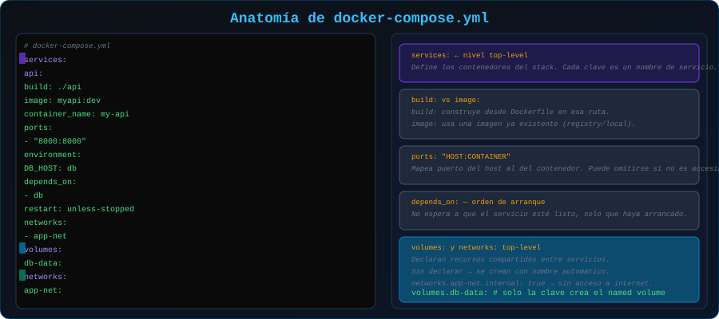

# 📄 Estructura del Archivo docker-compose.yml

<p align="center">
  
</p>

## 📋 Tabla de Contenidos

- [Anatomía del Archivo](#anatomía-del-archivo)
- [Top-Level Keys](#top-level-keys)
- [Propiedades de Servicios](#propiedades-de-servicios)
- [Sintaxis YAML Essentials](#sintaxis-yaml-essentials)
- [Validar el Archivo](#validar-el-archivo)

---

## Anatomía del Archivo

```yaml
# docker-compose.yml — Vista general de la estructura
#
# ┌─────────────────────────────┐
# │  services:                  │ ← Contenedores de la aplicación
# │    api:                     │
# │    db:                      │
# │    cache:                   │
# ├─────────────────────────────┤
# │  volumes:                   │ ← Almacenamiento persistente
# │    db-data:                 │
# │    uploads:                 │
# ├─────────────────────────────┤
# │  networks:                  │ ← Redes personalizadas
# │    frontend:                │
# │    backend:                 │
# ├─────────────────────────────┤
# │  configs:                   │ ← Configuraciones (Compose avanzado)
# │  secrets:                   │ ← Secretos (Compose avanzado)
# └─────────────────────────────┘
```

---

## Top-Level Keys

### `services` (obligatorio)

El único elemento requerido. Define los contenedores de la aplicación.

```yaml
services:
  api:
    image: node:22-alpine
  db:
    image: postgres:16-alpine
```

### `volumes` (opcional)

Declara volúmenes nombrados que pueden usarse en los servicios.

```yaml
volumes:
  db-data:           # Volumen simple (gestionado por Docker)
  uploads:
    driver: local    # Explícito (mismo efecto que arriba)
  cache:
    external: true   # Volumen creado fuera de Compose (ya existe)
```

### `networks` (opcional)

> 💡 Si **no declaras** redes, Compose crea automáticamente una red `<proyecto>_default` y conecta todos los servicios a ella.

```yaml
networks:
  frontend:          # Red para servicios públicos
    driver: bridge
  backend:           # Red interna, sin acceso exterior
    driver: bridge
    internal: true   # Los contenedores no pueden acceder a internet
```

---

## Propiedades de Servicios

### `image` vs `build`

```yaml
services:
  # Usar imagen existente de un registry
  db:
    image: postgres:16-alpine

  # Construir imagen desde Dockerfile
  api:
    build:
      context: ./api         # Directorio con el Dockerfile
      dockerfile: Dockerfile # Nombre del Dockerfile (por defecto)
      args:
        NODE_ENV: production  # ARG del Dockerfile

  # Forma corta de build (usa el directorio actual)
  frontend:
    build: .
```

### `ports`

```yaml
services:
  web:
    ports:
      # host:contenedor
      - "8080:80"       # Puerto 80 del contenedor → 8080 del host
      - "443:443"
      - "127.0.0.1:3000:3000"  # Solo accesible desde localhost

      # Sin puerto de host (asignación automática)
      - "80"            # Docker elige un puerto del host
```

### `environment` y `env_file`

```yaml
services:
  api:
    # Forma 1: variables inline
    environment:
      NODE_ENV: production
      PORT: 3000
      # Pasar variable del HOST al contenedor
      SECRET_KEY: ${SECRET_KEY}

    # Forma 2: desde archivo .env
    env_file:
      - .env
      - .env.production  # Se sobrescriben en orden

    # Forma de lista (alternativa)
    environment:
      - NODE_ENV=production
      - PORT=3000
```

### `volumes` en servicios

```yaml
services:
  db:
    volumes:
      # Named volume (declarado en top-level volumes:)
      - db-data:/var/lib/postgresql/data

      # Bind mount (ruta del host)
      - ./config/postgres.conf:/etc/postgresql/postgresql.conf:ro

      # Volumen anónimo (solo en contenedor)
      - /tmp/cache

  app:
    volumes:
      # Sintaxis larga (más explícita)
      - type: bind
        source: ./src
        target: /app/src
        read_only: false
```

### `depends_on`

```yaml
services:
  api:
    depends_on:
      # Forma simple: esperar que el contenedor ESTÉ CORRIENDO
      - db
      - redis

  worker:
    depends_on:
      # Forma con condición: esperar que el servicio esté HEALTHY
      db:
        condition: service_healthy
      redis:
        condition: service_started  # Por defecto
```

> ⚠️ `depends_on` garantiza el **orden de arranque**, no que el servicio esté listo para recibir conexiones. Para eso, usa `healthcheck`.

### `restart`

```yaml
services:
  api:
    restart: unless-stopped   # ✅ Recomendado para producción
    # restart: always         # Siempre reinicia (incluso al apagar Docker)
    # restart: on-failure     # Solo si termina con código != 0
    # restart: no             # Nunca reinicia (por defecto)
```

### `healthcheck`

```yaml
services:
  api:
    healthcheck:
      test: ["CMD", "curl", "-f", "http://localhost:3000/health"]
      interval: 30s    # Cada cuánto verificar
      timeout: 10s     # Tiempo máximo de respuesta
      retries: 3       # Intentos antes de considerar unhealthy
      start_period: 40s # Tiempo inicial de gracia
```

### `container_name`

```yaml
services:
  db:
    container_name: mi-app-postgres  # Nombre fijo del contenedor
    # ⚠️ Con nombre fijo, no puedes escalar (--scale)
```

---

## Sintaxis YAML Essentials

### Tipos de datos

```yaml
# Strings
nombre: "hola mundo"
nombre2: hola_mundo  # Sin espacios, sin comillas

# Números
puerto: 3000
memoria: 512

# Booleanos
activo: true
debug: false

# Listas
puertos:
  - "8080:80"
  - "443:443"

# Objetos anidados
build:
  context: .
  args:
    VERSION: "1.0"

# Comentarios
# Esto es un comentario
```

### Anclas YAML (reutilización)

```yaml
# Definir un bloque reutilizable con &
x-common: &common-config
  restart: unless-stopped
  networks:
    - app-net

services:
  api:
    <<: *common-config  # Heredar el bloque
    image: mi-api:latest

  worker:
    <<: *common-config  # Heredar el mismo bloque
    image: mi-worker:latest
```

---

## Validar el Archivo

```bash
# Validar sintaxis y ver la configuración resuelta
docker compose config

# Ver solo los servicios definidos
docker compose config --services

# Ver solo los volúmenes
docker compose config --volumes
```

---

## 🔗 Navegación

[← 01 - Intro Compose](01-intro-compose.md) | [03 - Servicios →](03-servicios.md)
