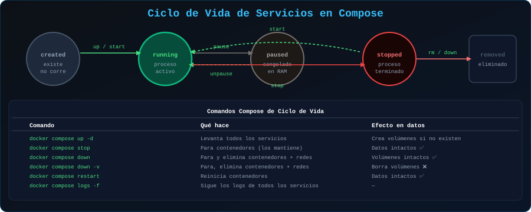

# ⚙️ Definición de Servicios en Docker Compose

<p align="center">
  
</p>

## 📋 Tabla de Contenidos

- [Ciclo de Vida de Servicios](#ciclo-de-vida-de-servicios)
- [Construir vs Usar Imagen](#construir-vs-usar-imagen)
- [Comunicación entre Servicios](#comunicación-entre-servicios)
- [Orden de Inicio y Dependencias](#orden-de-inicio-y-dependencias)
- [Escalar Servicios](#escalar-servicios)
- [Ejemplo: Stack Completo](#ejemplo-stack-completo)

---

## Ciclo de Vida de Servicios

```
docker compose up -d
        │
        ▼
┌──────────────────────┐
│    Crear red(es)     │ ← Automático si no existen
└──────────┬───────────┘
           │
           ▼
┌──────────────────────┐
│  Crear volúmenes     │ ← Si no existen
└──────────┬───────────┘
           │
           ▼
┌──────────────────────┐
│  Construir imágenes  │ ← Solo si hay build:
└──────────┬───────────┘
           │
           ▼
┌──────────────────────┐
│  Crear contenedores  │
│  (respetando orden   │
│   de depends_on)     │
└──────────┬───────────┘
           │
           ▼
┌──────────────────────┐
│  Iniciar servicios   │
└──────────────────────┘
```

---

## Construir vs Usar Imagen

### Usar imagen del registry

```yaml
services:
  # Imagen oficial con tag específico
  db:
    image: postgres:16-alpine

  # Imagen de Docker Hub privada
  api:
    image: miempresa/mi-api:v2.1.0

  # Imagen de otro registry
  app:
    image: ghcr.io/usuario/app:latest
```

### Construir desde Dockerfile

```yaml
services:
  api:
    build:
      context: ./backend    # Dónde está el Dockerfile
      dockerfile: Dockerfile.prod
      target: production    # Stage específico (multi-stage)
      args:
        APP_VERSION: "2.0"
        BUILD_DATE: "2025-01-15"
      cache_from:
        - tipo:registry,ref=miapp/api:latest  # Cache remoto
    image: mi-api:local     # Nombre para la imagen construida

  frontend:
    build: ./frontend       # Forma corta
```

```bash
# Construir sin usar cache
docker compose build --no-cache api

# Construir y levantar
docker compose up -d --build

# Solo construir (sin levantar)
docker compose build
```

---

## Comunicación entre Servicios

Compose crea automáticamente una red donde todos los servicios se comunican **por nombre de servicio** (DNS interno).

```yaml
services:
  api:
    image: mi-api:latest
    environment:
      # Los servicios pueden referenciarse por su nombre
      DATABASE_URL: postgresql://user:pass@db:5432/myapp
      REDIS_URL: redis://cache:6379
      # ↑ "db" y "cache" son los nombres de los servicios de abajo

  db:
    image: postgres:16-alpine
    # No necesita exponer puertos si solo hablan internamente

  cache:
    image: redis:7-alpine
```

### Múltiples redes (aislamiento)

```yaml
services:
  nginx:
    image: nginx:alpine
    networks:
      - public     # Accesible desde fuera

  api:
    image: mi-api:latest
    networks:
      - public     # Habla con nginx
      - internal   # Habla con db y cache

  db:
    image: postgres:16-alpine
    networks:
      - internal   # Solo accesible internamente

  cache:
    image: redis:7-alpine
    networks:
      - internal

networks:
  public:
  internal:
    internal: true  # Sin acceso a internet
```

---

## Orden de Inicio y Dependencias

### `depends_on` básico

```yaml
services:
  api:
    image: mi-api:latest
    depends_on:
      - db      # api inicia DESPUÉS de db
      - redis

  db:
    image: postgres:16-alpine

  redis:
    image: redis:7-alpine
```

> ⚠️ `depends_on` espera que el **contenedor** esté corriendo, no que el **servicio** esté listo. PostgreSQL tarda ~2 segundos en estar listo tras iniciar el contenedor.

### `depends_on` con `condition: service_healthy`

```yaml
services:
  api:
    image: mi-api:latest
    depends_on:
      db:
        condition: service_healthy   # Espera que postgres esté HEALTHY
      redis:
        condition: service_started   # Solo espera que esté corriendo

  db:
    image: postgres:16-alpine
    environment:
      POSTGRES_PASSWORD: secreto
    healthcheck:
      test: ["CMD-SHELL", "pg_isready -U postgres"]
      interval: 10s
      timeout: 5s
      retries: 5
      start_period: 30s

  redis:
    image: redis:7-alpine
    healthcheck:
      test: ["CMD", "redis-cli", "ping"]
      interval: 10s
      timeout: 3s
      retries: 3
```

---

## Escalar Servicios

```bash
# Escalar con --scale (no usar container_name si escalas)
docker compose up -d --scale worker=3

# Ver los contenedores escalados
docker compose ps
# NAME              IMAGE       STATUS
# app-worker-1      worker:img  Running
# app-worker-2      worker:img  Running
# app-worker-3      worker:img  Running
```

```yaml
# deploy.replicas (para swarm o referencia)
services:
  worker:
    image: mi-worker:latest
    deploy:
      replicas: 3
      resources:
        limits:
          cpus: "0.5"
          memory: 512M
```

---

## Ejemplo: Stack Completo

Aplicación real con frontend, API, base de datos y cache:

```yaml
# docker-compose.yml
services:

  # === FRONTEND ===
  nginx:
    image: nginx:alpine
    container_name: app-nginx
    ports:
      - "80:80"
      - "443:443"
    volumes:
      - ./nginx/nginx.conf:/etc/nginx/conf.d/default.conf:ro
      - static-files:/var/www/static:ro
    depends_on:
      api:
        condition: service_healthy
    networks:
      - public
    restart: unless-stopped

  # === BACKEND API ===
  api:
    build:
      context: ./api
      target: production
    container_name: app-api
    environment:
      NODE_ENV: production
      PORT: 3000
      DATABASE_URL: postgresql://${DB_USER}:${DB_PASS}@db:5432/${DB_NAME}
      REDIS_URL: redis://cache:6379
      JWT_SECRET: ${JWT_SECRET}
    volumes:
      - static-files:/app/static
    depends_on:
      db:
        condition: service_healthy
      cache:
        condition: service_healthy
    healthcheck:
      test: ["CMD", "wget", "-qO-", "http://localhost:3000/health"]
      interval: 30s
      timeout: 10s
      retries: 3
      start_period: 40s
    networks:
      - public
      - internal
    restart: unless-stopped

  # === BASE DE DATOS ===
  db:
    image: postgres:16-alpine
    container_name: app-db
    environment:
      POSTGRES_DB: ${DB_NAME}
      POSTGRES_USER: ${DB_USER}
      POSTGRES_PASSWORD: ${DB_PASS}
    volumes:
      - db-data:/var/lib/postgresql/data
      - ./db/init.sql:/docker-entrypoint-initdb.d/init.sql:ro
    healthcheck:
      test: ["CMD-SHELL", "pg_isready -U ${DB_USER} -d ${DB_NAME}"]
      interval: 10s
      timeout: 5s
      retries: 5
      start_period: 30s
    networks:
      - internal
    restart: unless-stopped

  # === CACHE ===
  cache:
    image: redis:7-alpine
    container_name: app-redis
    command: redis-server --requirepass ${REDIS_PASS} --appendonly yes
    volumes:
      - cache-data:/data
    healthcheck:
      test: ["CMD", "redis-cli", "-a", "${REDIS_PASS}", "ping"]
      interval: 10s
      timeout: 3s
      retries: 3
    networks:
      - internal
    restart: unless-stopped

# === VOLÚMENES ===
volumes:
  db-data:
  cache-data:
  static-files:

# === REDES ===
networks:
  public:
    driver: bridge
  internal:
    driver: bridge
    internal: true
```

---

## 🔗 Navegación

[← 02 - Estructura YAML](02-estructura-yaml.md) | [04 - Redes y Volúmenes →](04-redes-volumenes.md)
