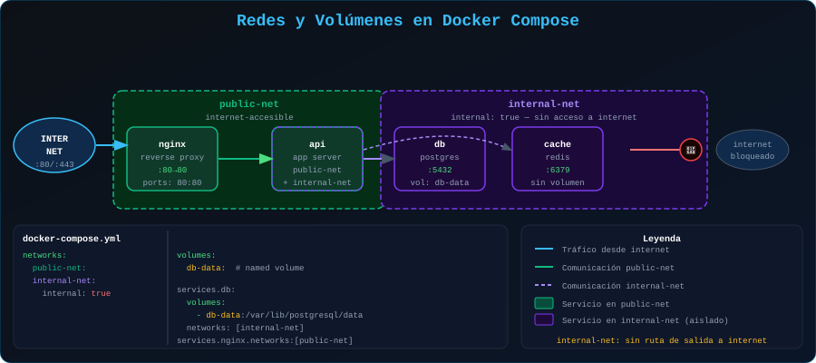

# 🌐 Redes y Volúmenes en Docker Compose

<p align="center">
  
</p>

## 📋 Tabla de Contenidos

- [Redes en Compose](#redes-en-compose)
- [La Red Default](#la-red-default)
- [Redes Personalizadas](#redes-personalizadas)
- [Volúmenes en Compose](#volúmenes-en-compose)
- [Patrón: Frontend / Backend Isolation](#patrón-frontend--backend-isolation)

---

## Redes en Compose

### La Red Default

Si no defines redes, Compose crea automáticamente **una sola red** llamada `<proyecto>_default` y conecta todos los servicios a ella.

```yaml
# Sin declarar networks: — todos en la misma red
services:
  api:
    image: mi-api:latest
  db:
    image: postgres:16-alpine
  # api puede llamar a db como "db:5432"
  # db puede llamar a api como "api:3000"
```

### Redes Personalizadas

```yaml
services:
  nginx:
    image: nginx:alpine
    ports:
      - "80:80"
    networks:
      - public-net

  api:
    image: mi-api:latest
    networks:
      - public-net    # Habla con nginx
      - private-net   # Habla con db

  db:
    image: postgres:16-alpine
    networks:
      - private-net   # db NO puede ser alcanzada desde nginx

networks:
  public-net:
    driver: bridge
  private-net:
    driver: bridge
    internal: true  # Sin acceso a internet desde esta red
```

### Aliases en red

```yaml
services:
  db:
    image: postgres:16-alpine
    networks:
      internal:
        aliases:
          - database      # También accesible como "database"
          - postgres-main

networks:
  internal:
```

### Conectar a red externa

```yaml
networks:
  # Red creada fuera de Compose (por otro proyecto o manualmente)
  shared-net:
    external: true
    name: proyecto-a_default  # Nombre exacto de la red externa
```

---

## Volúmenes en Compose

### Volúmenes Nombrados

```yaml
services:
  db:
    image: postgres:16-alpine
    volumes:
      - pg-data:/var/lib/postgresql/data

  backup:
    image: alpine
    volumes:
      - pg-data:/backup/source:ro  # El mismo volumen, solo lectura

volumes:
  pg-data:        # Docker gestiona la ubicación
    driver: local
    labels:
      project: mi-app
      type: database
```

### Bind Mounts en Compose

```yaml
services:
  api:
    image: mi-api:latest
    volumes:
      # Forma corta
      - ./src:/app/src
      - ./config/app.yml:/app/config.yml:ro

      # Forma larga (más explícita)
      - type: bind
        source: ./src
        target: /app/src
        read_only: false
```

### Volúmenes Externos

```yaml
volumes:
  # Volumen que ya existe (creado manualmente o por otro Compose)
  legacy-data:
    external: true

  # Con nombre diferente al del Compose
  production-db:
    external: true
    name: myapp-production-database
```

### Modo de Solo Lectura en Servicio

```yaml
services:
  app:
    image: mi-app:latest
    read_only: true   # Todo el FS del contenedor es read-only
    volumes:
      # Montar directorios donde la app SÍ necesita escribir
      - type: tmpfs
        target: /tmp
      - type: tmpfs
        target: /app/logs
```

---

## Patrón: Frontend / Backend Isolation

Arquitectura recomendada para separar capas de seguridad:

```yaml
services:
  # ═══════════════════════════════
  # Capa pública (internet → aquí)
  # ═══════════════════════════════
  nginx:
    image: nginx:alpine
    ports:
      - "80:80"     # Único punto de entrada
    volumes:
      - ./nginx/nginx.conf:/etc/nginx/conf.d/default.conf:ro
    networks:
      - dmz         # Red pública
    depends_on:
      - api

  # ═══════════════════════════════
  # Capa de aplicación
  # ═══════════════════════════════
  api:
    build: ./api
    # SIN puertos expuestos (solo nginx puede acceder)
    environment:
      DB_HOST: db
      REDIS_HOST: cache
    networks:
      - dmz         # Recibe tráfico de nginx
      - app-tier    # Habla con servicios internos

  worker:
    build: ./worker
    environment:
      DB_HOST: db
      REDIS_HOST: cache
    networks:
      - app-tier    # Solo red interna, nunca pública

  # ═══════════════════════════════
  # Capa de datos (solo interna)
  # ═══════════════════════════════
  db:
    image: postgres:16-alpine
    # SIN puertos expuestos
    volumes:
      - db-data:/var/lib/postgresql/data
    networks:
      - app-tier    # Solo accesible desde api y worker

  cache:
    image: redis:7-alpine
    networks:
      - app-tier

volumes:
  db-data:

networks:
  dmz:
    driver: bridge
  app-tier:
    driver: bridge
    internal: true
```

**Flujo de tráfico:**

```
Internet → nginx (80) → api:3000 → db:5432
                              ↘→ cache:6379
worker (background) → db:5432
                    → cache:6379
```

---

## Verificar configuración de redes y volúmenes

```bash
# Ver la configuración resuelta (incluyendo redes y volúmenes)
docker compose config

# Ver redes creadas por Compose
docker network ls | grep $(basename $(pwd))

# Inspeccionar una red
docker network inspect nombre-proyecto_nombre-red

# Ver volúmenes del proyecto
docker volume ls | grep $(basename $(pwd))
```

---

## 🔗 Navegación

[← 03 - Servicios](03-servicios.md) | [05 - Variables y Override →](05-variables-override.md)
