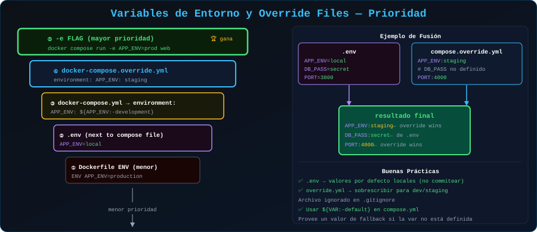

# 🔧 Variables de Entorno y Override Files

<p align="center">
  
</p>

## 📋 Tabla de Contenidos

- [Variables de Entorno en Compose](#variables-de-entorno-en-compose)
- [El Archivo .env](#el-archivo-env)
- [Interpolación de Variables](#interpolación-de-variables)
- [Override Files](#override-files)
- [Múltiples Entornos](#múltiples-entornos)

---

## Variables de Entorno en Compose

### Tres formas de definir variables

```yaml
services:
  api:

    # 1. Inline (hardcodeado — ❌ no usar para secretos)
    environment:
      NODE_ENV: production
      PORT: 3000

    # 2. Desde el entorno del host (sin valor = toma el del host)
    environment:
      - NODE_ENV          # Toma el valor de $NODE_ENV del host
      - SECRET_KEY        # Toma el valor de $SECRET_KEY del host

    # 3. Desde archivo .env
    env_file:
      - .env
      - .env.local        # Sobreescribe a .env
```

### Prioridad (de mayor a menor)

```
1. docker compose run -e VAR=valor (más alta)
2. environment: en docker-compose.yml
3. env_file: en docker-compose.yml
4. .env en el directorio del proyecto (más baja)
```

---

## El Archivo .env

Docker Compose busca automáticamente un archivo `.env` en el directorio donde ejecutas `docker compose`.

```bash
# .env — variables del proyecto
COMPOSE_PROJECT_NAME=mi-app   # Nombre del proyecto
COMPOSE_FILE=docker-compose.yml:docker-compose.override.yml

# Aplicación
NODE_ENV=development
PORT=3000
APP_VERSION=2.0.1

# Base de datos
DB_HOST=db
DB_PORT=5432
DB_NAME=appdb
DB_USER=appuser
DB_PASS=dev_password_123

# Redis
REDIS_HOST=cache
REDIS_PORT=6379

# NUNCA commitear secretos reales – usar .env.example como plantilla
```

```bash
# .env.example — plantilla que SÍ se commitea al repo
NODE_ENV=development
PORT=3000
DB_NAME=appdb
DB_USER=appuser
DB_PASS=          # ← completar con valor real
SECRET_KEY=       # ← completar con valor real
```

```bash
# .gitignore — excluir archivos con secretos reales
.env
.env.local
.env.production
```

---

## Interpolación de Variables

```yaml
# docker-compose.yml — usar variables con ${VARIABLE}
services:
  api:
    image: mi-api:${APP_VERSION:-latest}   # Con valor por defecto
    environment:
      NODE_ENV: ${NODE_ENV}
      DATABASE_URL: postgresql://${DB_USER}:${DB_PASS}@${DB_HOST}:${DB_PORT}/${DB_NAME}
    ports:
      - "${PORT:-3000}:3000"

  db:
    image: postgres:${POSTGRES_VERSION:-16-alpine}
    environment:
      POSTGRES_DB: ${DB_NAME}
      POSTGRES_USER: ${DB_USER}
      POSTGRES_PASSWORD: ${DB_PASS}
    volumes:
      - ${DATA_DIR:-./data}/postgres:/var/lib/postgresql/data
```

### Sintaxis de variables

```yaml
# ${VAR}              → error si VAR no está definida
# ${VAR:-default}     → usa "default" si VAR no está definida o está vacía
# ${VAR-default}      → usa "default" solo si VAR no está definida
# ${VAR:?mensaje}     → error con "mensaje" si VAR no está definida o vacía
# ${VAR?mensaje}      → error con "mensaje" solo si VAR no está definida

environment:
  REQUIRED: ${MUST_EXIST:?La variable MUST_EXIST es obligatoria}
  OPTIONAL: ${MAYBE_ABSENT:-valor-por-defecto}
```

```bash
# Verificar cómo se resuelven las variables
docker compose config
```

---

## Override Files

Docker Compose permite **combinar múltiples archivos** para crear configuraciones de diferentes entornos.

### Cómo funciona la fusión

```
docker-compose.yml        ← Base (siempre se carga)
       ↓ fusiona con
docker-compose.override.yml  ← Sobreescribe/añade (carga automática)
```

**Reglas de fusión:**
- Las propiedades escalares (strings, números) se **sobreescriben**
- Las listas (`ports`, `volumes`, `environment`) se **concatenan**
- Los bloques de objetos se **fusionan recursivamente**

### Estructura recomendada

```
proyecto/
├── docker-compose.yml          # Config base (producción-like)
├── docker-compose.override.yml # Dev automático (ignorar en prod)
├── docker-compose.dev.yml      # Dev explícito
├── docker-compose.staging.yml  # Staging
├── docker-compose.prod.yml     # Producción
└── .env                        # Variables por entorno
```

### Base: `docker-compose.yml`

```yaml
# docker-compose.yml — configuración base/producción
services:
  api:
    image: mi-api:${APP_VERSION:-latest}
    environment:
      NODE_ENV: production
      PORT: 3000
    restart: unless-stopped
    healthcheck:
      test: ["CMD", "wget", "-qO-", "http://localhost:3000/health"]
      interval: 30s
      timeout: 10s
      retries: 3

  db:
    image: postgres:16-alpine
    volumes:
      - db-data:/var/lib/postgresql/data
    environment:
      POSTGRES_DB: ${DB_NAME}
      POSTGRES_USER: ${DB_USER}
      POSTGRES_PASSWORD: ${DB_PASS}

volumes:
  db-data:
```

### Override de desarrollo: `docker-compose.override.yml`

```yaml
# docker-compose.override.yml — se carga AUTOMÁTICAMENTE en dev
services:
  api:
    build: ./api              # Build local en lugar de imagen
    environment:
      NODE_ENV: development   # Sobreescribe production
    volumes:
      - ./api/src:/app/src    # Hot reload del código
    ports:
      - "3000:3000"           # Exponer para debugging
    command: npm run dev      # Comando de desarrollo

  db:
    ports:
      - "5432:5432"     # Exponer DB para acceso desde host (IDE, herramientas)

  # Servicio extra solo para desarrollo
  adminer:
    image: adminer:latest
    ports:
      - "8080:8080"
    depends_on:
      - db
```

```bash
# Desarrollo: carga docker-compose.yml + docker-compose.override.yml
docker compose up -d

# Producción: solo el archivo base
docker compose -f docker-compose.yml up -d

# Staging: base + staging
docker compose -f docker-compose.yml -f docker-compose.staging.yml up -d
```

---

## Múltiples Entornos

### Estructura por entorno

```bash
# .env.dev
NODE_ENV=development
DB_PASS=dev_pass_local
APP_PORT=3000

# .env.staging
NODE_ENV=staging
DB_PASS=staging_pass_secure
APP_PORT=80

# .env.prod
NODE_ENV=production
DB_PASS=    # En prod: inyectado por CI/CD, no en archivo
APP_PORT=80
```

```bash
# Usar un .env específico
docker compose --env-file .env.staging up -d

# O antes de ejecutar:
export $(cat .env.staging | grep -v '^#' | xargs)
docker compose up -d
```

### Makefile para simplificar comandos

```makefile
# Makefile
.PHONY: dev staging prod down clean

dev:
	docker compose up -d

staging:
	docker compose -f docker-compose.yml -f docker-compose.staging.yml \
	  --env-file .env.staging up -d

prod:
	docker compose -f docker-compose.yml \
	  --env-file .env.prod up -d

down:
	docker compose down

clean:
	docker compose down -v --remove-orphans
```

---

## 💡 Buenas Prácticas

```
✅ Siempre usar .env.example como plantilla commiteada
✅ Agregar .env a .gitignore
✅ Usar ${VAR:?mensaje} para variables obligatorias
✅ El archivo base debe ser válido por sí solo (producción-safe)
✅ docker-compose.override.yml = SOLO desarrollo local
✅ Validar con docker compose config antes de desplegar
❌ Nunca commitear secretos reales
❌ Nunca usar 'latest' como tag en producción
```

---

## 🔗 Navegación

[← 04 - Redes y Volúmenes](04-redes-volumenes.md) | [→ Ejercicios](../2-ejercicios/)
