# 🐳 Semana 06: Docker Compose Básico

<p align="center">
  
</p>

## 🎯 Objetivos de Aprendizaje

Al finalizar esta semana, serás capaz de:

- ✅ Entender la estructura de docker-compose.yml
- ✅ Definir servicios múltiples
- ✅ Configurar redes y volúmenes en Compose
- ✅ Gestionar dependencias entre servicios
- ✅ Usar variables de entorno y archivos .env
- ✅ Aplicar override files para diferentes entornos

---

## 📚 Requisitos Previos

Antes de comenzar esta semana, debes:

- ✅ Completar la Semana 05 (Volúmenes y Persistencia)
- ✅ Dominar redes Docker
- ✅ Entender volúmenes nombrados y bind mounts

---

## 🗂️ Estructura de la Semana

```
week-06/
├── README.md                    # Este archivo
├── rubrica-evaluacion.md        # Criterios de evaluación
├── 0-assets/                    # Recursos visuales
│   └── week-06-header.svg
├── 1-teoria/                    # Material teórico
│   ├── 01-intro-compose.md
│   ├── 02-estructura-yaml.md
│   ├── 03-servicios.md
│   ├── 04-redes-volumenes.md
│   └── 05-variables-override.md
├── 2-ejercicios/                # Ejercicios guiados
│   ├── 01-primer-compose/
│   ├── 02-multi-servicio/
│   └── 03-entornos/
├── 3-proyecto/                  # Proyecto semanal
│   ├── README.md
│   ├── starter/
│   └── solution/
├── 4-recursos/                  # Material adicional
│   ├── ebooks-free/
│   ├── videografia/
│   └── webgrafia/
└── 5-glosario/                  # Términos clave
    └── README.md
```

---

## 📝 Contenidos

### 📚 Teoría

| #   | Tema                    | Duración | Archivo                                                       |
| --- | ----------------------- | -------- | ------------------------------------------------------------- |
| 1   | Introducción a Compose  | 20 min   | [01-intro-compose.md](1-teoria/01-intro-compose.md)           |
| 2   | Estructura YAML         | 20 min   | [02-estructura-yaml.md](1-teoria/02-estructura-yaml.md)       |
| 3   | Definición de Servicios | 25 min   | [03-servicios.md](1-teoria/03-servicios.md)                   |
| 4   | Redes y Volúmenes       | 20 min   | [04-redes-volumenes.md](1-teoria/04-redes-volumenes.md)       |
| 5   | Variables y Override    | 20 min   | [05-variables-override.md](1-teoria/05-variables-override.md) |

### 💻 Ejercicios Guiados

| #   | Ejercicio                 | Duración | Carpeta                                               |
| --- | ------------------------- | -------- | ----------------------------------------------------- |
| 1   | Primer Compose            | 45 min   | [01-primer-compose/](2-ejercicios/01-primer-compose/) |
| 2   | Aplicación Multi-Servicio | 50 min   | [02-multi-servicio/](2-ejercicios/02-multi-servicio/) |
| 3   | Múltiples Entornos        | 50 min   | [03-entornos/](2-ejercicios/03-entornos/)             |

### 🚀 Proyecto Semanal

**Stack LAMP/LEMP con Compose**

Crear un stack completo con servidor web, PHP/Node y base de datos usando Docker Compose.

📁 [Ver instrucciones del proyecto](3-proyecto/README.md)

---

## ⏱️ Distribución del Tiempo

| Actividad     | Tiempo      |
| ------------- | ----------- |
| 📖 Teoría     | 1.75 horas  |
| 💻 Ejercicios | 2.5 horas   |
| 🚀 Proyecto   | 1.5 horas   |
| **Total**     | **6 horas** |

---

## 📌 Entregables

- [ ] Ejercicios 01, 02 y 03 completados
- [ ] Proyecto stack funcional
- [ ] docker-compose.yml bien estructurado
- [ ] Archivo .env con variables
- [ ] Quiz teórico aprobado (≥70%)

---

## 🧪 Criterios de Evaluación

| Evidencia       | Peso | Criterio                             |
| --------------- | ---- | ------------------------------------ |
| 🧠 Conocimiento | 30%  | Quiz teórico aprobado (≥70%)         |
| 💪 Desempeño    | 40%  | Ejercicios completados correctamente |
| 📦 Producto     | 30%  | Proyecto funcional y documentado     |

📋 [Ver rúbrica detallada](rubrica-evaluacion.md)

---

## 💡 Conceptos Clave

- **services**: Definición de contenedores
- **networks**: Redes para los servicios
- **volumes**: Volúmenes persistentes
- **depends_on**: Orden de inicio
- **environment**: Variables de entorno
- **build**: Construir imagen desde Dockerfile
- **ports**: Mapeo de puertos
- **.env**: Archivo de variables

---

## 🔗 Navegación

| ⬅️ Anterior                       | 🏠 Inicio                   | Siguiente ➡️                      |
| --------------------------------- | --------------------------- | --------------------------------- |
| [Semana 05](../week-05/README.md) | [Bootcamp](../../README.md) | [Semana 07](../week-07/README.md) |

---

## 📚 Recursos Adicionales

- [Docker Compose overview](https://docs.docker.com/compose/)
- [Compose file reference](https://docs.docker.com/compose/compose-file/)
- [Environment variables in Compose](https://docs.docker.com/compose/environment-variables/)
