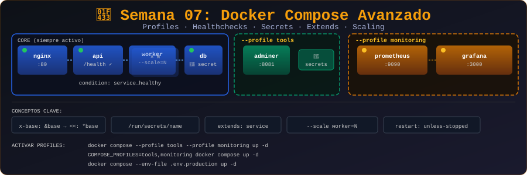

# 🐳 Semana 07: Docker Compose Avanzado

<p align="center">
  
</p>

## 🎯 Objetivos de Aprendizaje

Al finalizar esta semana, serás capaz de:

- ✅ Usar profiles para servicios condicionales
- ✅ Implementar healthchecks en servicios
- ✅ Configurar secrets y configs
- ✅ Usar extends y anchors YAML
- ✅ Escalar servicios con réplicas
- ✅ Aplicar restart policies

---

## 📚 Requisitos Previos

Antes de comenzar esta semana, debes:

- ✅ Completar la Semana 06 (Docker Compose Básico)
- ✅ Dominar docker-compose.yml
- ✅ Entender servicios, redes y volúmenes en Compose

---

## 🗂️ Estructura de la Semana

```
week-07/
├── README.md                    # Este archivo
├── rubrica-evaluacion.md        # Criterios de evaluación
├── 0-assets/                    # Recursos visuales
│   └── week-07-header.svg
├── 1-teoria/                    # Material teórico
│   ├── 01-profiles.md
│   ├── 02-healthchecks.md
│   ├── 03-secrets-configs.md
│   ├── 04-extends-anchors.md
│   └── 05-scaling-restart.md
├── 2-ejercicios/                # Ejercicios guiados
│   ├── 01-profiles/
│   ├── 02-healthchecks/
│   └── 03-secrets/
├── 3-proyecto/                  # Proyecto semanal
│   ├── README.md
│   ├── starter/
│   └── solution/
├── 4-recursos/                  # Material adicional
│   ├── ebooks-free/
│   ├── videografia/
│   └── webgrafia/
└── 5-glosario/                  # Términos clave
    └── README.md
```

---

## 📝 Contenidos

### 📚 Teoría

| #   | Tema              | Duración | Archivo                                                 |
| --- | ----------------- | -------- | ------------------------------------------------------- |
| 1   | Profiles          | 20 min   | [01-profiles.md](1-teoria/01-profiles.md)               |
| 2   | Healthchecks      | 25 min   | [02-healthchecks.md](1-teoria/02-healthchecks.md)       |
| 3   | Secrets y Configs | 20 min   | [03-secrets-configs.md](1-teoria/03-secrets-configs.md) |
| 4   | Extends y Anchors | 20 min   | [04-extends-anchors.md](1-teoria/04-extends-anchors.md) |
| 5   | Scaling y Restart | 20 min   | [05-scaling-restart.md](1-teoria/05-scaling-restart.md) |

### 💻 Ejercicios Guiados

| #   | Ejercicio                   | Duración | Carpeta                                           |
| --- | --------------------------- | -------- | ------------------------------------------------- |
| 1   | Profiles para Dev/Prod      | 45 min   | [01-profiles/](2-ejercicios/01-profiles/)         |
| 2   | Healthchecks y Dependencias | 50 min   | [02-healthchecks/](2-ejercicios/02-healthchecks/) |
| 3   | Secrets en Compose          | 50 min   | [03-secrets/](2-ejercicios/03-secrets/)           |

### 🚀 Proyecto Semanal

**Microservicios con Compose**

Arquitectura de microservicios con healthchecks, profiles para diferentes entornos y manejo seguro de secrets.

📁 [Ver instrucciones del proyecto](3-proyecto/README.md)

---

## ⏱️ Distribución del Tiempo

| Actividad     | Tiempo      |
| ------------- | ----------- |
| 📖 Teoría     | 1.75 horas  |
| 💻 Ejercicios | 2.5 horas   |
| 🚀 Proyecto   | 1.5 horas   |
| **Total**     | **6 horas** |

---

## 📌 Entregables

- [ ] Ejercicios 01, 02 y 03 completados
- [ ] Proyecto microservicios
- [ ] Healthchecks implementados
- [ ] Profiles configurados
- [ ] Quiz teórico aprobado (≥70%)

---

## 🧪 Criterios de Evaluación

| Evidencia       | Peso | Criterio                             |
| --------------- | ---- | ------------------------------------ |
| 🧠 Conocimiento | 30%  | Quiz teórico aprobado (≥70%)         |
| 💪 Desempeño    | 40%  | Ejercicios completados correctamente |
| 📦 Producto     | 30%  | Proyecto funcional y documentado     |

📋 [Ver rúbrica detallada](rubrica-evaluacion.md)

---

## 💡 Conceptos Clave

- **profiles**: Servicios condicionales
- **healthcheck**: Verificación de salud del servicio
- **secrets**: Datos sensibles (passwords, keys)
- **configs**: Archivos de configuración
- **extends**: Heredar configuración de otro servicio
- **anchors (&) / aliases (\*)**: Reutilización YAML
- **deploy.replicas**: Escalar servicios
- **restart**: always, unless-stopped, on-failure

---

## 🔗 Navegación

| ⬅️ Anterior                       | 🏠 Inicio                   | Siguiente ➡️                      |
| --------------------------------- | --------------------------- | --------------------------------- |
| [Semana 06](../week-06/README.md) | [Bootcamp](../../README.md) | [Semana 08](../week-08/README.md) |

---

## 📚 Recursos Adicionales

- [Compose profiles](https://docs.docker.com/compose/profiles/)
- [Healthcheck in Compose](https://docs.docker.com/compose/compose-file/05-services/#healthcheck)
- [Secrets in Compose](https://docs.docker.com/compose/use-secrets/)
- [YAML anchors](https://docs.docker.com/compose/compose-file/10-fragments/)
