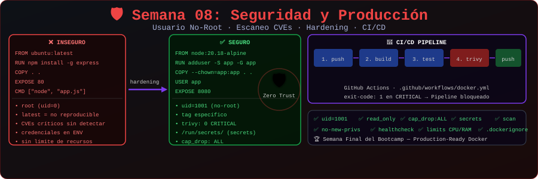

# 🐳 Semana 08: Seguridad y Producción

<p align="center">
  
</p>

## 🎯 Objetivos de Aprendizaje

Al finalizar esta semana, serás capaz de:

- ✅ Aplicar principios de seguridad en contenedores
- ✅ Ejecutar contenedores con usuarios no-root
- ✅ Escanear imágenes en busca de vulnerabilidades
- ✅ Implementar buenas prácticas de producción
- ✅ Configurar pipelines básicos de CI/CD
- ✅ Preparar aplicaciones para despliegue

---

## 📚 Requisitos Previos

Antes de comenzar esta semana, debes:

- ✅ Completar la Semana 07 (Docker Compose Avanzado)
- ✅ Dominar Docker Compose
- ✅ Entender multi-stage builds

---

## 🗂️ Estructura de la Semana

```
week-08-seguridad_produccion/
├── README.md                    # Este archivo
├── rubrica-evaluacion.md        # Criterios de evaluación
├── 0-assets/                    # Recursos visuales
│   └── week-08-header.svg
├── 1-teoria/                    # Material teórico
│   ├── 01-seguridad-contenedores.md
│   ├── 02-usuarios-no-root.md
│   ├── 03-escaneo-vulnerabilidades.md
│   ├── 04-buenas-practicas.md
│   └── 05-cicd-basico.md
├── 2-ejercicios/                # Ejercicios guiados
│   ├── 01-usuarios-no-root/
│   ├── 02-escaneo-imagenes/
│   └── 03-pipeline-cicd/
├── 3-proyecto/                  # Proyecto final
│   ├── README.md
│   ├── starter/
│   └── solution/
├── 4-recursos/                  # Material adicional
│   ├── ebooks-free/
│   ├── videografia/
│   └── webgrafia/
└── 5-glosario/                  # Términos clave
    └── README.md
```

---

## 📝 Contenidos

### 📚 Teoría

| #   | Tema                           | Duración | Archivo                                                                   |
| --- | ------------------------------ | -------- | ------------------------------------------------------------------------- |
| 1   | Seguridad en Contenedores      | 25 min   | [01-seguridad-contenedores.md](1-teoria/01-seguridad-contenedores.md)     |
| 2   | Usuarios No-Root               | 20 min   | [02-usuarios-no-root.md](1-teoria/02-usuarios-no-root.md)                 |
| 3   | Escaneo de Vulnerabilidades    | 20 min   | [03-escaneo-vulnerabilidades.md](1-teoria/03-escaneo-vulnerabilidades.md) |
| 4   | Buenas Prácticas de Producción | 20 min   | [04-buenas-practicas.md](1-teoria/04-buenas-practicas.md)                 |
| 5   | CI/CD Básico con Docker        | 20 min   | [05-cicd-basico.md](1-teoria/05-cicd-basico.md)                           |

### 💻 Ejercicios Guiados

| #   | Ejercicio           | Duración | Carpeta                                                   |
| --- | ------------------- | -------- | --------------------------------------------------------- |
| 1   | Usuarios No-Root    | 45 min   | [01-usuarios-no-root/](2-ejercicios/01-usuarios-no-root/) |
| 2   | Escaneo de Imágenes | 45 min   | [02-escaneo-imagenes/](2-ejercicios/02-escaneo-imagenes/) |
| 3   | Pipeline CI/CD      | 55 min   | [03-pipeline-cicd/](2-ejercicios/03-pipeline-cicd/)       |

### 🚀 Proyecto Final

**Aplicación Production-Ready**

Crear una aplicación completa lista para producción: imagen optimizada, usuario no-root, healthchecks, escaneo de vulnerabilidades y pipeline de CI/CD.

📁 [Ver instrucciones del proyecto](3-proyecto/README.md)

---

## ⏱️ Distribución del Tiempo

| Actividad     | Tiempo      |
| ------------- | ----------- |
| 📖 Teoría     | 1.75 horas  |
| 💻 Ejercicios | 2.5 horas   |
| 🚀 Proyecto   | 1.5 horas   |
| **Total**     | **6 horas** |

---

## 📌 Entregables

- [ ] Ejercicios 01, 02 y 03 completados
- [ ] Proyecto final production-ready
- [ ] Dockerfile con usuario no-root
- [ ] Reporte de escaneo de vulnerabilidades
- [ ] Pipeline CI/CD funcional
- [ ] Quiz teórico aprobado (≥70%)

---

## 🧪 Criterios de Evaluación

| Evidencia       | Peso | Criterio                             |
| --------------- | ---- | ------------------------------------ |
| 🧠 Conocimiento | 30%  | Quiz teórico aprobado (≥70%)         |
| 💪 Desempeño    | 40%  | Ejercicios completados correctamente |
| 📦 Producto     | 30%  | Proyecto funcional y documentado     |

📋 [Ver rúbrica detallada](rubrica-evaluacion.md)

---

## 💡 Conceptos Clave

- **Principio de menor privilegio**: Solo permisos necesarios
- **Usuario no-root**: USER en Dockerfile
- **Imagen base segura**: Alpine, distroless, slim
- **Escaneo**: Trivy, Docker Scout, Snyk
- **CI/CD**: GitHub Actions, GitLab CI
- **Immutable infrastructure**: Contenedores efímeros
- **12-Factor App**: Principios de aplicaciones cloud-native

---

## 🎓 Certificación del Bootcamp

Al completar esta semana y el proyecto final, habrás terminado el **Bootcamp Docker Zero to Hero**.

### Próximos Pasos

- 🚀 **Bootcamp Kubernetes**: Continúa tu aprendizaje
- 📜 **Certificaciones**: Docker Certified Associate (DCA)
- 💼 **Portfolio**: Usa los proyectos como evidencia

---

## 🔗 Navegación

| ⬅️ Anterior                       | 🏠 Inicio                   | Siguiente ➡️    |
| --------------------------------- | --------------------------- | --------------- |
| [Semana 07](../week-07-docker_compose_avanzado/README.md) | [Bootcamp](../../README.md) | 🎓 ¡Completado! |

---

## 📚 Recursos Adicionales

- [Docker security](https://docs.docker.com/engine/security/)
- [Docker Scout](https://docs.docker.com/scout/)
- [Best practices for writing Dockerfiles](https://docs.docker.com/develop/develop-images/dockerfile_best-practices/)
- [GitHub Actions with Docker](https://docs.docker.com/ci-cd/github-actions/)
- [12-Factor App](https://12factor.net/es/)
